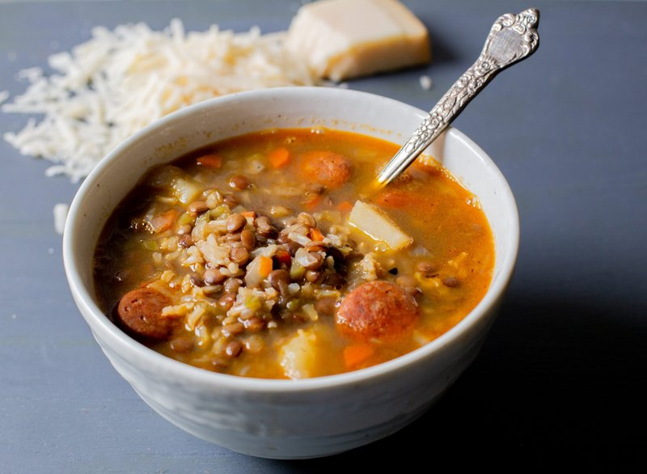

# Lentejas Chilenas

*A Chilean lentil stew: green or brown lentils slow-cooked with onion, garlic, carrot, potato, smoked bacon and tomato, finished with oregano and vinegar.*

**Serves:** 4

**Prep Time:** 15 minutes

**Cook Time:** 1 hour 15 minutes

## Overview
Smoked bacon renders in a heavy pot; onion, garlic and carrot soften in the fat. Tomato and dried oregano build a base. Lentils and stock simmer for 45 minutes until tender. Potato chunks go in for the last 20 minutes. A splash of red wine vinegar at the end brightens the rich stew.

## Ingredients

- 400 g green lentils (or brown lentils, rinsed)
- 200 g smoked streaky bacon (or smoked pancetta - cut into 1 cm pieces)
- 1 onion (large, chopped)
- 4 garlic cloves (crushed)
- 2 carrots (diced)
- 1 stick celery (diced)
- 2 fresh tomatoes (grated) or 1 small tin chopped tomatoes
- 2 tablespoons tomato puree
- 1 teaspoon smoked paprika
- 1 teaspoon dried oregano
- 1 teaspoon ground cumin
- 1 ½ teaspoons salt
- ½ teaspoon ground black pepper
- 2 bay leaves
- 1.4 litres hot stock
- 2 potatoes (medium, peeled, cut into 2 cm cubes)
- 1 tablespoon red wine vinegar
- 3 tablespoons fresh parsley (chopped)

## Method

### Stage 1 - Bacon
1. Heat a wide heavy pot over medium heat.
1. Add the bacon; cook 6-7 minutes until the fat renders and the bacon is lightly gold.

### Stage 2 - Aromatics
1. Add the onion, carrot and celery; cook 10 minutes, stirring, until soft.
1. Add garlic; cook 30 seconds.

### Stage 3 - Spices and tomato
1. Stir in paprika, oregano, cumin; toast 30 seconds.
1. Add tomato and tomato puree; reduce 4 minutes.

### Stage 4 - Simmer
1. Add rinsed lentils, bay, salt, pepper, hot stock.
1. Bring to a simmer; reduce heat; cover.
1. Cook 45 minutes, stirring occasionally, until lentils are tender.

### Stage 5 - Potato
1. Add the potato; cook another 18-20 minutes until tender.
1. Stir in vinegar; taste; adjust salt.

### Stage 6 - Serve
1. Scatter parsley.
1. Eat with crusty bread or a wedge of marraqueta.

## Notes
- **Brown / green lentils:** Hold their shape better than red lentils, which collapse. The Chilean original uses green.
- **Smoked bacon depth:** The signature. Skip it (and add 1 tsp smoked paprika more) for a vegetarian version.
- **Vinegar at the end:** Cuts the richness. Don't add to the boil - it goes flat.

## Storage
- Refrigerate 5 days; lentils improve on day 2.
- Freezes 3 months.
