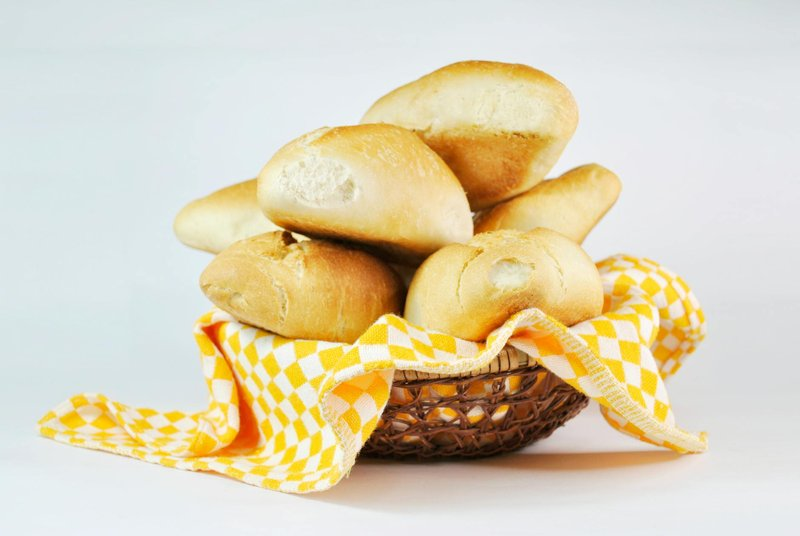

# Marraqueta

*Chile's everyday bread: a small crusty four-segment roll that pulls apart cleanly along its deep score. Eaten with butter, avocado or cheese.*

**Serves:** 8 (makes 8 small rolls, in 4-segment shapes)

**Prep Time:** 25 minutes (plus 1 hour 30 minutes rising)

**Cook Time:** 22 minutes

## Overview
Chile's everyday bread, the small crusty roll with four lobes that pulls apart cleanly along its deep score. You make a lean dough from bread flour, yeast, water and salt (no sugar, no fat) and give it a long first rise of an hour to develop flavour. Divide into sixteen small balls, pair into four-lobe shapes (two balls side-by-side, pressed in the middle to form four humps), and let them rise briefly again. Bake at 230°C with steam (a tray of hot water at the bottom of the oven) until the rolls are deeply crusty on the outside and tender inside. Eaten warm, torn open and spread with butter, mashed avocado, or a slice of fresh cheese. The morning bread of Chile.

## Ingredients

- 500 g strong white bread flour
- 1 sachet (7 g) fast-action yeast
- 1 ½ teaspoons salt
- 320 ml warm water
- 2 tablespoons olive oil (or vegetable oil)
- 1 tray of hot water (for the oven, for steam)

## Method

### Stage 1 - Dough
1. Whisk flour, yeast, salt.
1. Add warm water and oil; mix to a shaggy dough.
1. Knead 10 minutes on a lightly floured surface until smooth and elastic.
1. Cover; rise 1 hour until doubled.

### Stage 2 - Shape
1. Knock back; divide into 16 small pieces (about 50 g each).
1. Roll each piece into a tight ball.
1. Pair the balls - place two side-by-side, slightly touching.
1. Press a chopstick or the side of a thin wooden spoon firmly down the middle, then perpendicular across - making a deep cross-shaped score that almost (but not quite) divides each ball into 4 segments.
1. Place on a lined baking tray, leaving 4 cm between each pair.
1. Cover loosely; rise 25 minutes.

### Stage 3 - Heat the oven
1. Heat oven to 230°C (210°C fan).
1. Place an empty metal tray on the bottom rack.

### Stage 4 - Bake
1. Just before putting the bread in, pour 200 ml of hot water into the empty tray on the bottom (creates steam).
1. Place the bread tray on the middle rack.
1. Bake 20-22 minutes until deep gold and crusty.
1. Tap the bottom - should sound hollow.

### Stage 5 - Cool
1. Cool 10 minutes on a wire rack - the crust crackles audibly.

### Stage 6 - Serve
1. Eat warm. Split along the score lines (the 4 segments pull apart) and butter generously.

## Notes
- **Lean dough:** No sugar, no fat. Marraqueta's identity is the crispy crust and chewy crumb of a plain bread. Don't enrich.
- **Steam matters:** The hot-water tray at the bottom gives a steamy oven environment for the first few minutes, which lets the crust set thin and crackly.
- **The four-segment shape:** It's iconic and functional - pulls apart into 4 small bread portions, perfect for two people sharing.

## Storage
- Eat fresh within 6 hours - marraqueta stales fast.
- Refresh in a hot oven 3 minutes.
- Freeze 1 month; toast from frozen.
