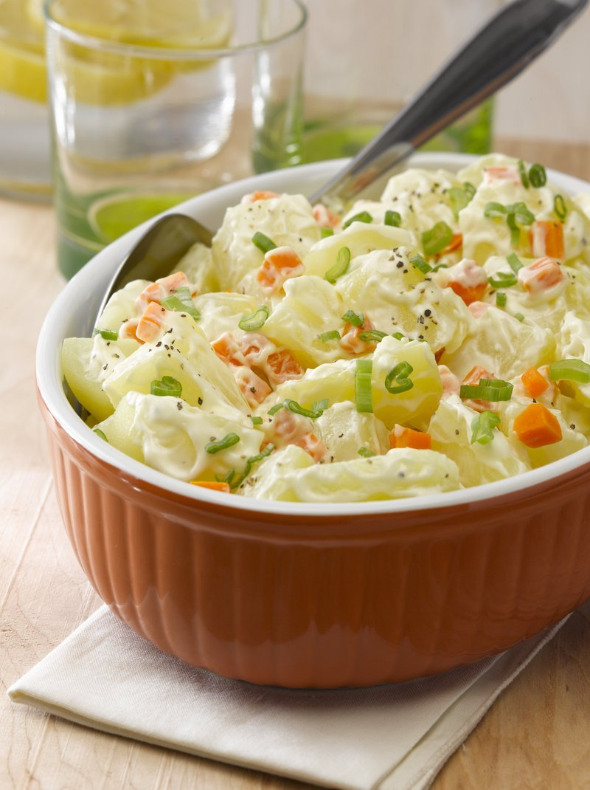

# Papas Mayo

*Chilean potato salad: warm boiled potatoes folded with mayonnaise, sliced spring onion, hard-boiled egg, a touch of mustard and parsley. Simpler than the German or American versions, more about good potatoes and a generous mayo than about pickles or bacon. Eaten alongside grilled meats, fried fish or roast chicken - the Sunday-lunch staple.*

**Serves:** 4 as a side

**Prep Time:** 15 minutes

**Cook Time:** 25 minutes

## Overview
Floury potatoes boil whole in their skins; peel and dice while still warm. Mix with hard-boiled egg, sliced spring onion, Dijon, mayonnaise, white wine vinegar, salt, pepper, parsley. Toss gently. Best slightly warm - the mayo grips the potato and the egg crumbles softly.

## Ingredients

- 800 g floury potatoes (Maris Piper, King Edward, Yukon Gold)
- 1 tablespoon salt (for boil)
- 3 hard-boiled eggs (chopped)
- 4 spring onions (sliced thin)
- 6 tablespoons mayonnaise
- 2 tablespoons Dijon mustard
- 1 tablespoon white wine vinegar
- 1 teaspoon salt (to taste)
- ½ teaspoon ground black pepper
- 3 tablespoons fresh parsley (chopped)

## Method

### Stage 1 - Boil
1. Wash potatoes; place in a large pot; cover with cold water; add salt.
1. Bring to a boil; cook 18-22 minutes until a knife slides through easily.
1. Drain; cool 5 minutes.

### Stage 2 - Peel and dice
1. While still warm but cool enough to handle, peel the skins off with fingers or a paring knife.
1. Dice into 2 cm cubes.

### Stage 3 - Mix
1. In a wide bowl, whisk mayonnaise, mustard, vinegar, salt, pepper.
1. Add the warm potato, chopped egg, spring onions and parsley.
1. Toss gently - keep some potato chunks intact.

### Stage 4 - Serve
1. Best slightly warm or at room temperature.
1. Serve alongside grilled steaks, sausages, fried fish, or chicken.

## Notes
- **Warm potato grabs the mayo:** Cold-mixed potato salad has dressing pooling at the bottom. Mix warm; the potato absorbs.
- **Floury not waxy:** Waxy potatoes give chunky pieces but hold shape too well; floury gives some crumble and some chunk.
- **Mayo + Dijon:** The Chilean ratio. Don't add too much mustard - it should be a background sharpness.

## Storage
- Refrigerate 3 days. Bring to room temperature before serving.
