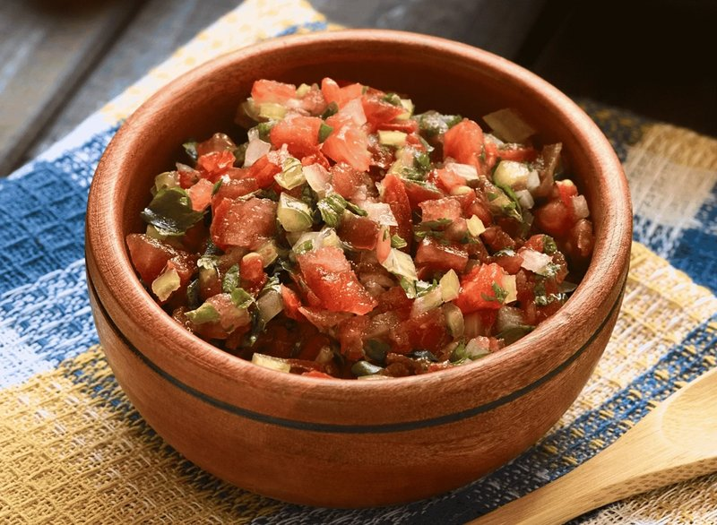

# Pebre

*Chile's table salsa: a fresh chunky relish of tomato, onion, coriander, ají chilli, garlic, olive oil and lemon (or red wine vinegar). Spooned over fresh bread before a meal; alongside grilled meats and empanadas; with chorrillana, cazuela, anything. The Chilean equivalent to chimichurri but tomato-forward.*

**Serves:** 6 (small bowl)

**Prep Time:** 12 minutes

**Cook Time:** 0 minutes

## Overview
Chile's table salsa, the fresh chunky relish that turns up in a small bowl next to bread before any meal and stays on the table until everything is gone. You chop tomato, onion and coriander fine (smaller than a chopped salad, almost a relish), then combine with crushed garlic, ají chilli (or red chilli if ají isn't around), olive oil, vinegar or lemon, salt and pepper. Fold gently and let sit for ten minutes so the flavours mingle. Eat with fresh bread before a meal, spooned over grilled meat, alongside empanadas, with chorrillana, with cazuela. Basically with anything savoury that comes out of a Chilean kitchen.

## Ingredients

- 3 ripe tomatoes (deseeded, finely diced)
- 1 red onion (small, very finely chopped)
- 1 large bunch fresh coriander (40 g, finely chopped)
- 2 garlic cloves (crushed)
- 1-2 fresh red chillies, or 1 ají chilli (very finely chopped)
- 4 tablespoons olive oil
- 2 tablespoons red wine vinegar (or lemon juice)
- 1 teaspoon salt
- ½ teaspoon ground black pepper

## Method

### Stage 1 - Chop
1. Dice tomato, onion to a small 4-5 mm size.
1. Finely chop coriander and chilli.

### Stage 2 - Combine
1. In a small serving bowl, combine all chopped ingredients with garlic.
1. Pour over olive oil and vinegar; sprinkle salt and pepper.
1. Stir gently.

### Stage 3 - Rest
1. Let sit 10 minutes for flavours to mingle.

### Stage 4 - Serve
1. Taste; adjust salt and vinegar.
1. Place at the table with bread, grilled meats, or empanadas.

## Notes
- **Tomato seeds out:** Bleed water and dilute the sauce.
- **Coriander generously:** A small bunch (40 g, stems and leaves) is right. Pebre is herbal-forward.
- **Heat:** Ají de color is the Chilean original, mild, fruity. Red Thai or Fresno chillies substitute. Adjust to taste.

## Storage
- Refrigerate 2 days. The vegetables soften but the sauce keeps.
