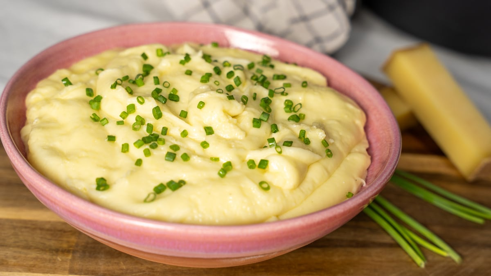

# Puré de Papas Chileno

*Chile's mashed potato: floury potatoes boiled then mashed silky-smooth with butter, milk, salt and a touch of nutmeg. The Chilean Sunday-lunch side that accompanies plateada, lomo, pollo asado and any other major Chilean main course.*

**Serves:** 6

**Prep Time:** 15 minutes

**Cook Time:** 25 minutes

## Overview
Puré de papas is Chile's everyday mashed potato and the canonical side to any major Chilean main course: floury potatoes boiled till tender, drained, dried briefly over low heat, and mashed silky-smooth with plenty of butter and warm milk, seasoned with salt, white pepper and a touch of grated nutmeg. The dish distinguishes itself from Northern European or British mashed potatoes by the generous use of butter and the touch of nutmeg (the Chilean touch); also by the silky-smooth texture (passing through a ricer or food mill is canonical). Served with plateada, lomo a lo pobre, charquicán, or any rich Chilean main, providing a creamy comforting base. Three details define proper Chilean puré. First, floury potatoes. Maris Piper, Russet, or King Edward; floury potatoes give the proper silky mash. Waxy potatoes give a gluey result. Second, dry the potatoes after draining. Tip the drained potatoes back into the warm pan and let dry over very low heat for 1-2 minutes to evaporate excess moisture; this is essential for the proper texture. Third, warm milk and butter. Cold milk added to hot potatoes seizes; warming the dairy first gives a silky result.

## Ingredients

- 1.2 kg floury potatoes (Maris Piper, Russet, King Edward; peeled and cubed)
- 100 g unsalted butter (cubed)
- 250 ml whole milk (warmed)
- 1 ½ teaspoons fine sea salt
- ½ teaspoon ground white pepper
- ¼ teaspoon ground nutmeg
- 2 tablespoons fresh chives (chopped; optional)

## Method

### Stage 1 - Cook the potatoes
1. Place the cubed potatoes in a large pot with cold water and 1 teaspoon of salt.
2. Bring to a boil; cook 15-18 minutes till the potatoes are properly tender (a knife slides through easily).

### Stage 2 - Drain and dry
1. Drain thoroughly.
2. Tip back into the warm pan; let dry over very low heat for 1-2 minutes (removes excess moisture; essential for the proper texture).

### Stage 3 - Mash
1. Use a potato masher or push the potatoes through a ricer/food mill for the silkiest finish.
2. Mash till smooth (no lumps).

### Stage 4 - Add butter and milk
1. Add the cubed butter; whisk till melted.
2. Add the warm milk in two additions, whisking between, till the mash is silky and smooth.
3. The mash should hold a soft trail behind a spoon; loose but not runny.

### Stage 5 - Season
1. Add the salt, white pepper and nutmeg.
2. Taste; adjust salt.

### Stage 6 - Serve
1. Transfer to a serving bowl.
2. Make a small well in the centre; add a knob of butter to melt.
3. Scatter chives if using.
4. Serve immediately as a side.

## Notes
- **Floury potatoes only:** waxy potatoes give gluey mash.
- **Dry the potatoes before mashing:** essential for silky texture.
- **Warm milk:** cold milk seizes the potatoes.
- **Nutmeg is the Chilean touch:** distinguishes from generic mash.
- **Don't over-mash:** especially if using an electric mixer; too much beating gives gluey paste.

## Variations
**With sour cream:** swap 100 ml of milk for sour cream; richer tangier version.
**Roasted garlic puré:** add 1 head of roasted garlic mashed in; gives a sweet garlic depth.
**Cheese puré:** add 100 g of grated mature cheese (Parmesan or sharp cheddar) when whisking in butter; gives a richer cheesy mash.
**Olive oil puré:** swap butter for extra virgin olive oil; gives a lighter Mediterranean-leaning version.

## Serving
With any Chilean main: plateada, lomo a lo pobre, charquicán, asado, roasted chicken. As Sunday lunch.

## Storage
- Best eaten warm and fresh.
- Keeps refrigerated 2 days; reheat with a splash of milk in a saucepan over low heat.
- Don't freeze; the texture suffers.
