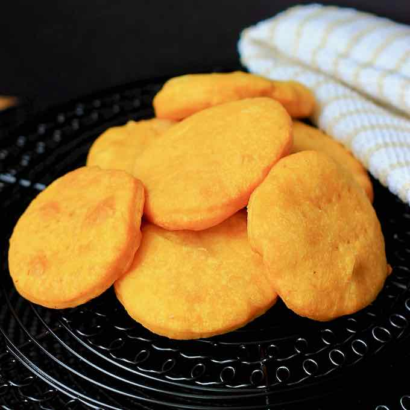

# Sopaipillas

*Chile's rainy-day flatbread: pumpkin-and-flour discs deep-fried golden and puffed. Eaten warm with pebre, mustard or a smear of butter.*

**Serves:** 6 (makes 15-18)

**Prep Time:** 25 minutes (plus 30 minutes resting)

**Cook Time:** 25 minutes

## Overview
Pumpkin (or butternut) cubes boil, drain, mash. The warm purée mixes with flour, melted butter, baking powder and salt to a soft, pliable dough. Rest for 30 minutes. Roll to 5 mm thick; stamp out 8 cm rounds; pierce each twice with a fork. Fry at 170°C 90 seconds per side until deep gold.

## Ingredients

- 500 g pumpkin (or butternut squash, peeled, cut into 3 cm chunks)
- 1 teaspoon salt (for boil)
- 450 g plain flour
- 2 teaspoons baking powder
- 1 teaspoon salt
- 60 g unsalted butter (melted)
- 1 litre vegetable oil for deep frying

## Method

### Stage 1 - Pumpkin
1. Place pumpkin in a pot with salted water to cover; bring to a boil.
1. Cook 15 minutes until very tender.
1. Drain very thoroughly; return to the dry pot; mash to a smooth purée.
1. Cool to lukewarm - too hot melts the butter unevenly.

### Stage 2 - Dough
1. Whisk flour, baking powder, salt in a wide bowl.
1. Add 400 g of the warm pumpkin purée and the melted butter; mix to a soft dough.
1. Knead 3-4 minutes on a lightly floured surface - the dough should be soft and slightly sticky but workable.
1. Cover; rest 30 minutes.

### Stage 3 - Shape
1. Roll the dough on a floured surface to 5 mm thick.
1. Stamp out 8 cm rounds with a cutter or glass.
1. Pierce each round twice through the centre with a fork - this prevents puffing too dramatically.

### Stage 4 - Fry
1. Heat oil to 170°C in a deep pan.
1. Fry in batches of 4-5, 90 seconds per side, until deep gold.
1. Drain on kitchen paper.

### Stage 5 - Serve
1. Eat warm. Plain with butter, dipped in pebre, or spread with mustard.
1. For sweet sopaipillas pasadas, dunk in a hot chancaca syrup (brown sugar boiled with orange peel and cinnamon).

## Notes
- **Dry pumpkin:** Drain very well after boiling - wet pumpkin gives wet dough that won't fry crisp.
- **Don't roll too thin:** 5 mm is right. Thinner gives crispy crackers; thicker gives doughy centres.
- **Pierce them:** Without the fork holes, they balloon then collapse to leathery flatbreads. With the holes, they stay flat-ish and crisp.

## Storage
- Best eaten warm same day. Refresh briefly in a 200°C oven 3 minutes.
- The dough keeps 24 hours refrigerated; fry fresh.
