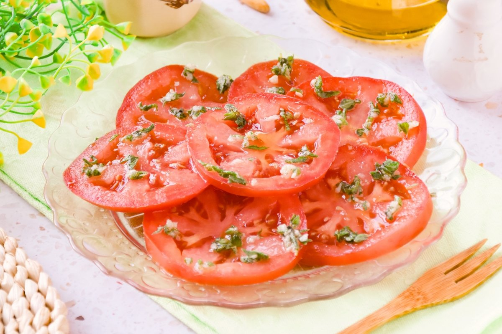

# Tomates Aliñados

*Chile's dressed tomato salad: thick slices of ripe tomato dressed with olive oil, white vinegar, sliced raw onion, a generous handful of fresh basil and a pinch of merkén. The Chilean summer table standard that arrives alongside grilled meats, fish, or any plate that needs a bright fresh counterpoint.*

**Serves:** 4-6

**Prep Time:** 10 minutes (plus 15 minutes resting)

**Cook Time:** 0 minutes

## Overview
Tomates aliñados (literally "dressed tomatoes") is Chile's simple summer tomato salad and one of the most pervasive side dishes across the country: thick slices of properly ripe tomatoes (the traditional Chilean tomate is meaty, sweet, fragrant, peak summer is the season) dressed with extra virgin olive oil, white vinegar, salt, pepper, fresh chopped basil and a small sprinkling of merkén (the Chilean smoked-chilli spice; or substitute with smoked paprika), with thinly sliced raw white or red onion mixed through. The dish distinguishes itself from generic tomato-and-onion salad by the merkén dust and the generous fresh basil. Served alongside grilled meats (asado), Pebre's cousin, baked fish, charquicán, any rich main that benefits from a bright acidic counterpoint. The dish lives or dies by tomato quality; use the ripest tomatoes you can find. Fresh basil is generous, not garnish. The merkén dust at the end is what makes the salad distinctly Chilean.

## Ingredients

- 6 large ripe tomatoes (sliced into 1 cm rounds)
- 1 medium white or red onion (very thinly sliced)
- 1 large handful fresh basil (chopped)
- 4 tablespoons extra virgin olive oil
- 3 tablespoons white wine vinegar (or apple cider vinegar)
- 1 ½ teaspoons fine sea salt
- 1 teaspoon ground black pepper
- 1 teaspoon merkén (or smoked paprika + a tiny pinch of cayenne)
- 1 teaspoon dried oregano (optional)

### Optional
- 2 garlic cloves (very finely crushed)
- A small handful fresh parsley (chopped)
- A few sliced black olives

## Method

### Stage 1 - Soak the onion (optional)
1. If using assertive raw onion, soak the sliced onion in cold water 10 minutes; drain.
2. Skip if you like the sharp version.

### Stage 2 - Arrange
1. Lay the tomato slices on a wide serving platter (slightly overlapping).
2. Scatter the sliced onion over.

### Stage 3 - Dress
1. Whisk together the olive oil, vinegar, salt, pepper, merkén, oregano and crushed garlic (if using).
2. Drizzle over the tomatoes.

### Stage 4 - Add herbs and rest
1. Scatter the chopped basil and parsley (if using) generously over.
2. Add olives if using.
3. Let stand 15 minutes at room temperature so the flavours meld and the tomatoes release some juice.

### Stage 5 - Serve
1. Serve at room temperature.

## Notes
- **Ripe tomatoes essential:** the dish depends on quality.
- **Fresh basil generously:** the Chilean touch.
- **Merkén dust:** distinguishes from generic tomato salad.
- **Let it rest:** flavours marry, tomatoes release juice.
- **Don't refrigerate:** serve at room temperature.

## Variations
**With avocado:** add 1 sliced ripe avocado; gives creaminess.
**With cheese:** add 80 g crumbled queso fresco or feta.
**With cucumber:** add 1 sliced cucumber.
**Spicier:** double the merkén; or add 1 sliced fresh chilli.

## Serving
At room temperature alongside any Chilean main: asado, pollo asado, lomo a lo pobre, baked fish. Marraqueta bread for sopping the juices.

## Storage
- Best eaten the day it's made.
- Keeps refrigerated 1 day; tomatoes break down further.
- Don't freeze.
