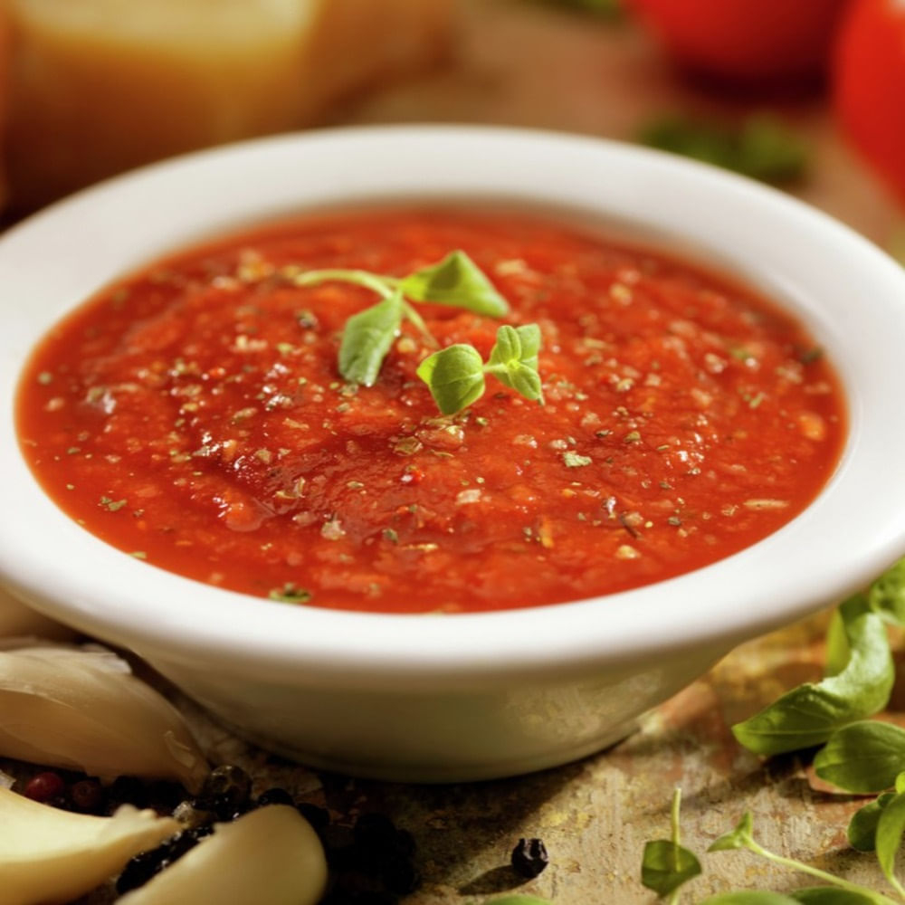

# Ají Chileno

*Chile's hot sauce: fresh ají (Chilean chillies) blitzed with garlic, cumin, oregano, lemon juice and olive oil into a thick fiery red-orange table condiment. The Chilean hot sauce that turns up at every asado, every empanada plate and every "completo" hot dog stand - distinct from but related to ají picante across South America.*

**Serves:** Makes about 300 ml

**Prep Time:** 15 minutes

**Cook Time:** 5 minutes

## Overview
Ají Chileno (or "salsa de ají") is Chile's foundational hot sauce, distinct from but related to the wider Latin American ají family: fresh hot Chilean ají chillies (typically ají cacho de cabra, the "goat's horn" chilli that becomes merkén when smoked) deseeded and blitzed with crushed garlic, cumin, dried oregano, fresh lemon juice, white vinegar, olive oil, salt and pepper into a thick red-orange relish. Outside Chile, substitute with serrano, jalapeño, or red bell plus cayenne mix for the colour and heat. Unlike Colombian ají picante (raw), the Chilean version is briefly cooked in oil to bloom the chilli flavours. Lemon adds the acidic brightness. The table condiment at every Chilean meal: alongside grilled meats, with empanadas, on completos, in sandwiches, alongside rice and beans.

## Ingredients

- 200 g fresh red hot chillies (ají cacho de cabra, serrano, red jalapeño, or red Anaheim; with stems removed)
- 1 medium red bell pepper (deseeded; for colour and sweetness)
- 8 garlic cloves
- 4 tablespoons olive oil
- 1 medium tomato (chopped; optional for body)
- 1 small white onion (chopped)
- 4 tablespoons fresh lemon juice
- 3 tablespoons white wine vinegar
- 1 tablespoon ground cumin
- 1 tablespoon dried oregano
- 1 ½ teaspoons fine sea salt
- 1 teaspoon ground black pepper
- 1 teaspoon caster sugar (balances acidity)

## Method

### Stage 1 - Prep the chillies
1. Cut the stems off the chillies.
2. For milder: cut lengthwise, scrape out seeds and white pith.
3. For fiercer: leave seeds in.
4. Roughly chop.

### Stage 2 - Sauté
1. Heat the olive oil in a wide pan over medium heat.
2. Add the chopped onion; cook 4 minutes till soft.
3. Add the crushed garlic; cook 30 seconds.
4. Add the chopped chillies and red bell pepper; cook 3-4 minutes till slightly softened.
5. Add the chopped tomato (if using); cook 2 minutes.
6. Add the cumin, oregano, salt and pepper.

### Stage 3 - Cool
1. Take off the heat; let cool 5 minutes.

### Stage 4 - Blitz
1. Transfer to a blender or food processor.
2. Add the lemon juice, vinegar and sugar.
3. Blitz till you have a thick smooth-ish purée (some texture is fine).

### Stage 5 - Rest
1. Transfer to a clean jar.
2. Refrigerate at least 1 hour to let the flavours meld.

### Stage 6 - Serve
1. Bring to room temperature; serve in a small bowl at the table.

## Notes
- **Adjust chilli heat:** seeds in for fierce, out for mild.
- **Briefly cooked:** distinguishes from raw versions.
- **Lemon for brightness:** essential.
- **Sugar balances acidity:** small touch, not sweetening.
- **Make in batches:** keeps 2 weeks refrigerated.

## Variations
**Smoky ají chileno (merkén-style):** add 1 tablespoon of merkén; smokier deeper version.
**Green ají:** use green chillies; add a handful of fresh coriander; gives a fresher tangier version.
**Aji con tomate:** double the tomato; gives a more salsa-like version.
**Aji con verduras:** add chopped carrot to the sauté; gives more body.

## Serving
At the table alongside grilled meats, completos, empanadas, rice dishes, sandwiches. With Chilean asado, lomo a lo pobre, charquicán. Drink: cold Cristal beer.

## Storage
- Keeps refrigerated 2 weeks in a sealed jar with a thin layer of olive oil on top.
- Freezes in ice cube trays for portion control; 3 months.
- Bring to room temperature before serving.
