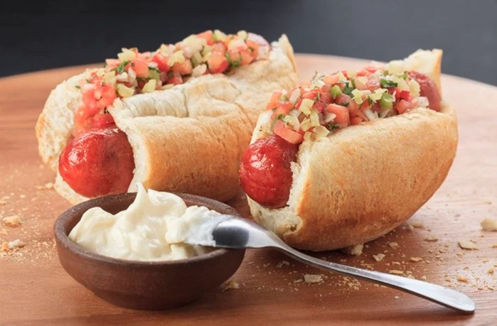

# Choripán Chileno

*Chile's street sandwich: grilled longaniza chorizo split lengthways, tucked into a roll and topped with pebre, a fresh tomato-coriander-garlic salsa.*

**Serves:** 4

**Prep Time:** 15 minutes

**Cook Time:** 12 minutes

## Overview
Chile's street sandwich and the food that fuels any Sunday football game or summer picnic. You take a Chilean longaniza (or any good fresh pork sausage), split it lengthways but leave it attached at one end so it opens like a butterfly, and grill it six minutes per side until the surface is charred and the inside still juicy. Marraqueta rolls split and toast briefly on the grill, the sausage tucks into the roll, and a generous spoonful of pebre goes on top. Some hands add a dab of mayo or mustard. Eat immediately, standing up, with a beer in the other hand.

## Ingredients

### Sausages and rolls
- 4 Chilean longaniza (or any good fresh chorizo / pork sausages; ~120 g each)
- 4 marraqueta rolls (or crusty hot-dog buns)
- 2 tablespoons neutral oil

### Pebre
- 2 ripe tomatoes (deseeded, finely diced)
- 1 red onion (small, finely diced)
- 30 g fresh coriander (chopped)
- 2 garlic cloves (minced)
- ½ tablespoon mild chilli
- ½ tablespoon smoked paprika
- 3 tablespoons olive oil
- 2 tablespoons red-wine vinegar
- 1 teaspoon salt

### Optional toppings
- Mayonnaise
- Mustard

## Method

### Stage 1 - Pebre
1. Combine the diced tomato, onion, coriander, garlic, ají or merkén, olive oil, vinegar and salt in a bowl.
1. Toss; rest 15 minutes.

### Stage 2 - Grill sausages
1. Heat a grill or griddle pan to medium-high.
1. With a sharp knife, slice each sausage lengthways, leaving the back attached so it opens like a butterfly.
1. Brush both sides with oil.
1. Grill 5-6 minutes per side, cut-side first, until charred outside and cooked through.

### Stage 3 - Toast rolls
1. Split the rolls partway through (not all the way).
1. Place cut-side-down on the grill 1 minute to toast lightly.

### Stage 4 - Assemble
1. Tuck a butterflied sausage into each roll.
1. Spoon generous pebre on top (be generous - it's the dish).
1. Add a drizzle of mayo or mustard if liked.

### Stage 5 - Serve
1. Eat immediately, standing if possible, with napkins.

## Notes
- **Butterfly the sausage:** opens up surface area for char and means it tucks flat into the roll. Whole-tube sausages don't fit cleanly.
- **Pebre fresh, not jarred:** the whole appeal is the bright fresh salsa over hot sausage. Day-old pebre is fine; week-old is not.
- **Merkén is iconic but optional:** the Chilean smoked-chilli powder gives a particular smoky heat. Smoked paprika + a pinch of cayenne is a close substitute.

## Storage
- Eats immediately - don't pre-assemble.
- Pebre keeps 3 days refrigerated; flavour deepens.
- Grilled sausages reheat poorly; cook to order.
