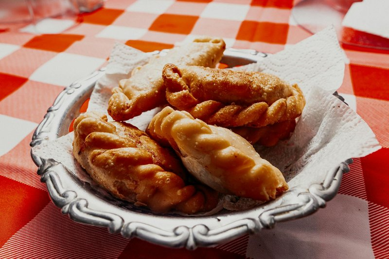

# Empanadas de Queso

*Small Chilean cheese empanadas - different from the larger beef-filled empanadas de pino. Half-moons of butter-rich dough wrapped around a generous filling of melting queso fresco or mozzarella, deep-fried golden. Eats hot, the cheese stretching as you bite. The pop-in-the-mouth snack at Chilean parties, fondas (national holidays), and family gatherings.*

**Serves:** Makes 16 empanadas

**Prep Time:** 45 minutes (plus 30 minutes resting)

**Cook Time:** 20 minutes

## Overview
Dough: flour, salt, butter, warm milk, an egg - kneads to a smooth pliable dough; rests 30 min. Filling: queso fresco or mozzarella cubes about 1 cm; a sprinkle of oregano. Dough divides; each ball rolls to a 10 cm disc; filling sits in the centre; folds in half; edges crimp with a fork. Deep-fries in moderately hot oil 3 minutes per side till deep gold. Drains briefly. Eats hot.

## Ingredients

### Dough
- 400 g plain flour
- 1 ½ teaspoons salt
- 80 g unsalted butter (melted)
- 200 ml warm milk
- 1 large egg
- 1 tablespoon white vinegar

### Filling
- 350 g mozzarella OR queso fresco (cut into 1 cm cubes)
- 1 teaspoon dried oregano
- ½ teaspoon ground black pepper

### Frying
- 800 ml neutral oil

### Egg wash (for sealing)
- 1 egg (beaten)

## Method

### Stage 1 - Dough
1. In a wide bowl, whisk flour and salt.
1. Make a well; pour in the melted butter, warm milk, egg and vinegar.
1. Mix to a shaggy dough; knead 6 minutes till smooth and supple.
1. Rest in a covered bowl 30 minutes.

### Stage 2 - Filling
1. Toss the cheese cubes with oregano and pepper.

### Stage 3 - Roll and fill
1. Divide the dough into 16 balls (about 45 g each); keep covered.
1. Roll each ball to a 10 cm disc on a lightly floured surface.
1. Place 3-4 cheese cubes in the centre.
1. Brush the edge with egg wash.
1. Fold in half to a half-moon.
1. Crimp the edge firmly with the tines of a fork.

### Stage 4 - Fry
1. Heat oil to 175°C.
1. Lower 4 empanadas at a time; fry 3 minutes per side till deep gold.
1. Lift onto a wire rack.

### Stage 5 - Serve
1. Eat hot; the cheese pulls in strands.

## Notes
- **Crimp firmly:** any gap and the cheese leaks into the oil during frying.
- **Don't overfill:** too much cheese and the empanadas burst. 3-4 cubes is the sweet spot.
- **Hot oil, not just warm:** below 170°C the dough absorbs oil and the empanadas are greasy.

## Storage
- Best within 10 minutes of frying.
- Unfried empanadas freeze on a tray, then bag; fry from frozen + 1 minute per side.
- Cooked: reheat 5 minutes in a 200°C oven.
