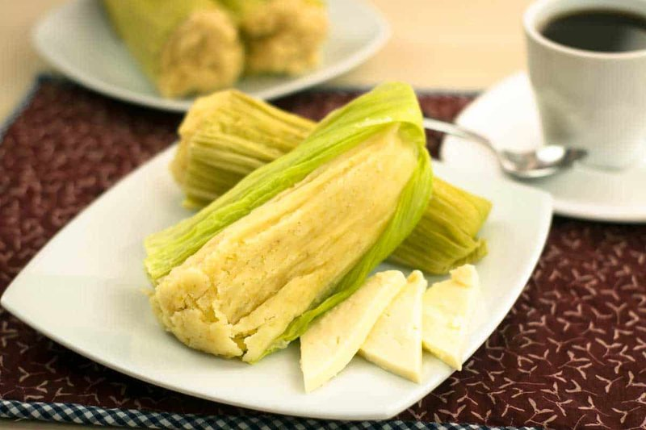

# Humitas

*Fresh corn pulped with basil, onion and butter, wrapped in corn husks and steamed into tender parcels. The Andean / Chilean answer to a tamale, but unfilled - just sweet fresh corn, intensified. Eats hot with a sprinkle of sugar (savoury-sweet at the table) or with pebre alongside.*

**Serves:** 6 (makes 12 humitas)

**Prep Time:** 30 minutes

**Cook Time:** 50 minutes

## Overview
The Andean-Chilean answer to the Mexican tamale, but unfilled: just sweet fresh corn intensified by being pulped, wrapped in its own husk, and steamed into tender parcels. Fresh sweetcorn is shucked and the husks saved in warm water to soften. The kernels strip from the cob in two parts: half get pulsed to a coarse paste, half stay whole, and the two textures combine in the bowl with onion softened in butter with paprika and salt. A heaped tablespoon of mixture goes onto each softened husk, the sides are folded in, the ends folded down, and a thin strip of husk ties the parcel closed. Steamed for 45 minutes till the corn sets. Served hot with a sprinkle of sugar (the savoury-sweet contrast happens at the table) or with pebre alongside for a saltier finish.

## Ingredients
- 6 fresh ears of sweetcorn (with their husks)
- 1 onion (medium, finely diced)
- 50 g butter
- 1 teaspoon sweet paprika
- 1 teaspoon salt
- ½ teaspoon ground white pepper
- 8 fresh basil leaves (chopped)
- 2 tablespoons fine cornmeal (optional - only if mixture seems too wet)

### To serve
- Sugar (a bowl at the table - guests sprinkle to taste)
- [Pebre](../side-dishes/pebre.md) (Chilean salsa), optional

## Method

### Stage 1 - Prep husks
1. Carefully peel husks off the corn, keeping them whole. Save the inner large leaves and a few thin strips for tying.
1. Cover husks with warm water; soak 20 minutes to soften.
1. Shave the kernels off the cobs with a sharp knife.

### Stage 2 - Filling
1. Pulse half the corn kernels in a food processor to a coarse paste; leave the other half whole.
1. Soften the onion in butter over medium heat 8 minutes till translucent.
1. Stir in the paprika, salt, white pepper; cook 30 seconds.
1. Off heat; stir in the corn paste, whole kernels and chopped basil.
1. If the mixture is very wet, stir in 2 tablespoons cornmeal.

### Stage 3 - Wrap
1. Drain the husks; pat dry.
1. Lay a large husk flat (or overlap two smaller ones); spoon 3 heaped tablespoons of filling in the centre.
1. Fold the long sides over the filling; fold the pointed end down; fold the wide end up.
1. Tie around the middle with a thin strip of husk.

### Stage 4 - Steam
1. Set a steamer over a pot of boiling water.
1. Pack humitas seam-side-down; cover; steam 45 minutes.

### Stage 5 - Serve
1. Lift onto a platter; let each diner unwrap their own.
1. Provide sugar in a small bowl (a Chilean tradition: each diner sprinkles a little).
1. Serve with pebre alongside if liked.

## Notes
- **Fresh corn only:** frozen kernels weep too much water; tinned has the wrong flavour. Use fresh in season.
- **Don't over-pulse:** half-paste, half-whole gives the right texture. All-puréed humitas are baby food.
- **Tie firmly:** loose parcels unwrap during steaming.

## Storage
- Keep 3 days refrigerated in their husks.
- Re-steam 10 minutes to reheat.
- Freeze 2 months; thaw overnight; re-steam.
