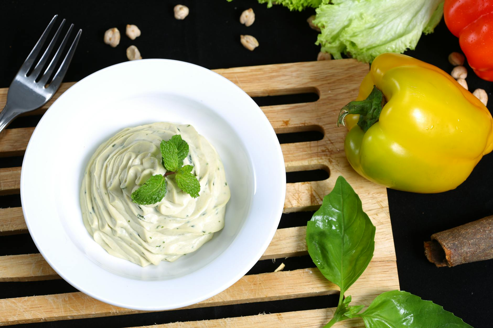

# Mayonesa Chilena

*Chile's homemade mayonnaise: an emulsion of egg yolks, sunflower oil, lemon juice, salt and a touch of mustard, whisked or blitzed till thick and pale. The Chilean condiment that goes on practically everything, Chileans are famously the world's heaviest per-capita mayonnaise consumers.*

**Serves:** Makes about 350 ml

**Prep Time:** 15 minutes

**Cook Time:** 0 minutes

## Overview
Mayonesa chilena is Chile's pervasive homemade mayonnaise and one of the most beloved Chilean condiments. Chileans are famously the world's heaviest per-capita consumers of mayonnaise, putting it on completos (Chilean hot dogs), churrasco italiano (the iconic sandwich with avocado, tomato and mayo), sopaipillas, papas fritas, salads, sandwiches, and sometimes just slathered on bread. The homemade version uses egg yolks, sunflower oil, fresh lemon juice, a touch of Dijon and salt, whisked or blitzed till the mixture emulsifies into a thick pale-yellow sauce. The taste is dramatically different from commercial Hellmann's: brighter, fresher, properly acidic, with a real lemon-egg-mustard flavour. Sunflower oil is the traditional Chilean choice; olive oil is too strong at home-mayo strength. Room-temperature ingredients are essential or the emulsion won't form. Drizzle the oil drop by drop at first, then a thin stream; adding it too fast is the most common failure.

## Ingredients

- 2 large egg yolks (room temperature); OR 1 whole egg (room temperature) for the easier stick-blender version
- 1 teaspoon Dijon mustard
- 2 tablespoons fresh lemon juice (or white vinegar)
- 1 teaspoon fine sea salt
- ½ teaspoon ground white pepper
- 300 ml sunflower oil (or vegetable oil; or rapeseed oil)

### Optional flavourings (for variants)
- 2 garlic cloves (crushed): for aioli-style
- 1 small bunch fresh herbs (parsley, dill, chives): for green mayo
- 1 teaspoon Aleppo pepper or merkén, for spicy mayo

## Method (Hand-whisked classic version)

### Stage 1 - Combine base
1. Place the egg yolks in a wide bowl.
2. Add the Dijon, half the lemon juice, salt and white pepper.
3. Whisk together till smooth and slightly thickened.

### Stage 2 - Add oil very slowly
1. Begin adding the oil drop by drop while whisking constantly.
2. As the emulsion starts to form (the mixture thickens and turns pale), increase to a thin stream.
3. Keep whisking continuously.
4. Continue till all the oil is incorporated and the mayonnaise is thick and pale.

### Stage 3 - Adjust
1. Whisk in the remaining lemon juice.
2. Taste; adjust salt and lemon.

## Method (Stick-blender version, easier)

### Stage 1 - Combine in a tall narrow jug
1. Place 1 whole room-temperature egg in a tall narrow jug.
2. Add the Dijon, lemon juice, salt and pepper.
3. Pour all the oil over the egg.

### Stage 2 - Blitz
1. Insert a stick blender all the way to the bottom of the jug; don't move it.
2. Blitz for 10-15 seconds without moving the stick blender; the emulsion forms at the bottom.
3. Once the emulsion is established (you'll see it turn pale yellow at the bottom), slowly lift the stick blender up while still blitzing.
4. Continue till all the oil is emulsified.
5. The whole process takes about 30 seconds.

### Stage 3 - Adjust
1. Taste; adjust salt and lemon.
2. Add any flavourings (garlic, herbs, chilli).

## Notes
- **Room temperature ingredients:** essential. Cold eggs don't emulsify properly.
- **Sunflower or vegetable oil:** olive oil is too strong.
- **Add oil slowly:** the most common failure point.
- **If it breaks (separates):** start with a new yolk in a clean bowl; slowly whisk the broken mayo into the new yolk; the emulsion will reform.
- **Use within a week:** raw egg means short shelf life.

## Variations
- **Aioli chileno:** add 2-4 crushed garlic cloves; gives the traditional Chilean garlic version.
- **Mayo verde:** add 1 small bunch of finely chopped fresh herbs (parsley, chives, dill); gives a green herby version.
- **Spicy mayo (mayo picante):** add 1 teaspoon of merkén + 1 chopped chilli; gives the Chilean spicy version.
- **Avocado mayo:** blitz 1 ripe avocado into the finished mayo; gives a creamy guacamole-mayo hybrid; the traditional sauce for churrasco italiano.

## Serving
- With everything Chilean: completos (Chilean hot dogs), churrasco italiano, sandwiches, sopaipillas, papas fritas, salads. Chileans put it on practically anything.

## Storage
- Keeps refrigerated 1 week in a sealed jar.
- Don't freeze; the emulsion breaks.
- Use raw-egg-aware kitchen safety; keep refrigerated at all times.
- If it separates after storage, blitz with the stick blender briefly to re-emulsify.
