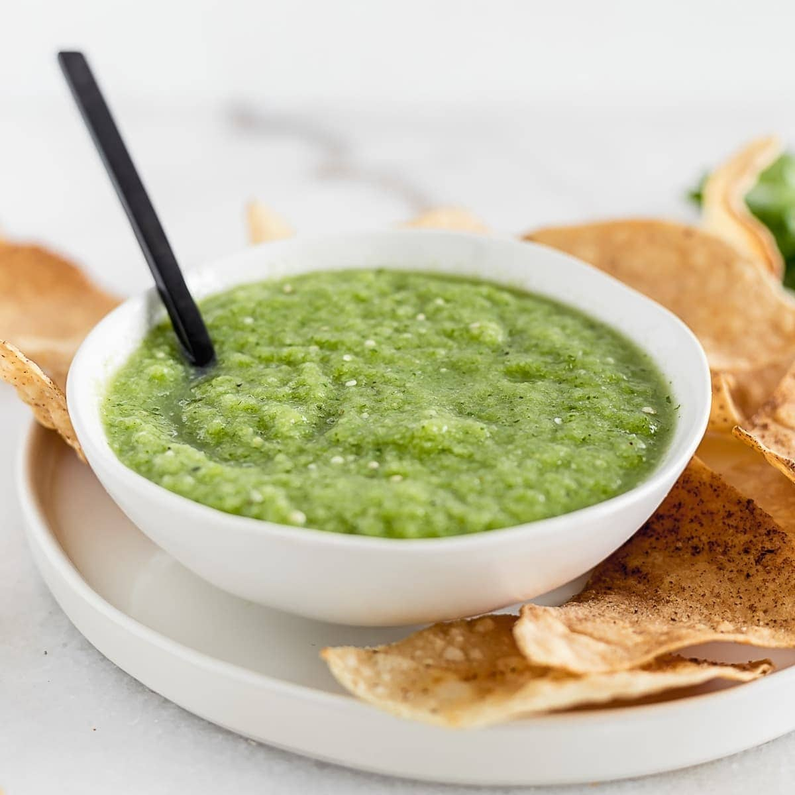

# Salsa Verde Chilena

*Chile's parsley-coriander green sauce: finely chopped fresh parsley, coriander, scallions, garlic, lemon juice and olive oil, blitzed to a vivid green relish. The Chilean herbal sauce that complements grilled meats, fish and roasted vegetables, sharper and herbier than its Italian cousin.*

**Serves:** Makes about 250 ml

**Prep Time:** 15 minutes

**Cook Time:** 0 minutes

## Overview
Salsa verde Chilena is Chile's version of the wider Latin/Iberian green-sauce family, distinct from the Italian salsa verde (which uses capers, anchovies, and breadcrumbs) and the Argentine chimichurri (which is more oregano-dominant): a vivid green relish made from finely chopped fresh flat-leaf parsley, fresh coriander, spring onions, garlic, lemon juice, white wine vinegar, olive oil, salt and pepper, sometimes with a touch of merkén for warm depth. The dish is used as a table condiment alongside grilled meats (asado), grilled fish, roasted chicken and vegetables, providing a bright fresh herby counterpoint to the richer mains. Both herbs go in together; parsley alone or coriander alone is acceptable but the pair is traditional. The texture should be chunky, not a smooth purée; visible bits of herb. Combined raw, not cooked, and best eaten within 24 to 48 hours while the herbs are still bright.

## Ingredients

- 1 large bunch fresh flat-leaf parsley (about 50 g; chopped)
- 1 large bunch fresh coriander (about 50 g; chopped)
- 6 spring onions (finely sliced)
- 6 garlic cloves (crushed)
- 1 fresh green chilli (deseeded, finely chopped; or 1 jalapeño)
- 6 tablespoons extra virgin olive oil
- 3 tablespoons fresh lemon juice
- 2 tablespoons white wine vinegar
- 1 teaspoon merkén (or smoked paprika + a pinch of cayenne)
- 1 ½ teaspoons fine sea salt
- 1 teaspoon ground black pepper
- 1 teaspoon dried oregano

### Optional additions
- 2 tablespoons capers (drained, chopped)
- 1 tablespoon honey or a tiny pinch of sugar (balances acidity)

## Method

### Stage 1 - Chop the herbs
1. Finely chop the parsley, coriander, spring onions, and chilli.

### Stage 2 - Combine
1. In a wide bowl, combine all chopped ingredients.
2. Add the olive oil, lemon juice, vinegar, merkén, salt, pepper and oregano.
3. Stir to combine.
4. Add capers and honey/sugar if using.

### Stage 3 - Rest
1. Cover and rest 20-30 minutes at room temperature so the flavours meld.

### Stage 4 - Serve
1. Stir before serving.
2. Transfer to a small jug or bowl.

## Notes
- **Two herbs together:** parsley AND coriander is traditional.
- **Chunky texture:** not a paste.
- **Fresh, not cooked:** stays bright.
- **Adjust merkén for heat:** light or fierce.

## Variations
- **With anchovy (Italian-leaning):** add 4 anchovy fillets finely chopped; gives Italian salsa verde character.
- **With capers:** add 2 tablespoons chopped capers; gives more brininess.
- **Spicier:** double the chilli; add 1 chopped habanero.
- **With basil:** add 1 small bunch fresh basil; common variation.

## Serving
- Alongside grilled meats (Chilean asado), grilled fish, roasted chicken, baked potatoes, bread. As a dipping sauce or a drizzle.

## Storage
- Keeps refrigerated 4 days in a sealed jar; herbs go drab after that.
- Don't freeze; herbs lose freshness.
- Make small batches.
