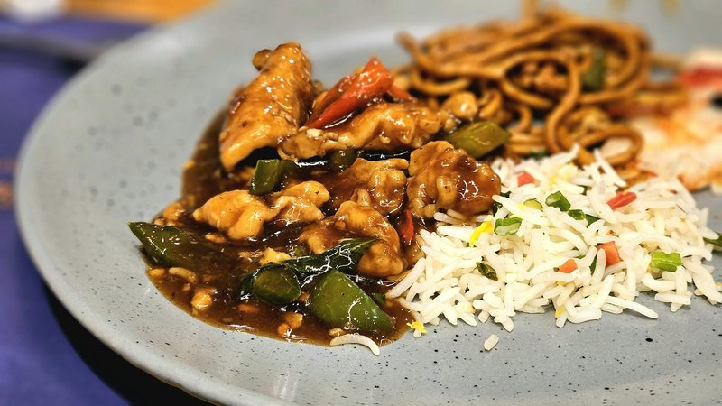

# Chicken in Black Bean Sauce

*A Cantonese stir-fry: chicken pieces tossed hot in a sauce of salted black beans, garlic, ginger and Shaoxing wine.*

**Serves:** 4
**Prep Time:** 15 minutes
**Cook Time:** 6 minutes

## Overview
Fermented black beans are the funk you can't fake; this is the dish where they earn their place at the front of the wok. Bone-in chicken wings are the right cut here because they cook fast under high heat while the skin renders and crisps along the cut edges. You bash the dried black beans with garlic until they're coarsely smashed (don't blitz them to a paste, you want texture), then fry them in oil with ginger until they release that distinctive briny, almost coffee-bitter aroma that says you're cooking real Cantonese. The wings go in, get tossed in the bean mixture, then deglaze with Shaoxing and a splash of stock so a sticky savoury slick coats every piece. Serve with steamed rice and a pile of stir-fried greens.

## Ingredients

### Protein & Marinade
- 450 grams chicken wings (cut in half at the joint)
- 1 tablespoon light soy sauce
- 1 tablespoon dry sherry (or rice wine)

### Cooking
- 2 teaspoons groundnut oil
- 1 tablespoon fresh ginger (finely chopped)
- 1 tablespoon garlic (finely chopped)
- 1 ½ tablespoons black beans (coarsely chopped)
- 1 red pepper (chopped)
- 1 ½ tablespoons spring onions (finely chopped)
- 150 ml Chinese chicken stock

## Method

### Stage 1 - Prepare & Marinate
1. Cut each chicken wing in half at the joint and place in a bowl.
1. Mix together the soy sauce and sherry or rice wine, and pour over the chicken pieces.
1. Leave to marinate for about 1 hour, then drain the chicken and discard the marinade.

### Stage 2 - Stir-Fry Aromatics
1. Heat a wok or large frying pan and add the oil when it is hot.
1. Immediately add the ginger.
1. Stir-fry the ginger for a few seconds, then add the garlic, spring onions, red pepper and black beans.

### Stage 3 - Brown & Simmer
1. A few seconds later, add the chicken and stir-fry for 2-5 minutes at high heat until golden brown.
1. Add the stock and bring the mixture to the boil.
1. Immediately reduce the heat to low and simmer for 15 minutes, or until the chicken is cooked through.

## Notes
- **Black beans:** Fermented black beans (douchi) add essential umami depth. Rinse before using to remove excess salt if preferred.
- **Chicken wings:** The best choice for this dish, they remain moist and cook quickly. All dark meat ensures flavourful results.
- **Aromatics:** Fragrant ginger and garlic are essential. Add early to infuse the oil and build flavour layers.

## Serving
- Serve with: Stir-fried spinach with garlic, or steamed rice

## Storage
- Keeps 2-3 days refrigerated
- Freezes well up to 2 months
- Flavour deepens after 24 hours
