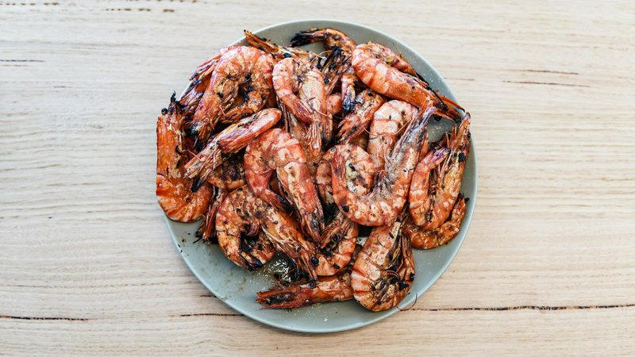

# Braised Prawns

*A Cantonese braised prawn: shell-on prawns simmered in a ginger-soy-Shaoxing sauce till the shells turn coral and the sauce thickens to a.*

**Serves:** 4
**Prep Time:** 10 minutes
**Cook Time:** 2 minutes

## Overview
This is what street vendors across southern China make in big shallow woks at the front of their stalls, head-on prawns sliding around in a slick of garlicky soy that takes the colour of caramel as it reduces. The beauty is in how little it asks of you: get the ginger and spring onions thick-sliced ahead of time, have the soy-sugar-Shaoxing mixture in a jug ready to pour, and you're four minutes from finished prawns. You sear the prawns in their shells over hard heat so the shells caramelise (that's where most of the flavour lives), pull them out, build the sauce in the same pan, then return the prawns to glaze. Eat them with your fingers, suck the heads, dip the meat in the dregs of the wok. Equally good hot off the heat or cold the next day from the fridge for a picnic plate.

## Ingredients

### Protein
- 225 grams prawns (shelled and de-veined)

### Braising Sauce
- 1 ½ tablespoons spring onions (finely chopped)
- 2 teaspoons fresh ginger (finely chopped)
- 1 tablespoon dry sherry (or rice wine)
- 1 tablespoon light soy sauce
- 70 ml Chinese chicken stock

## Method

### Stage 1 - Prepare
1. Wash and pat dry the prawns on kitchen paper.

### Stage 2 - Build Braising Sauce
1. Combine the braising sauce ingredients together in a wok or large saucepan and bring to the boil.
1. Turn the heat down low and simmer for 2 minutes.

### Stage 3 - Braise Prawns
1. Add the prawns and stir, mixing them in well.
1. Cover the pan and braise for 2 minutes.
1. Serve at once or allow to cool and serve cold.

## Notes
- **Prawn quality:** Use fresh, high-quality prawns for best results. Frozen prawns should be thawed and well-drained.
- **Quick cooking:** Prawns cook very fast, overcooking makes them rubbery. The 2-minute braise is sufficient for most medium prawns.
- **Versatile serving:** Equally excellent served hot as a quick stir-fry or chilled as a starter or picnic dish.
- **Aromatics:** Fresh ginger and spring onions are essential, don't skip these for the fragrant, authentic flavour.

## Serving
Serve hot with: Steamed rice
Serve cold as: A starter or light picnic dish

## Storage
- Keep 1-2 days refrigerated
- Serve cold within a few hours for best texture (prawns can become rubbery if refrigerated too long)
- Not recommended for freezing (prawns lose texture quality)
