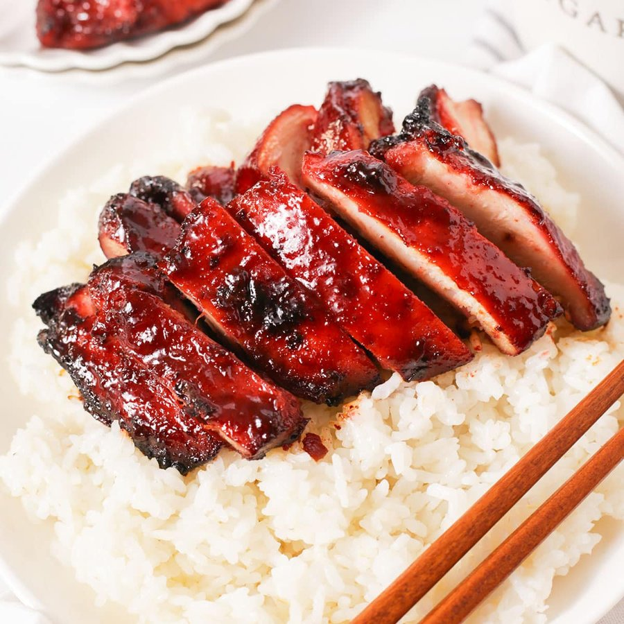

# Cantonese BBQ Chicken

*Cantonese roast-shop chicken: thighs lacquered in hoisin, soy and honey, grilled over coals till the skin crisps to deep mahogany and the glaze sticks.*

**Serves:** 4

**Prep Time:** 15 minutes (plus 4 hours marinating, ideally overnight)

**Cook Time:** 25 minutes

## Overview
A summer-BBQ adaptation of the lacquered red roast meats that hang in the windows of Cantonese siu mei shops. The marinade borrows from char siu (hoisin, soy, Shaoxing wine, five-spice, fermented bean curd, garlic, ginger) but pulls back on the sugar, since chicken doesn't need as much sweetness as pork shoulder. Bone-in skin-on thighs are the right cut: they stay juicy on the grill, the skin renders down and crisps, and the bones give the meat shape. The thighs cook over indirect heat first, then move directly over the coals for the last few minutes while a honey-maltose glaze is brushed on repeatedly. Every brush of glaze caramelises, blackens slightly at the edges, then gets brushed again. The result is sticky-shiny with a smell that is half five-spice, half woodsmoke. A two-zone fire is the only real requirement. Serve sliced over plain rice with sliced cucumber and a spoon of chilli oil, or stuffed into bao with hoisin and spring onion.

## Ingredients

### Chicken
- 8 bone-in skin-on chicken thighs (about 1.2 kg)

### Marinade
- 3 tbsp hoisin sauce
- 2 tbsp light soy sauce
- 1 tbsp dark soy sauce
- 2 tbsp Shaoxing rice wine
- 2 tbsp oyster sauce
- 1 tbsp toasted sesame oil
- 1 tbsp grated ginger
- 4 garlic cloves, finely grated
- 2 tsp Chinese five-spice powder
- 1 tbsp soft brown sugar
- 1 cube fermented red bean curd (nam yu), mashed (optional, for the classic siu mei red tint)
- ½ tsp white pepper

### Glaze
- 3 tbsp honey
- 1 tbsp maltose (or extra honey)
- 1 tbsp hot water

### To serve
- Steamed jasmine rice
- Sliced cucumber
- Spring onion, sliced fine on the bias
- Chilli oil

## Method

### Stage 1 - Marinate
1. Pat the chicken thighs dry with kitchen paper.
2. Combine all the marinade ingredients in a large bowl and whisk smooth.
3. Add the thighs and turn to coat thoroughly, lifting the skin and rubbing the marinade underneath where you can.
4. Cover and refrigerate at least 4 hours, ideally overnight. Twelve hours is the sweet spot.

### Stage 2 - Bring to room temperature, prep the grill
1. Lift the thighs out of the marinade about 30 minutes before cooking so they take heat evenly.
2. Set up the BBQ for two-zone cooking. Pile the coals on one side; leave the other side empty. Aim for around 200 C at the cool side, 250 C at the hot side. On a gas grill, run two burners on high and leave one off.
3. Whisk the honey, maltose and hot water together in a small bowl. This is the glaze.

### Stage 3 - Indirect cook
1. Place the thighs skin-side up on the cool side of the grill. Close the lid.
2. Cook 15 to 18 minutes, brushing once with the marinade halfway through. The skin will tighten and turn a deep ruddy brown; an instant-read thermometer in the thickest part of a thigh should read 70 C.

### Stage 4 - Glaze and char
1. Slide the thighs across to the direct heat side, skin-side down.
2. Brush the meat side with glaze. Grill 1 to 2 minutes until the skin crisps and blackens in patches.
3. Flip skin-side up. Brush generously with glaze. Grill another 1 to 2 minutes.
4. Repeat the flip-and-glaze cycle once more, so the chicken gets three or four passes of glaze in total. You want the surface to look sticky, glossy and edged with small black caramelised patches, not uniformly dark.
5. Final internal temperature should read 74 C in the thickest part.

### Stage 5 - Rest and serve
1. Lift the thighs onto a wooden board. Brush with any remaining glaze. Rest 5 minutes.
2. Chop straight through the bone into 3 cm strips (cleaver) or pull the meat from the bone and slice. Either is correct; the former is more Cantonese.
3. Arrange over jasmine rice with cucumber slices on the side. Scatter spring onion. Offer chilli oil for spooning.

## Notes
- **Maltose vs honey:** maltose is the traditional Cantonese roast-shop glazing sugar. It is thicker, less sweet, and caramelises with a deeper colour than honey. Asian supermarkets stock it in plastic tubs. Honey is the standard substitute and works well; the colour is slightly less mahogany.
- **Fermented red bean curd (nam yu):** the small jarred cubes are what give Cantonese siu mei its signature red-amber colour. Mashed in, the flavour is subtle and savoury rather than overt. Skip it if you cannot source it; the chicken will be a shade browner but no less tasty.
- **Whole bird option:** the same marinade and method works on a spatchcocked whole chicken. Cook indirect 35 to 45 minutes, then move over the coals to glaze for 5 minutes a side.
- **Crispy skin:** dry the marinated thighs in the fridge uncovered for 30 minutes before grilling for crisper skin. The surface needs to be dry-tacky, not wet.
- **Indoor version:** roast at 220 C on a rack over a tray for 25 minutes, then flick to the top oven shelf under the grill for 3 minutes a side while brushing with glaze.

## Storage
- Best eaten straight off the grill. Keeps 3 days refrigerated; reheat in a 180 C oven for 8 minutes to revive the skin.
- Leftover chicken pulled and tossed with hoisin makes excellent bao or fried-rice filling.
