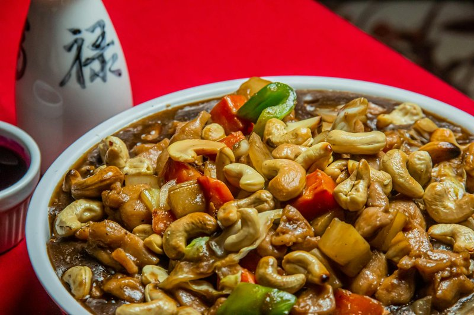

# Cashew Chicken

*The Cantonese restaurant classic: chicken stir-fried hot with onion, pepper and roasted cashews in a soy-and-oyster-sauce glaze.*

**Serves:** 4
**Prep Time:** 10 minutes
**Cook Time:** 3 minutes

## Overview
Cashew chicken is the gentler cousin of kung pao, a dish for nights when stir-fry rhythm matters more than the chilli burn. The cashews are the star and the technique that defines the dish is keeping them crisp; toasting them dry in the wok first and returning them only for the final toss is the traditional method, where cashews cooked through the whole stir-fry go soft and lose their point. Chicken thigh diced into 2 cm cubes is the right size for a fast-cook, juicy result, and velveting in cornflour and soy is the Cantonese restaurant trick that gives the glossy, tender finish. The sauce is a light, glossy build of soy, oyster sauce, sugar and a splash of stock; not the heavy brown sauce of generic takeaway versions but a thin, clinging glaze that coats without drowning. Served over rice with sliced spring onion green scattered across.

## Ingredients

### Chicken & Coating
- 225 grams boneless chicken breasts (skinned)
- 1 egg white
- 1 teaspoon salt
- 1 teaspoon cornflour

### Cooking & Sauce
- 150 ml groundnut oil
- 50 grams cashew nuts
- 2 teaspoons dry sherry (or rice wine)
- 1 tablespoon light soy sauce

### Garnish
- 1 tablespoon spring onions (finely chopped)

## Method

### Stage 1 - Prepare & Coat
1. Cut the chicken breasts into 1 cm cubes.
1. Combine them with the egg white, salt and cornflour in a small bowl.
1. Refrigerate for about 20 minutes so that the flavours combine.

### Stage 2 - Cook Chicken
1. Heat the oil in a wok or deep frying pan until moderately hot.
1. Add the chicken mixture and stir-fry quickly in the oil to keep it from sticking.
1. Cook until it turns white, which should take about 2 minutes.
1. Drain the chicken cubes in a colander, reserving 1 tablespoon of the oil.

### Stage 3 - Finish
1. Clean the wok and return the reserved oil to it.
1. Re-heat the wok until very hot.
1. Add the cashew nuts, sherry, soy sauce and cooked chicken.
1. Stir-fry the mixture for 2 minutes.
1. Turn out onto a platter and garnish with spring onions.

## Notes
- **Textural contrast:** The interplay of tender chicken, crunchy nuts, and silky sauce is essential. Don't over-cook the chicken.
- **Cashew nuts:** Use roasted, unsalted cashews for best flavour. Add late to maintain crunch.
- **Egg white coating:** Creates a silky exterior. Don't skip the 20-minute rest period.

## Serving
- **Serve with:** Steamed rice and a simple stir-fried vegetable

## Storage
- Best served immediately for optimal texture contrast
- Keeps 1-2 days refrigerated (nuts may lose crispness)
- Not recommended for freezing
