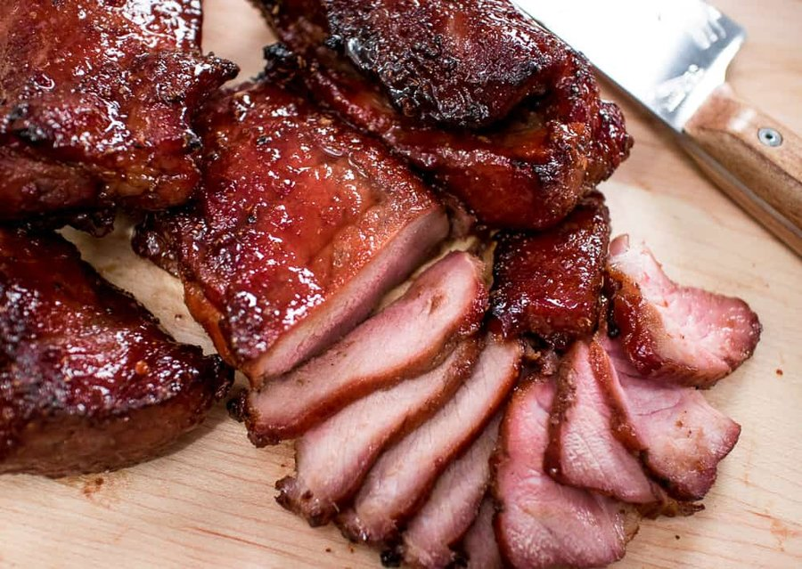

# Char Siu

*Lacquered strips of pork the colour of dark cherry wood, edges blackened where the honey-maltose glaze has caramelised against the heat. The smell is unmistakable: five-spice, rose wine, fermented bean curd, and pork fat sizzling onto coals.*

**Serves:** 6

**Prep Time:** 20 minutes (plus overnight marinade)

**Cook Time:** 50 minutes

## Overview
Char siu, literally "fork-roasted" in Cantonese, is the lacquered red barbecue pork that hangs in the windows of siu mei shops across Hong Kong, Guangzhou and any Cantonese diaspora neighbourhood worth knowing. Traditionally long strips of pork are skewered on hooks and lowered into vertical ovens or charcoal pits, where the marinade caramelises into a shimmering, almost brittle crust while the inside stays juicy and pink at the edges. The marinade is a careful balance: hoisin sauce for sweetness and body, light and dark soy for salt and colour, Shaoxing wine for aromatics, five-spice for warmth, fermented red bean curd (nam yu) for the deep umami funk that distinguishes shop-quality char siu from home attempts, and a final glaze of maltose syrup thinned with honey for that characteristic glossy finish. Pork shoulder is the cut of choice because the marbling keeps the meat moist through high-heat roasting; lean cuts like loin go dry and stringy. The classic colour comes from a small amount of red yeast rice or, in modern home recipes, a touch of red food colour, though the dish tastes the same without it. Difficulty is moderate. The marinade needs overnight, and the roasting needs your attention for the final glazing turns under high heat, but the technique itself is straightforward. Serve over rice with greens, in a soft bao bun, or chopped onto wonton noodles.

## Ingredients

### Pork
- 1.2 kg pork shoulder, cut into long strips 5 cm thick

### Marinade
- 3 tbsp hoisin sauce
- 2 tbsp light soy sauce
- 1 tbsp dark soy sauce
- 2 tbsp Shaoxing rice wine
- 2 tbsp oyster sauce
- 2 cubes red fermented bean curd (nam yu), mashed
- 2 tbsp brown sugar
- 1 tsp Chinese five-spice powder
- 4 garlic cloves, grated
- 1 thumb fresh ginger, grated
- 1 tsp sesame oil
- ½ tsp white pepper
- Optional: ¼ tsp red yeast rice powder for colour

### Glaze
- 3 tbsp maltose syrup (or runny honey)
- 2 tbsp honey
- 1 tbsp hot water

## Method

### Stage 1 - Marinate
1. Combine all marinade ingredients in a bowl and stir until smooth.
2. Pat the pork strips dry and lower them into the marinade, turning to coat. Reserve 3 tablespoons of marinade in a separate jar for basting.
3. Cover and refrigerate at least 12 hours, ideally 24.

### Stage 2 - Bring to room temperature
1. Take the pork out of the fridge 45 minutes before cooking.
2. Heat the oven to 220 degrees fan. Line a deep roasting tray with foil and pour in 250 ml water to catch drips and prevent smoking.
3. Place a wire rack over the tray.

### Stage 3 - First roast
1. Arrange the pork strips on the rack with space between them.
2. Roast for 15 minutes, then flip and roast another 15 minutes.

### Stage 4 - Glaze
1. While the pork roasts, warm the maltose, honey and hot water together in a small pan, stirring until smooth.
2. Pull the pork out after the first 30 minutes. Brush all surfaces with reserved marinade.
3. Return to the oven for 5 minutes, then flip, brush with glaze, and roast 5 more minutes.
4. Repeat the glazing turn one more time, watching closely. The surface should look glassy and start to char in patches.

### Stage 5 - Final char and rest
1. Switch the oven to grill (broil) at high for the last 2 to 3 minutes to deepen the char, turning once. Do not walk away; the sugars burn fast.
2. Rest the pork on a board for 10 minutes before slicing across the grain into 1 cm pieces.

## Notes
- **Maltose vs honey:** maltose is traditional and gives the proper sticky lacquer. Honey alone works but is thinner. You can find maltose in any Chinese supermarket.
- **Nam yu:** the red fermented bean curd is the secret. Without it the marinade tastes generic; with it the dish gains its proper depth.
- **Cut the strips long:** long, thick strips give you the contrast of caramelised crust against tender centre. Cubes overcook.
- **Charring:** the dark patches on the edges are the point. Slightly burnt corners are prized, not a mistake.

## Storage
- Char siu keeps 4 days refrigerated, wrapped tightly. It slices well cold for fried rice or noodles. Freezes 2 months. Reheat covered with a splash of water at 160 degrees to keep it from drying.
