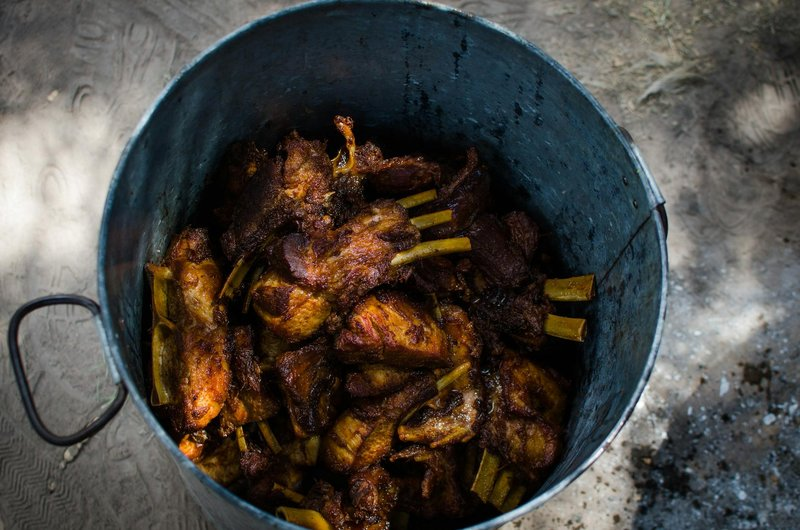

# Chilli Pork Spare Ribs

*Sichuan's spare ribs: pork ribs marinated in soy, garlic and chilli.*

**Serves:** 2-4
**Prep Time:** 10 minutes
**Cook Time:** 40 minutes

## Overview
This is the western-Chinese showstopper that turns spareribs into something glossy, sticky and properly spicy. The ribs are double-cooked: first deep-fried until the outside crisps and the bones colour, then braised in a sauce of chilli bean paste (doubanjiang), hoisin and yellow bean until the meat slips off the bone. The deep-fry isn't optional, it's what gives the finished ribs their textured surface so the braise sauce clings instead of pooling. The finish happens in the oven or under the grill with the reduced sauce brushed on every few minutes, building thin caramelised layers until the surface looks lacquered. Serve with steamed rice and a pile of cucumber batons for the heat to bounce off.

## Ingredients

### Protein
- 700 grams pork spareribs (separated into individual ribs)
- 570 ml groundnut oil (for deep frying)

### Braising Sauce
- 900 ml Chinese chicken stock
- 1 tablespoon chilli bean sauce (or 2 teaspoons chilli powder)
- 2 teaspoons sugar
- 70 ml dry sherry (or rice wine)
- 1 tablespoon dark soy sauce
- 1 tablespoon light soy sauce
- 2 teaspoons garlic (finely chopped)
- 1 tablespoon spring onions (finely chopped)
- 1 tablespoon whole yellow bean sauce
- 1 ½ tablespoons hoisin sauce

## Method

### Stage 1 - Deep-Fry
1. Heat the oil in a deep fryer or large wok.
1. Deep-fry the spareribs in batches until brown and crisp.
1. Drain the spareribs well on kitchen paper and set aside.

### Stage 2 - Braise
1. Combine all the sauce ingredients in a large pot and bring to the boil.
1. Add the deep-fried spareribs and simmer them, covered, for about 40 minutes until tender.
1. Drain off the sauce and remove any remaining fat.
1. Reserve the sauce (it can be frozen and re-used).

### Stage 3 - Finish in Oven
1. Pre-heat the oven to 180°C.
1. Put the spareribs onto a rack in a roasting tin.
1. Bake them in the oven for 15-20 minutes until browned, basting occasionally with the sauce.
1. Serve immediately.

## Notes
- **Chilli bean sauce:** Use authentic fermented chilli bean sauce for authentic taste. Chilli powder is an acceptable substitute if unavailable.
- **Deep-frying then braising:** This two-stage cooking method renders fat while keeping meat tender and succulent.
- **Sauce preservation:** The braising sauce can be frozen and reused multiple times, developing richer flavour with each use.
- **Finishing options:** Oven, grill, or barbecue all work beautifully, each imparts different character.

## Serving
- **Serve with:** Bok choi or fried rice

## Storage
- Keeps 3-4 days refrigerated (flavour improves with age)
- Freezes well up to 2-3 months
- Braising sauce can be frozen separately for future use
