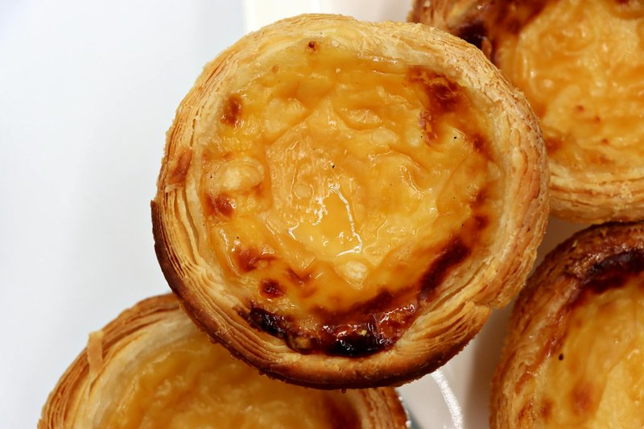

# Hong Kong Egg Tarts

*Cantonese egg tarts: small biscuit-style shortcrust shells filled with a delicate yellow custard, baked till just-set and matte.*

**Serves:** 6 (makes 12 tarts)

**Prep Time:** 30 minutes (plus 30 min dough chill)

**Cook Time:** 25 minutes

## Overview
The shortcrust uses lard (or vegetable shortening + butter) for the right crumbly texture; sugar gives the slight sweetness; egg yolk binds. Rolled to 3 mm thick, cut into discs slightly larger than the muffin-tin wells, gently pressed in, chilled. The custard: eggs whisk with hot sugar syrup (sugar dissolved in just-boiled water, cooled) and a small amount of evaporated milk for richness, plus vanilla. Strained twice for a glassy finish, ladled into the chilled shells, baked at 220°C for the first 8 minutes (to set the pastry edges) then 180°C for 12-15 more (until the custard is just-set with no visible jiggle in the centre).

## Ingredients

### Pastry
- 200 g plain flour
- 30 g cornflour
- 60 g icing sugar (sifted)
- A pinch of salt
- 130 g cold lard (cubed, OR 80 g cold butter + 50 g vegetable shortening)
- 1 egg yolk (large)
- 1 tablespoon cold water (if needed)

### Custard
- 4 eggs (large)
- 150 g caster sugar
- 200 ml water (just-boiled)
- 100 ml evaporated milk (NOT condensed; sold in tins)
- 1 teaspoon vanilla extract

### Equipment
- A 12-cup muffin tin, OR 12 individual tart tins (about 7 cm diameter)

## Method

### Stage 1 - Pastry
1. In a wide bowl, whisk flour, cornflour, icing sugar and salt.
1. Rub in the cold lard (or butter + shortening) with fingertips until the mixture resembles coarse breadcrumbs.
1. Add the egg yolk; mix with a fork.
1. Bring together with your hands into a dough - add the cold water only if needed.
1. Press into a thick disc; wrap in cling film; refrigerate 30 minutes.

### Stage 2 - Roll and line
1. Lightly grease the muffin tin wells.
1. Roll the dough on a floured surface to about 3 mm thick.
1. Cut out 12 circles, about 9 cm in diameter (slightly larger than the wells - a saucer or biscuit cutter works).
1. Press each circle gently into a muffin well, easing the dough up the sides so it just reaches the top edge.
1. Don't stretch the dough or it'll shrink during baking.
1. Refrigerate the lined tin 15 minutes while you make the custard.

### Stage 3 - Sugar syrup
1. Place 150 g sugar in a heatproof jug; pour in 200 ml just-boiled water.
1. Stir to dissolve completely.
1. Cool to room temperature.

### Stage 4 - Custard
1. In a separate bowl, whisk the 4 eggs lightly - just enough to combine, not to foam.
1. Slowly whisk in the cooled sugar syrup.
1. Whisk in the evaporated milk and vanilla extract.
1. Strain the custard through a fine sieve into a clean jug (catches the chalazae and any foam).
1. Strain a SECOND time - Hong Kong egg tarts have a perfectly smooth glassy custard, and twice-straining is the trick.
1. Let stand 5 minutes; gently skim off any foam from the surface (foam gives a pocked baked surface).

### Stage 5 - Fill
1. Heat oven to 220°C (200°C fan).
1. Carefully pour the custard into each chilled pastry shell to about 90% full (not all the way; the custard expands slightly as it bakes).

### Stage 6 - Bake
1. Bake at 220°C for 8 minutes (sets the pastry edges).
1. Reduce heat to 180°C (160°C fan); bake another 12-15 minutes.
1. The custard is done when set but with the slightest jiggle in the very centre when the tin is tapped - NOT puffed, NOT cracked. If the custard puffs significantly, your oven is too hot; open the door briefly to release heat.

### Stage 7 - Cool
1. Cool in the tin 5 minutes (the custard finishes setting).
1. Lift out gently - use a knife around the edges if they stick.
1. Cool on a rack to warm or room temperature.

### Stage 8 - Serve
1. Eat warm or at room temperature. Cold tarts are still good but the custard texture is best when slightly warm.

## Notes
- **Lard gives the right pastry:** The Cantonese shell is crumbly-tender, not flaky. Lard (or vegetable shortening) gives that texture; pure butter gives a slightly chewier shell. Both work; lard is the traditional choice.
- **Twice-strained custard:** This is the single tip that separates great Hong Kong egg tarts from mediocre ones. The smooth glassy yellow surface comes from straining out every speck of egg-white string and every air bubble.
- **Watch the oven:** A custard that puffs and cracks was baked too hot or too long. The ideal is a flat matte yellow surface with no browning. If your custards consistently crack, drop the temperature 10°C and add 2 minutes.

## Storage
- Best within 4 hours of baking.
- Refrigerate 2 days; bring to room temperature 30 minutes before serving (or re-warm at 150°C 5 minutes - careful not to overcook the custard).
- Don't freeze; the custard texture suffers on thaw.
