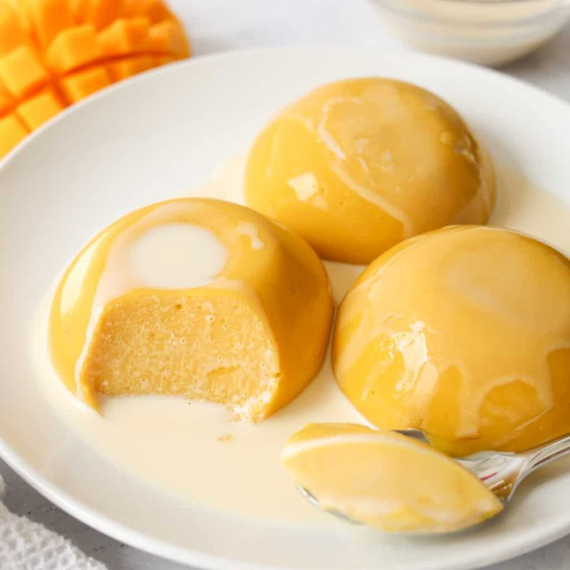

# Mango Pudding

*Hong Kong's defining cold dessert: a wobbly pale-orange pudding of pureed ripe mango set with a small amount of gelatin, lightened with evaporated milk and a touch of double cream. Served chilled in a small bowl with extra mango cubes and a drizzle of evaporated milk on top. Distinct from Indian / South-Asian mango puddings (which are heavier, often with custard) - the Hong Kong style is light, lactic, and quivering. A summer dim-sum staple; eaten cold.*

**Serves:** 6 (one per dariole mould or small bowl)

**Prep Time:** 20 minutes

**Total Time:** 4-6 hours (setting)

## Overview
Ripe mango (Alphonso or Nam Dok Mai if available; any sweet ripe mango works) blends to a smooth puree with sugar and lime juice. Powdered gelatin blooms in cold milk 5 minutes. Half the milk warms to dissolve sugar; the bloomed gelatin stirs in to dissolve. The warm milk pours into the mango puree along with the cold remaining milk, evaporated milk and a splash of double cream. Whisked smooth, ladled into 6 small moulds or glasses, refrigerated 4-6 hours until set. Served with diced fresh mango and a drizzle of evaporated milk.

## Ingredients

### Pudding
- 400 g ripe mango flesh (about 2 large mangoes - peeled, stones removed, weighed)
- 80 g caster sugar (more or less depending on mango sweetness)
- 1 tablespoon lime juice (cuts the sweetness, brightens flavour)
- 12 g powdered gelatin (about 2 ½ teaspoons, or 6 sheets)
- 150 ml whole milk (cold, for blooming the gelatin)
- 150 ml whole milk (additional, for the syrup)
- 150 ml evaporated milk (tinned)
- 60 ml double cream

### To serve
- 1 ripe mango (extra, diced into small cubes for topping)
- 60 ml evaporated milk (for drizzling)
- A few mint leaves (optional)
- A pinch of toasted coconut flakes (optional)

## Method

### Stage 1 - Mango puree
1. Cube the 400 g mango flesh.
1. Place in a blender with the sugar and lime juice.
1. Blend smooth.
1. Taste; if your mango is intensely sweet, reduce sugar to 60 g; if slightly tart, increase to 100 g.
1. Reserve in a wide bowl.

### Stage 2 - Bloom the gelatin
1. Sprinkle the powdered gelatin over 150 ml COLD milk in a small bowl.
1. Let stand 5 minutes - the gelatin swells and looks slightly spongy.

### Stage 3 - Warm milk
1. In a small saucepan, warm the OTHER 150 ml of milk to just below a simmer (steam rising, no bubbles).
1. Off heat; tip in the bloomed gelatin mixture.
1. Whisk until the gelatin fully dissolves - no specks remain.

### Stage 4 - Combine
1. Pour the warm gelatin-milk into the mango puree, whisking constantly.
1. Whisk in the evaporated milk and double cream.
1. Strain through a fine sieve into a measuring jug (removes fibers, gives a silky pudding).

### Stage 5 - Pour
1. Lightly oil 6 small dariole moulds or pour directly into 6 serving glasses (about 130 ml each).
1. Ladle the mixture in.
1. Cool 15 minutes at room temperature (the gelatin sets more evenly from a gradual chill).

### Stage 6 - Set
1. Cover each with cling film (don't let it touch the surface).
1. Refrigerate at least 4 hours, ideally overnight.
1. The puddings are set when they wobble but don't slosh.

### Stage 7 - Unmould (optional)
1. To unmould from dariole moulds: dip the bottom in hot tap water for 5-8 seconds; run a knife around the edge; invert onto a plate.
1. If serving in glasses, skip this step.

### Stage 8 - Serve
1. Top each pudding with a generous spoonful of diced fresh mango.
1. Drizzle 1 tablespoon evaporated milk over.
1. Garnish with a mint leaf and / or a pinch of toasted coconut.
1. Eat cold.

## Notes
- **Mango ripeness matters more than variety:** Underripe mango makes a sour, fibrous pudding. Choose mangoes that yield slightly to gentle pressure and smell fragrant at the stem. If the only mango available is underripe, leave at room temperature 2-3 days.
- **Gelatin proportion is gentle:** Hong Kong mango pudding should wobble freely; this isn't a firm panna cotta. The 12 g gelatin for 750 ml of liquid gives a soft tender set. More and the pudding becomes rubbery; less and it won't hold its shape.
- **Evaporated milk on top is the signature:** The Hong Kong restaurant presentation has a small pour of evaporated milk over the unmoulded pudding - like a creamy moat. Don't substitute condensed milk (too sweet) or fresh cream (too rich).

## Storage
- Refrigerate 3 days, covered.
- Once garnished, eat the same day; the diced mango weeps overnight.
- Doesn't freeze well.
