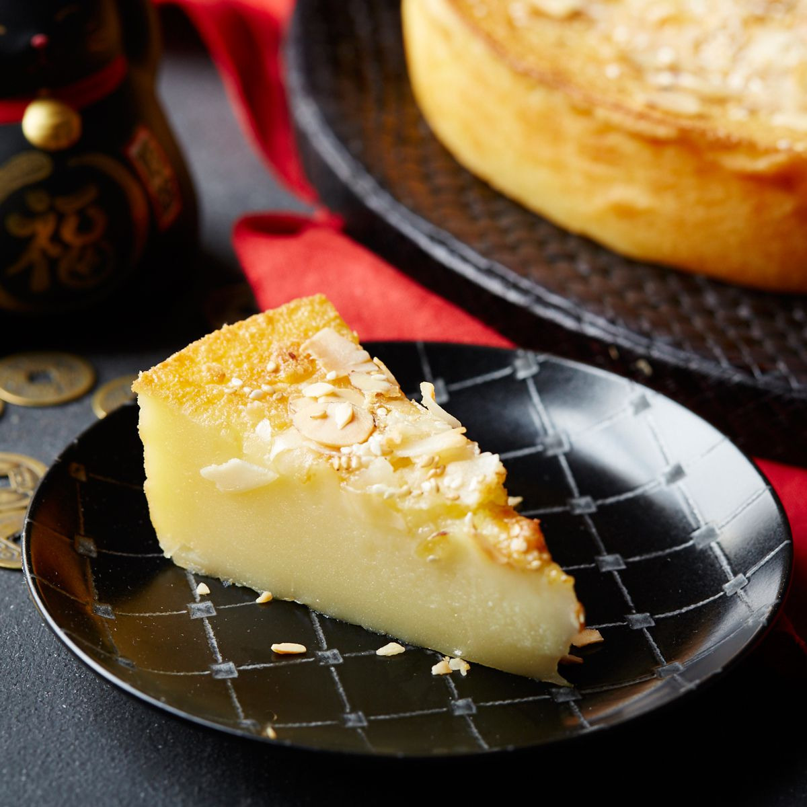

# Nian Gao

*Sticky rice cake for Lunar New Year. The name puns on "year higher" - eat it and you'll rise in the year ahead. A dense, faintly sweet, gloriously chewy slab steamed in a cake pan and then sliced and pan-fried in egg batter for the second-day breakfast.*

**Serves:** 8

**Prep Time:** 15 minutes

**Cook Time:** 75 minutes (mostly steaming)

## Overview
Glutinous rice flour and a small amount of rice flour for bite, dissolved in brown-sugar syrup made with water (just-boiled), with a glug of oil for sheen and the faintest pinch of salt. Poured into a greased cake pan, steamed for an hour, cooled overnight. The cake firms up dramatically as it cools, going from pourable batter to a sliceable, translucent amber slab. Best eaten on Day 2, sliced and pan-fried in beaten egg.

## Ingredients

### The cake
- 400 g glutinous rice flour (sweet rice flour)
- 100 g plain rice flour (gives a slight bite)
- 250 g dark muscovado or palm sugar (or 150 g muscovado + 100 g brown sugar)
- 400 ml water (just-boiled)
- 2 tablespoons vegetable oil (plus extra for greasing)
- A small pinch of fine sea salt

### To finish
- 4 dried jujubes or pitted dates (optional, for garnish)
- 1 teaspoon black sesame seeds (optional)

### For pan-frying slices (Day 2)
- 2 eggs (beaten)
- 1 tablespoon vegetable oil

## Method

### Stage 1 - Make the batter
1. Tip the sugar into a heat-proof jug and pour over the just-boiled water. Stir with a wooden spoon until the sugar has fully dissolved. Add the salt and the oil. Leave to cool to lukewarm - about 10 minutes.
1. In a large bowl, whisk together the glutinous rice flour and rice flour to break up any lumps.
1. Pour the cooled sugar syrup into the flour mixture in a steady stream, whisking continuously. The batter should be smooth and pourable, the colour of weak tea.
1. Pass the batter through a sieve into a 20 cm round cake pan that you've greased generously with oil and lined with a circle of parchment.

### Stage 2 - Steam
1. Set up a steamer with at least 4 cm of water in the base. Bring to a hard boil.
1. Press the dates (if using) gently into the surface of the batter at intervals; scatter the black sesame seeds.
1. Place the cake pan in the steamer, cover, and steam over a constant medium-high heat for 60 minutes. Top up the water level halfway through; the steamer should never run dry.
1. Test by inserting a chopstick into the centre; it should come out clean. If still wet, steam for another 10 minutes.
1. Lift the pan out and leave to cool on a wire rack - completely. The cake is far too soft to slice when warm.

### Stage 3 - Cool, slice, fry
1. When fully cooled (best left overnight, covered with a damp cloth), run a knife around the edge and invert onto a board.
1. Slice into rectangles about 1 cm thick. The slices should be tacky to the touch and slightly translucent.
1. Beat the eggs in a wide shallow bowl. Heat the oil in a non-stick frying pan over medium heat.
1. Dip each slice into the egg, letting excess drip off, and lay carefully in the pan. Fry for 2-3 minutes per side until the egg sets into a golden lace around the cake and the centre is heated through.
1. Lift out, drain briefly on kitchen paper, and serve immediately.

## Notes
- Glutinous rice flour is the one shaped by the name - it's also sold as "sweet rice flour" or "mochiko". Don't substitute regular rice flour for the whole quantity; the cake won't have the chew.
- Brown sugar gives the classic dark colour and slight caramel edge. White sugar makes a paler, more neutral cake; both have their place.
- The freshly-steamed cake is delicious sliced thin and eaten on the day with a cup of tea, before the chilling-and-frying ritual. Both versions are correct.

## Serving
Sliced and egg-fried for breakfast or a Day-2 dim sum spread. A small steaming spread of jasmine tea on the side.

## Storage
Wrapped tightly in clingfilm, refrigerated, up to a week. It firms up further over time. Slices freeze well; thaw at room temperature before frying.
