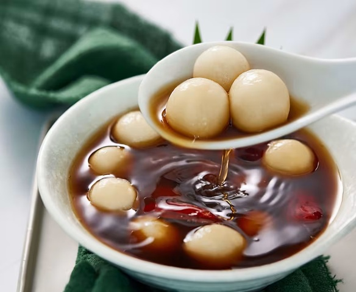

# Tang Yuan

*China's reunion-soup balls: chewy glutinous rice balls oozing sweet black sesame paste, served in a fragrant ginger-and-sugar syrup.*

**Serves:** 4 (makes 16 balls)

**Prep Time:** 30 minutes (plus 30 min filling freeze)

**Cook Time:** 15 minutes

## Overview
Filling: black sesame seeds toasted in a dry pan, ground to a paste with sugar and softened lard (or butter); chilled until firm enough to roll into 16 small balls; frozen on a tray. Dough: glutinous rice flour mixed with just-boiled water (the hot water gelatinises some of the starch, giving the dough its characteristic chew) into a smooth pliable ball; rested briefly. Each piece of dough flattens between palms, takes a frozen filling ball, wraps around, rolls smooth, a hidden ball-in-ball. Boiled in water until they float and the outer dough is translucent (about 4 minutes from when the water comes back to boiling). Served in small bowls in a hot ginger-osmanthus syrup.

## Ingredients

### Filling (sesame paste)
- 100 g black sesame seeds
- 60 g caster sugar
- 40 g lard (softened - or use unsalted butter)
- A pinch of salt

### Dough
- 200 g glutinous rice flour (sometimes called sweet rice flour or sticky rice flour)
- 130-150 ml water (just-boiled)
- A pinch of salt

### Syrup
- 800 ml water
- 80 g caster sugar (or rock sugar / yellow rock candy)
- 4 cm fresh ginger (sliced thin)
- 1 tablespoon dried osmanthus flowers (optional but classic; sold at Chinese shops)
- 1 small piece dried tangerine peel (chen pi, optional)

## Method

### Stage 1 - Toast the sesame seeds
1. Place black sesame seeds in a dry frying pan over medium heat.
1. Toast 3-4 minutes, shaking continuously, until they smell intensely nutty and a few start to pop.
1. Tip onto a plate to cool fully.

### Stage 2 - Grind the filling
1. Once the sesame seeds are cool, grind them in a spice grinder, food processor or mortar to a coarse-fine powder (some texture is fine).
1. Tip into a bowl; mix with sugar, softened lard (or butter) and a pinch of salt until you have a thick, dark, slightly oily paste.

### Stage 3 - Shape and freeze the filling
1. Divide the filling into 16 portions (about 10 g each).
1. Roll each into a small ball (cherry-sized).
1. Place on a tray; freeze at least 30 minutes - frozen filling is essential for wrapping, otherwise the soft paste squishes out when you try to enclose it.

### Stage 4 - Make the dough
1. Place the glutinous rice flour and pinch of salt in a wide bowl.
1. Pour in the just-boiled water in stages, stirring with chopsticks or a spoon (don't use your hands - the water is too hot).
1. As it cools enough to handle, knead by hand into a smooth, soft, slightly sticky dough - like Play-Doh consistency.
1. Add more rice flour if too sticky, or a teaspoon of cold water if too dry.
1. Cover with cling film; rest 10 minutes.

### Stage 5 - Wrap
1. Divide the dough into 16 equal pieces (about 20 g each); cover with a damp cloth.
1. Take a piece of dough; flatten between your palms into a disc 5 cm across with the edges thinner than the centre.
1. Place a frozen filling ball in the centre.
1. Bring the edges of the dough up and over to enclose; pinch the seam closed; roll between your palms into a smooth round ball.
1. Set on a lightly floured tray.
1. Repeat for all 16.
1. Work quickly - the filling thaws as you work.

### Stage 6 - Make the syrup
1. In a wide saucepan, combine water, sugar, ginger slices and dried tangerine peel (if using).
1. Bring to a boil; reduce to a low simmer; cook 8 minutes to infuse.
1. Stir in the osmanthus flowers (if using).
1. Keep warm.

### Stage 7 - Boil the tang yuan
1. Bring a separate wide pot of water to a rolling boil.
1. Slide in the tang yuan; stir gently so they don't stick to the base.
1. They sink, then float to the surface within 1-2 minutes.
1. Once they're all floating, cook 3 more minutes - the dough is translucent and the filling is hot.

### Stage 8 - Serve
1. Lift the tang yuan out with a slotted spoon; place 4 in each small serving bowl.
1. Ladle hot ginger syrup over to half-cover.
1. Eat immediately, with a spoon - and bite carefully; the filling is volcanic.

## Notes
- **Frozen filling is the secret:** Soft filling cannot be wrapped - it squishes out when you pinch the dough closed. Pre-freezing makes the filling firm and easy to enclose; it thaws inside the boiling tang yuan, becoming the molten ooze that makes the dessert memorable.
- **Hot water for the dough:** Adding boiling water (rather than cold) partially gelatinises the starch and gives glutinous rice flour its characteristic chewy-smooth texture. Cold water gives a crumbly dough.
- **Glutinous rice flour, not regular rice flour:** They're different products. Glutinous (sticky) rice flour has the chewy starch profile; regular rice flour gives a brittle dry dough that won't enclose the filling.

## Storage
- Best within 30 minutes of boiling - they firm slightly as they cool.
- Freeze raw filled tang yuan on a tray, then bag - keeps 2 months. Boil from frozen (add 2 extra minutes).
- Cooked leftover tang yuan keep 1 day; reheat in hot syrup 2 minutes.
