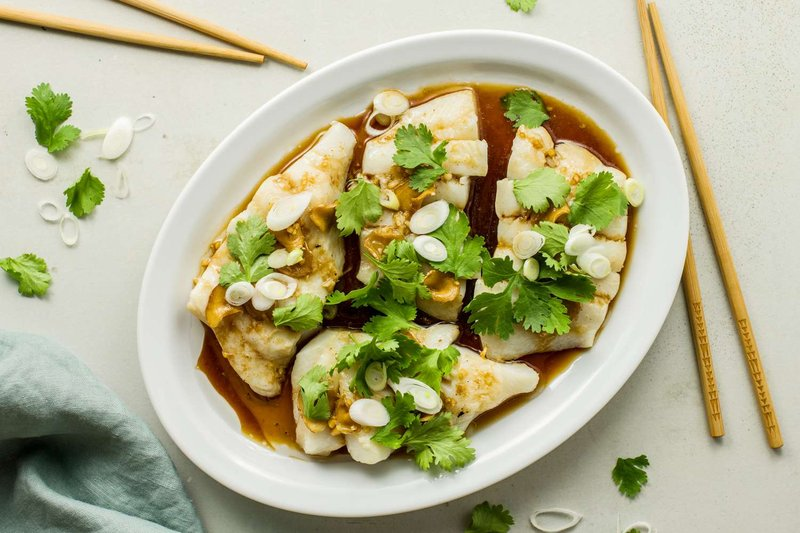

# Fried Fish with Ginger

*A Cantonese fried fish: a whole white fish shallow-fried till the skin crisps.*

**Serves:** 4
**Prep Time:** 10 minutes

## Overview
Ginger is to Chinese fish cookery what lemon is to European fish: the cleansing aromatic that lets the fish itself stay centre-stage. For this dish you want a firm white fish, sea bass, bream or even good fillet of cod, dredged in a light cornflour coat and pan-fried until the edges crisp and the centre is just opaque. The sauce is where the ginger does its work: julienne it fine, fry it gently in oil until the threads start to curl and turn pale gold (this is the moment, any darker and it goes bitter), then add soy, Shaoxing, a touch of sugar and a splash of stock. You spoon the gingery sauce over the resting fish so the threads sit on top like a scattering of golden hay. Serve with steamed rice and stir-fried greens.

## Ingredients

### Fish & Coating
- 225 grams cod fillets
- ¼ teaspoon salt
- 1 ½ tablespoons cornflour
- 75 ml groundnut oil

### Aromatics & Sauce
- 1 ½ tablespoons fresh ginger (finely shredded)
- 1 tablespoon Chinese chicken stock
- ½ teaspoon salt
- 1 tablespoon dry sherry (or rice wine)
- 1 teaspoon sugar

## Method

### Stage 1 - Prepare
1. Sprinkle the fish fillets on both sides with ¼ teaspoon of salt.
1. Cut the fish into 2 cm wide strips and let them sit for 20 minutes.
1. Dust with cornflour just before cooking.

### Stage 2 - Shallow-Fry
1. Heat the oil in a wok or large frying pan.
1. When hot, add the ginger and, a few seconds later, the fish.
1. Shallow-fry the fish strips until crisp and brown.
1. Remove them with a slotted spoon and drain on kitchen paper.

### Stage 3 - Make Sauce
1. Pour off all the oil and discard it.
1. Wipe the wok clean.
1. Add the stock, salt, sherry and sugar to the wok.
1. Bring them to the boil.

### Stage 4 - Finish
1. Return the fish slices to the pan.
1. Turn the fish gently in the sauce for 1 minute, taking care not to break up the slices.
1. Remove to a platter and serve at once.

## Notes
- **Ginger as flavouring:** Fresh ginger should be shredded finely to infuse its subtle warmth without overwhelming the fish.
- **Shallow-frying technique:** The goal is a crispy, golden exterior while maintaining tender, moist flesh inside.
- **Gentle handling:** Fish flakes easily, be gentle when turning in the sauce to maintain presentation.
- **Fresh ginger essential:** Use fresh, not powdered, for the delicate fragrance this dish requires.

## Serving
- Serve with: Steamed rice and a simple green vegetable such as bok choi

## Storage
- Best served immediately for optimal crispness and texture
- Keeps 1 day refrigerated but texture will soften
- Not recommended for freezing (fish becomes mushy upon thawing)
