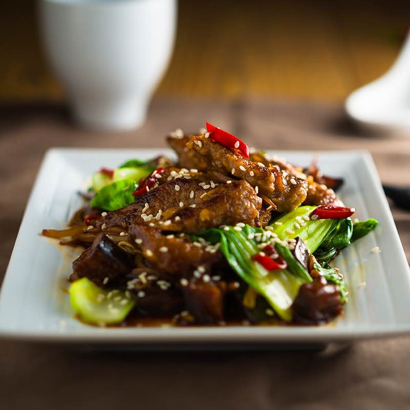

# Five-Spice Beef (Wuxiang Niurou)

*Slow-braised beef shank sliced cold into thin glossy rounds, dark from soy and rock sugar, perfumed with star anise, cassia and Sichuan pepper. A classic Northern Chinese deli meat with deep Hui Muslim roots, traditionally eaten as a cold appetiser or layered into noodle soups.*

**Serves:** 4-6

**Prep Time:** 20 minutes (plus overnight salting and overnight cooling)

**Cook Time:** 2 hours

## Overview
Wuxiang niurou is one of China's great deli meats, descended from the spiced braised meats of the Hui Muslim community that travelled along the Silk Road and settled into the cuisines of Beijing, Xi'an and Nanjing. The legend traces the modern dish to Ma Qingrui's Yue Sheng Zhai restaurant in Beijing in the 1700s, which still operates today as a halal state enterprise. Originally made with mutton, the recipe shifted to beef shank as the dish moved into the mainstream Han diet: shank is lean, gelatinous and full of connective tissue that turns silky after a long simmer. The flavour is dark, sweet and savoury with a slow warmth from Sichuan peppercorn and the woody perfume of cassia and star anise. Difficulty is low but the timeline is long: salt overnight, braise an afternoon, cool overnight in the liquid so the meat tightens and the spices penetrate. Sliced thinly across the grain the next day, the beef shows off the marbled cross-section of muscle and tendon that makes shank the right cut. Eat as part of a cold meze with pickles and peanuts, layer into a bowl of lanzhou lamian, or fold into bing flatbreads with cucumber.

## Ingredients

### Beef and cure
- 900 g beef shank (3-4 pieces)
- 1 tbsp kosher salt
- 1 tsp ground Sichuan pepper

### Braising liquid
- 60 ml neutral oil
- 150 g rock sugar
- 6 thick slices fresh ginger
- 6 spring onions (white and pale green only), cut into 5 cm lengths
- 1 tbsp chicken bouillon powder (optional)
- 30 ml Shaoxing wine
- 30 ml light soy sauce
- 30 ml dark soy sauce
- 30 ml Chinese soybean paste (huangdou jiang)

### Spice bundle
- 3 star anise pods (about 2 g)
- 2 g cassia bark
- 1 tsp fennel seeds (about 2 g)
- 2 tsp whole Sichuan peppercorns (about 2 g)
- 1 tsp cloves (about 1 g)

## Method

### Stage 1 - Cure
1. Pat the beef shanks dry. Rub all over with the salt and ground Sichuan pepper.
1. Place in a covered container and refrigerate overnight, or at least 4 hours.

### Stage 2 - Blanch
1. Put the cured shanks in a large pot, cover with cold water and bring to a boil.
1. Boil 5 minutes, skimming the grey scum that rises.
1. Drain and rinse the meat under cold water to wash off any residue. Set aside.

### Stage 3 - Caramel and aromatics
1. In a wok over medium-low heat, combine the neutral oil and rock sugar.
1. Stir continuously as the sugar liquefies, foams, then deepens to the colour of dark soy. It should smoke lightly but never smell burnt.
1. Add the ginger and spring onion (stand back, it spits). Stir for 1 minute to toast.
1. Take off the heat.

### Stage 4 - Braise
1. Tie the star anise, cassia, fennel, Sichuan peppercorns and cloves in muslin or place in a tea ball.
1. Put the shanks in the smallest pot that fits them in a single layer. Add cold water to barely cover, plus the optional chicken bouillon. Bring to a simmer and skim.
1. Pour in the caramel mixture (scrape every drop). Add Shaoxing wine, light and dark soy, soybean paste, and the spice bundle.
1. Cover, reduce to the lowest simmer and cook 1 ½ hours. Test with a chopstick: when the beef slides off the chopstick easily, it is done. If it clings, simmer 15 more minutes and test again.

### Stage 5 - Cool and serve
1. Let the beef cool completely in the braising liquid, then refrigerate overnight in the same liquid.
1. Lift the firmed beef from the jellied broth. Slice thinly across the grain.
1. Serve cold with a spoonful of warm braising liquid, or layer into noodle soups or sandwiches.

## Notes
- **Cool in the liquid:** the meat tightens as it cools, and the spices penetrate over the resting hours. Skipping this step gives flabby, under-flavoured beef.
- **Soybean paste swap:** if huangdou jiang is hard to find, Japanese miso or Korean doenjiang give a similar deep umami. A spoon of Pixian doubanjiang adds gentle heat.
- **Shank only:** other cuts can work but shank's mix of muscle and connective tissue gives the marbled, slightly springy cross-section that defines the dish.
- **Save the braising liquid:** strain and freeze it; it is a "master stock" that gets better each time you use it for another braise.

## Storage
- Beef keeps 5 days refrigerated in its braising liquid.
- Freezes well, sliced or whole, for up to 3 months.
- Reuse the strained liquid to braise eggs, tofu or another batch of beef.
