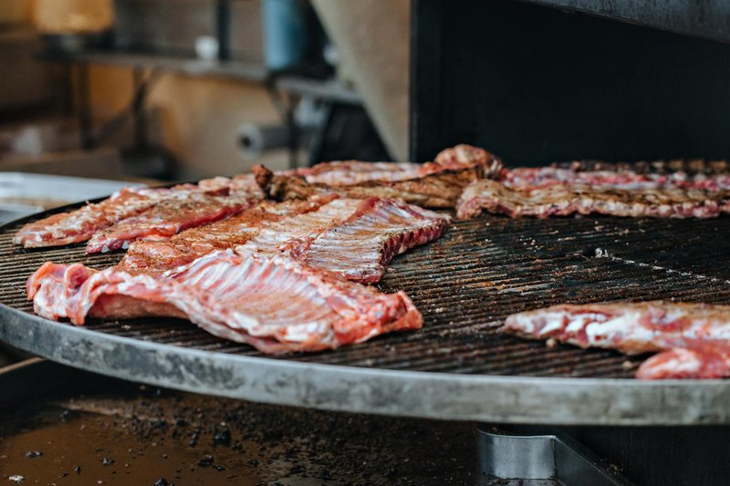

# Five Spice Spare Ribs

*Cantonese five-spice ribs: pork ribs marinated in soy, hoisin and Chinese five-spice.*

**Serves:** 2-4
**Prep Time:** 15 minutes
**Cook Time:** 40 minutes

## Overview
This is the dish that uses five-spice powder the way it's meant to be used: as a backbone, not a sprinkle. Spareribs are marinated in soy, Shaoxing and five-spice for several hours so the warm complexity of cassia, fennel, clove and Sichuan peppercorn works into the meat. Then they're deep-fried until the surface crisps and the bones brown, and finally braised in a piquant sauce sharpened with rice vinegar and the bright bitterness of dried orange peel. The vinegar-and-peel pairing is what stops the dish from going syrupy-sweet; both pull against the sugar and five-spice and keep the finish savoury. Serve in a deep dish with the braising sauce poured over and steamed rice on the side to mop it up.

## Ingredients

### Protein
- 700 grams pork spareribs (separated into individual ribs)
- 570 ml groundnut oil (for deep-frying)

### Marinade
- 1 tablespoon dry sherry (or rice wine)
- 1 tablespoon light soy sauce
- 1 tablespoon white rice vinegar
- ½ teaspoon sesame oil

### Braising Sauce
- 1 tablespoon garlic (finely chopped)
- 1 tablespoon five spice powder
- 1 ½ tablespoons spring onions (finely chopped)
- 1 tablespoon sugar
- 1 tablespoon light soy sauce
- 2 teaspoons freshly grated orange peel
- 70 ml cider vinegar

## Method

### Stage 1 - Prepare & Marinate
1. Cut each spare rib into 7 cm long chunks.
1. Mix the marinade ingredients together in a bowl and steep the spareribs for about 25 minutes at room temperature.

### Stage 2 - Deep-Fry
1. Heat the oil in a deep-fat fryer or wok.
1. Slowly cook the marinated spareribs in batches until brown, draining each batch on kitchen paper.

### Stage 3 - Braise
1. Put the sauce ingredients into a clean wok or frying pan.
1. Bring the sauce to the boil, then reduce the heat.
1. Add the spareribs and simmer them slowly, uncovered, for about 40 minutes, stirring occasionally.
1. Add a little water to the sauce if necessary to prevent it from drying up.

### Stage 4 - Finish
1. Skim any fat off the surface.
1. Serve immediately.

## Notes
- **Five spice powder:** Essential to the signature flavour. Contains star anise, clove, cinnamon, Sichuan peppercorn and fennel.
- **Orange peel:** Freshly grated adds brightness that balances the richness of the ribs. Avoid dried peel for subtlety.
- **Vinegar variety:** Cider vinegar provides apple-like sweetness; rice vinegar offers delicate acidity. Either works beautifully.
- **Two-stage cooking:** Deep-frying creates crispy texture, while braising renders fat and infuses flavour.

## Serving
Serve with: Steamed rice and a simple vegetable

## Storage
- Keeps 3-4 days refrigerated (flavour improves after 24 hours)
- Freezes well up to 2-3 months
- Remove surface fat before storing to preserve best quality
