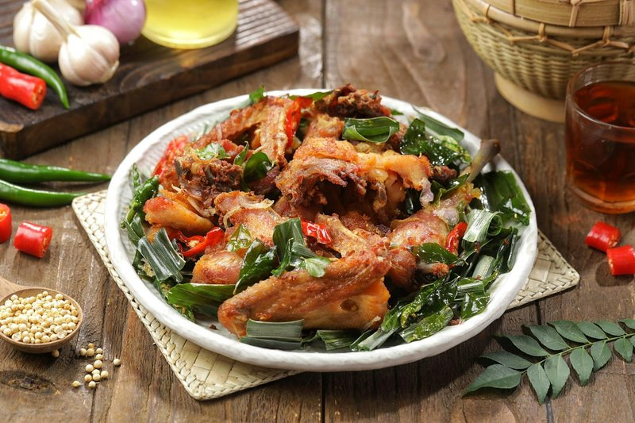

# Guizhou Chili Chicken (Guizhou Lazi Ji)

*Bone-in chicken pieces braised in a deep crimson sauce of pounded fresh chilli paste (ciba lajiao), ginger, garlic and Sichuan peppercorns. The aroma is rounded and toasty rather than fiery, with the slow-cooked sweetness of caramelised chilli skins layered over warm spice.*

**Serves:** 4

**Prep Time:** 20 minutes

**Cook Time:** 55 minutes

## Overview
Guizhou lazi ji is the southwest's answer to the Sichuan chongqing lazi ji, but with a fundamentally different character. Where Chongqing's version is a dry, fried, chilli-buried dish, Guizhou's is a wet braise built on ciba lajiao: rehydrated mild dried chillies pounded into a thick red paste with ginger and garlic, then slow-fried in oil until it deepens to a rich, almost jam-like base. The paste is the soul of the dish and the soul of Guizhou cooking more broadly: the province is the first in China where chilli was used as a condiment after its arrival from the Americas, and produces roughly a third of the country's chillies today. The slow-fry of the paste is the critical step; rush it and the sauce stays harsh, do it right and the flavours bloom into something layered and fragrant. Best after an overnight rest and even better the day after, served over plain rice with the orange chilli oil pooling around the edge.

## Ingredients

### Ciba lajiao (chilli paste)
- 15 g mixed mild-to-medium dried chillies (huaxi lajiao, tiaozi jiao, er jing tiao or wrinkled varieties)
- 15 g fresh ginger, peeled
- 3 garlic cloves

### Braise
- 240 ml vegetable oil
- 1 whole chicken (small, about 900 g), cut into 4 cm pieces, bone-in
- 1 tbsp Pixian doubanjiang
- 15 g fresh ginger, roughly chopped
- 3 garlic cloves, smashed
- 1 spring onion, cut into 5 cm pieces
- 2 tsp sweet wheat paste (tian mian jiang)
- 1 tsp dark soy sauce
- ½ tsp granulated sugar
- ½ tsp whole Sichuan peppercorns
- 250-350 ml water
- Sliced spring onion greens, to garnish

## Method

### Stage 1 - Ciba lajiao
1. Stem the dried chillies and shake out any loose seeds.
1. Simmer the chillies in water for 10 minutes, then leave to soak until just warm.
1. Drain, slit the chillies and scrape out the seeds for a milder paste.
1. Pound or blitz the chillies with the ginger and garlic in a food processor or stone mortar until you have a thick, chunky red paste. It should not be smooth.

### Stage 2 - Fry the chicken
1. Heat 240 ml oil in a wok or heavy pot to 200 °C.
1. Fry the chicken pieces in 2-3 batches, 4-5 minutes each, until golden. Drain on kitchen paper.
1. Pour off half the oil and reserve. Let the remaining oil cool to about 160 °C.

### Stage 3 - Bloom the paste
1. Add the ciba lajiao to the cooled oil. Fry over medium-low heat for 5 minutes, stirring constantly. The paste should darken to brick red and smell deeply fragrant.
1. Add the Pixian doubanjiang, smashed garlic and chopped ginger. Stir-fry 1 minute.

### Stage 4 - Braise
1. Return the fried chicken to the wok. Add 250-350 ml water (just enough to two-thirds submerge the chicken).
1. Add the spring onion pieces, sweet wheat paste, dark soy, sugar and Sichuan peppercorns. Stir to combine.
1. Cover with the lid slightly ajar and simmer over low heat for 35-40 minutes, stirring every 10 minutes, until the chicken is tender.
1. Uncover and raise the heat to medium-high. Cook 5 minutes more until the sauce reduces by half and gleams red.
1. Transfer to a serving bowl and scatter with sliced spring onion greens.

## Notes
- **Chilli choice matters:** the goal is aroma, not heat. Use mild aromatic chillies as the base and add only a few hot ones (zi dan tou, xiao mi la) if you want a sharper kick.
- **Don't rush the paste:** five minutes of slow-frying is the difference between raw, sharp chilli flavour and the rich, sweet, layered base the dish is known for.
- **Make ahead:** the flavour deepens overnight. Cook the day before and reheat.
- **Save the oil:** the leftover red chilli oil from this dish is a treasure - drizzle over noodles or use to dress cold tofu.

## Storage
- Keeps 4 days refrigerated; reheat gently with a splash of water.
- Freezes well for up to 2 months.
