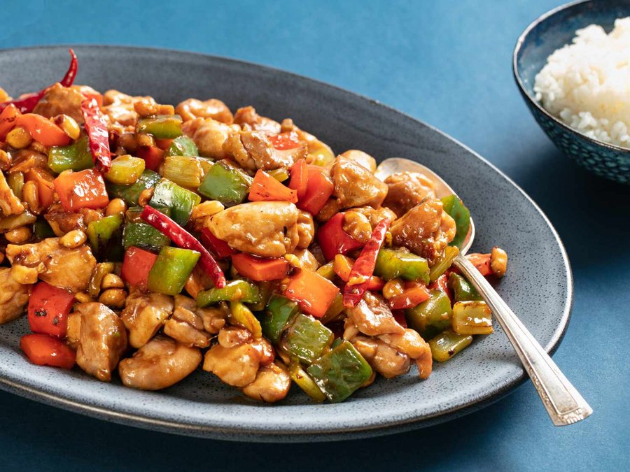

# Sichuan Chicken with Kung Pao Sauce

*Sichuan's Kung Pao with cashews instead of peanuts: chicken cubes stir-fried hot with dried chillies, Sichuan peppercorns, garlic.*

**Serves:** 4
**Prep Time:** 15 minutes
**Cook Time:** 2 minutes

## Overview
This is the modern Sichuan home cook's take on gongbao jiding, swapping the classic peanut for the rounder, sweeter crunch of toasted cashew without losing what makes the dish work. The sauce is built on the signature Sichuan "lychee" balance: a touch of sugar for sweetness, black vinegar for sharp sourness, soy for salt, and the warming tingle of toasted Sichuan peppercorn with the smoky bite of dried er jing tiao chillies. Dice the chicken thigh into uniform 2 cm cubes so it cooks fast and evenly, sear it hard in a smoking wok, then build the sauce around it in seconds with the chillies and aromatics. The cashews go in last so they stay crunchy, never soft. Serve over plain rice and don't worry about leftovers, there won't be any.

## Ingredients

### Chicken & Coating
- 2 skinless chicken breasts (cut into neat pieces)
- 1 egg white
- 2 teaspoon cornflour
- ½ teaspoon salt

### Cooking
- 3 tablespoons sunflower oil
- 3 dried red chillies (chopped)

### Sauce
- 2 tablespoon yellow salted beans (mashed)
- 1 tablespoon hoisin sauce
- 1 teaspoon soft light brown sugar
- 1 tablespoon medium-dry sherry
- 1 tablespoon wine vinegar
- 4 garlic cloves (crushed)
- 150 ml chicken stock
- 115 grams roasted cashew nuts

### Garnish
- Fresh coriander

## Method

### Stage 1 - Coat & Prepare Sauce
1. Cut the chicken into neat pieces.
1. Lightly whisk the egg white in a dish and whisk in the cornflour and salt.
1. Add the chicken and stir until coated.
2. In a bowl, mash the beans and stir in the hoisin sauce, brown sugar, sherry, vinegar, garlic and stock. Set aside.

### Stage 2 - Cook Chicken
1. Heat a wok and add the oil.
1. Stir-fry the chicken for 2 minutes until tender.
1. Lift out the chicken and set aside.

### Stage 3 - Build Sauce
1. Heat the oil remaining in the wok and fry the chilli pieces for 1 minute.
1. Return the chicken to the wok and pour in the prepared bean sauce mixture.
1. Bring to the boil and stir in the cashew nuts.
1. Heat through.

### Stage 4 - Serve
1. Spoon into a heated serving dish.
1. Garnish with fresh coriander leaves.
1. Serve immediately.

## Notes
- **Kung pao sauce components:** The combination of mashed beans, hoisin, vinegar, and sugar creates the signature Sichuan flavour profile, not a single dominant note but a complex interplay.
- **Yellow salted beans:** Also called yellow bean sauce. Essential for authentic flavour; mash well to distribute evenly.
- **Dried chillies:** Infuse the oil with fragrance and heat without overwhelming tenderness of the chicken.

## Serving
- Serve with: Steamed white rice to balance the complex sauce

## Storage
- Keeps 2-3 days refrigerated
- Freezes well up to 2-3 months
- Flavour develops after 24 hours
