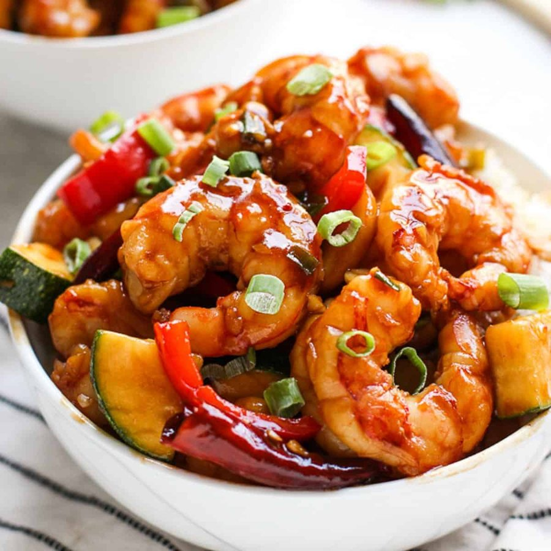

# Kung Pao Shrimp

*A glossy stir-fry of plump shrimp tossed with charred dried chillies, tingly Sichuan peppercorns and roasted peanuts in a sweet-sour-savoury sauce. The smell as the chillies hit the wok is unmistakable: toasted chilli skin, citrus-numbing peppercorn, and the high note of black vinegar caramelising on hot metal.*

**Serves:** 3-4

**Prep Time:** 20 minutes

**Cook Time:** 8 minutes

## Overview
Kung pao (gongbao) shrimp is the seafood cousin of the classic Sichuan gongbao jiding, named for the 19th-century governor-general Ding Baozhen whose title was Gong Bao. Where the chicken version uses diced meat, the shrimp version keeps the prawns whole or halved so they curl into bright pink commas around the chillies and peanuts. The flavour profile is the signature Sichuan "lychee" balance: a touch of sweetness from sugar, sourness from black vinegar, salt and umami from soy, and the warm tingle (ma la) of toasted Sichuan peppercorn paired with the smoky bite of dried er jing tiao chillies. This is a fast dish, fundamentally a wok exercise: every ingredient must be prepped and lined up before the heat goes on, because once the chillies hit the oil you have maybe ninety seconds before everything is overcooked. Difficulty is moderate for a home cook with a working wok and high burner; the trick is keeping the chillies dark red and fragrant without scorching them black, and pulling the shrimp out the moment they curl. Served over plain rice it is one of the most rewarding ten-minute meals in the repertoire.

## Ingredients

### Shrimp and marinade
- 400 g raw shrimp, peeled and deveined
- 1 tsp Shaoxing wine
- 1 tsp light soy sauce
- 1 tsp cornflour
- ¼ tsp salt
- ¼ tsp white pepper

### Sauce
- 1 tbsp light soy sauce
- 1 tsp dark soy sauce
- 1 tbsp Chinkiang black vinegar
- 2 tsp granulated sugar
- 1 tsp cornflour
- 3 tbsp water (or chicken stock)

### Stir-fry
- 3 tbsp vegetable oil (Sichuan caiziyou ideal)
- 8-12 dried er jing tiao chillies, snipped into 2 cm pieces, seeds shaken out
- 1 tsp whole Sichuan peppercorns
- 3 garlic cloves, thinly sliced
- 2 cm ginger, finely diced
- 4 spring onions, white parts cut into 1 cm pieces (greens reserved)
- 60 g roasted unsalted peanuts

## Method

### Stage 1 - Prep
1. Pat the shrimp dry; toss with Shaoxing wine, soy, cornflour, salt and white pepper. Rest 10 minutes.
1. Whisk all sauce ingredients in a small bowl until the cornflour dissolves.
1. Arrange chillies, peppercorns, garlic, ginger, spring onion whites, peanuts and sauce within arm's reach of the hob.

### Stage 2 - Wok
1. Heat the wok over high heat until lightly smoking. Add the oil and swirl.
1. Reduce heat to medium-high. Add Sichuan peppercorns and dried chillies; stir 15-20 seconds until the chillies darken to deep red and smell toasty (do not blacken).
1. Add garlic, ginger and spring onion whites. Stir-fry 10 seconds.
1. Add the shrimp in a single layer. Toss for 30 seconds until they begin to turn pink.
1. Stir the sauce, pour it in, and toss vigorously for 30-45 seconds until thickened and glossy and the shrimp are just cooked through.
1. Add the peanuts and spring onion greens. Toss once and slide onto a warm plate.

## Notes
- **Chilli colour, not char:** dark red is fragrant; black is acrid. If your wok runs hot, drop the heat as soon as the chillies go in.
- **Lychee flavour:** the sweetness should suggest fruit, not pudding. Taste the sauce before cooking and rebalance sugar/vinegar.
- **Peppercorn freshness:** Sichuan peppercorns lose their tingle within months of opening. If yours are stale, toast and grind a pinch fresh.
- **Don't overcook the shrimp:** they finish cooking in the residual heat of the sauce. Pull at "just pink".

## Storage
- Best eaten immediately; shrimp toughen on reheating.
- Leftovers keep 1 day refrigerated; reheat briefly in a hot wok with a splash of water.
