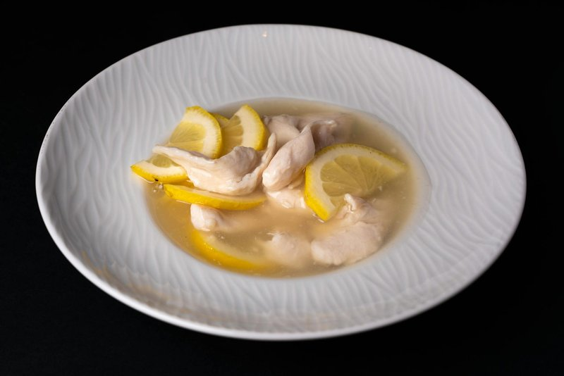

# Lemon Chicken

*The Cantonese restaurant lemon chicken: battered chicken pieces deep-fried crisp and drizzled with a tangy lemon sauce thickened with cor.*

**Serves:** 4
**Prep Time:** 10 minutes
**Cook Time:** 2 minutes

## Overview
Lemon chicken is a Hong Kong invention, dim sum hall meets Western tea-room, designed to be approachable to British diners in the colonial era and ended up sticking around as a Cantonese classic in its own right. The chicken is sliced into thin strips, dipped in a light egg-and-cornflour batter, and shallow-fried until the surface is golden and faintly crisp. The sauce is glossy and slightly translucent, sharp with fresh lemon juice, sweetened with a measured spoon of sugar so it doesn't tip cloying, and given depth with a flake of dried chilli and a splash of chicken stock. You pour the warm sauce over the fried chicken just before serving so the strips stay crisp under their sweet-sour coat. Garnish with paper-thin lemon slices on top and serve over rice.

## Ingredients

### Chicken & Coating
- 225 grams chicken breasts (skinned)
- 1 egg white
- 2 teaspoons cornflour
- 70 ml groundnut oil

### Sauce
- 70 ml Chinese chicken stock
- 1 ½ tablespoons fresh lemon juice
- 2 teaspoons sugar
- 2 teaspoons light soy sauce
- 2 teaspoons dry sherry (or rice wine)
- ½ teaspoon garlic (finely chopped)
- 1 dried red chilli
- 1 teaspoon cornflour (blended with 1 teaspoon water)

## Method

### Stage 1 - Prepare & Coat
1. Cut the chicken into strips, about 7 cm long.
1. Combine the chicken strips with the egg white and cornflour in a bowl.
1. Place in the refrigerator for about 20 minutes.

### Stage 2 - Shallow-Fry
1. Heat the oil in a wok or deep frying pan until moderately hot.
1. Add the chicken strips and stir them quickly in the oil to keep them from sticking.
1. Cook the strips until they turn white, stirring continuously (this will take about 1 minute).
1. Drain the breasts immediately in a colander.

### Stage 3 - Make Sauce
1. Wipe the wok clean and re-heat it.
1. Add all the sauce ingredients except for the cornflour mixture.
1. Bring the mixture to the boil over high heat, then add the cornflour mixture.
1. Simmer for 1 minute until lightly thickened.

### Stage 4 - Combine & Serve
1. Return the chicken strips to the sauce.
1. Stir-fry long enough to coat them all well with the sauce.
1. Turn onto a platter and serve at once.

## Notes
- **Fresh lemon juice:** Essential, bottled juice lacks the brightness needed. Squeeze just before cooking to preserve acidity.
- **Egg white coating:** Creates a silky texture on the outside while keeping the chicken breast tender inside. Don't over-fry.
- **Cornflour slurry timing:** Add late to prevent over-thickening. The sauce should be glossy, not heavy.
- **Dried red chilli:** Infuses flavour without overwhelming, remove after cooking if you prefer milder heat.

## Serving
- Serve with: Steamed white rice and a simple green vegetable to balance the acidity

## Storage
- Best served immediately for optimal texture
- Keeps 1-2 days refrigerated (chicken may dry out slightly upon reheating)
- Not recommended for freezing (coating texture deteriorates)
