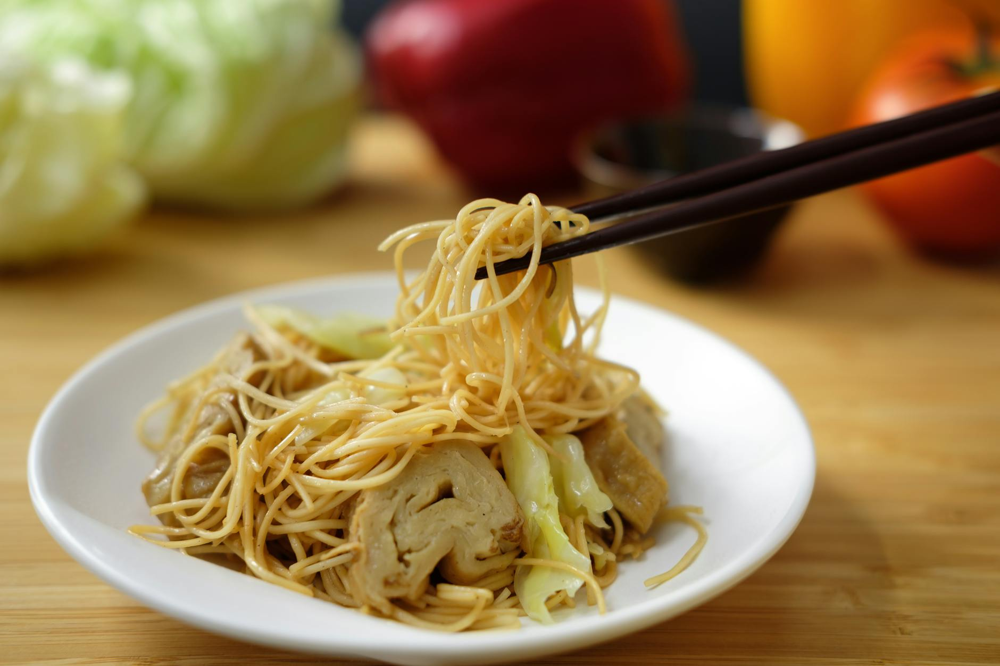

# Longevity Noodles

*Yi mein noodles stir-fried with shiitake mushrooms and garlic chives, never cut. You don't bite a longevity noodle in half on Lunar New Year, it's a symbolic long-life dish, and even by accident is unlucky. Slurp the whole length and start over.*

**Serves:** 4

**Prep Time:** 15 minutes

**Cook Time:** 12 minutes

## Overview
Yi mein are the long, slightly chewy Cantonese egg noodles served at birthdays and the New Year because their unbroken length symbolises a long life; tradition holds you should never cut them with a knife or break them in the wok. Pre-fried into round cakes for keeping, they soften almost instantly in hot water and then pick up sauce like a sponge when they hit the pan. You stir-fry them over hard heat with shiitake mushrooms, ginger and the unmistakable allium hit of fresh garlic chives, then finish with soy and a splash of Shaoxing for that gentle wine-warmth in the background. The trick is the gentle hand: toss the noodles, don't slap them, and they'll stay long, intact and silky. Pile them high in a wide bowl for the table; cut them at your peril.

## Ingredients

### The base
- 400 g yi mein (e-fu noodles): about 2 cakes, or fresh thin egg noodles
- 200 g shiitake mushrooms (fresh, sliced thick; or 30 g dried, rehydrated)
- 1 large bunch garlic chives (or 6 spring onions, cut into 5 cm batons)
- 1 thumb fresh ginger (julienned)
- 3 garlic cloves (sliced thin)
- 2 tablespoons vegetable oil

### The sauce
- 3 tablespoons light soy sauce
- 1 tablespoon dark soy sauce
- 1 tablespoon oyster sauce
- 1 tablespoon shaoxing wine
- 1 teaspoon sesame oil
- 1 teaspoon caster sugar
- 200 ml chicken stock (or mushroom soaking liquid if using dried)

## Method

### Stage 1 - Prep
1. Bring a large pan of water to the boil. Drop in the yi mein cakes and cook for 60 seconds, just to loosen the strands. Drain quickly and rinse under cold water to halt the cooking. Don't toss; the strands tangle easily and the longer they stay together, the easier they are to lift in one piece.
1. Whisk together all the sauce ingredients in a small jug.
1. If you're using dried shiitake, save the soaking liquid for the stock.

### Stage 2 - Stir-fry the aromatics
1. Heat a wok or wide heavy pan over high heat until smoking. Add the oil and swirl.
1. Add the ginger and garlic; stir-fry for 20 seconds until fragrant.
1. Add the mushrooms and stir-fry for 2 minutes, they should release their water and start to colour at the edges.

### Stage 3 - Combine
1. Pour the sauce mixture into the wok. Bring to a simmer; let it bubble for 30 seconds.
1. Add the noodles, lifting them into the pan in one piece. Toss gently with two pairs of chopsticks (or a chopstick and a spoon): the goal is to coat the strands in sauce while keeping them whole.
1. After 90 seconds the noodles will have absorbed most of the sauce and turned a dark glossy brown.
1. Add the garlic chives (or spring onion batons) and toss for a final 30 seconds, they should wilt but stay vivid green.
1. Tip onto a wide serving platter, piled high.

## Notes
- Yi mein is also called e-fu, e-fu mein, or "Cantonese egg noodles", they're the pale gold, flat round cakes about the size of a saucer. The brief par-boil is essential or they don't pick up the sauce.
- The eat-the-noodle-whole rule is taken more or less seriously depending on the household, but slicing the noodles in advance or chopping them on the plate is a clear breach of etiquette at a Lunar New Year table.
- A handful of julienned roast pork (char siu) or shredded poached chicken folded in at the same stage as the chives turns this into a one-bowl meal.

## Serving
- Mounded onto a wide platter at the centre of the table, so everyone reaches in with chopsticks. Best with a steamed whole fish nearby and a small bowl of pickled garlic on the side.

## Storage
Best eaten immediately; the noodles go gummy if refrigerated. Halve the recipe rather than save leftovers.
