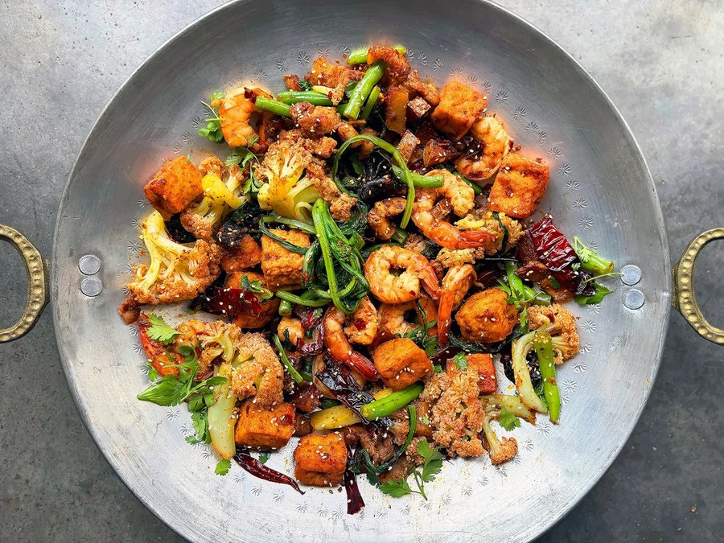

# Mala Dry-Pot (Ganguo)

*A heaped wok of shrimp, pork belly, fried tofu and vegetables tossed in a glossy red mala sauce, scattered with sesame seeds and toasted whole chillies. The smell is pure Chongqing street kitchen: caraway-warm cumin, citrussy Sichuan pepper, and the sweet smoke of rendered pork fat hitting hot oil.*

**Serves:** 4

**Prep Time:** 30 minutes

**Cook Time:** 20 minutes

## Overview
Ganguo, literally "dry pot", is the dry sister of hotpot. Where hotpot is a communal soup simmered at the table, dry pot is a wok composition: each ingredient pre-cooked separately, then everything tossed together at the last moment in a fragrant mala sauce based on Pixian doubanjiang, fermented black beans and chilli oil. The result lands somewhere between a stir-fry, a casserole and a giant heap of bar snacks. The dish is usually credited to Chongqing in the 1990s and exploded into nationwide popularity in the 2000s; it now anchors the menu of countless ganguo restaurants where you point at ingredients on a fridge and they appear minutes later in a single-handled wok at your table. Difficulty for a home cook is low if you accept the rhythm: blanch the vegetables, sear the proteins, then build the final dish from already-cooked components. The trick is restraint with the sauce, generous heat under the wok, and the willingness to commit to a long ingredient list. The recipe is endlessly flexible: lotus root, potato, cauliflower, mushrooms, squid, chicken wings, beef, fish balls, tofu skin, whatever you have, in any combination, totalling 1-1 ½ kg.

## Ingredients

### Proteins
- 300 g shell-on shrimp, tails left on
- 230 g pork belly, thinly sliced
- 1 tsp Shaoxing wine
- 1 tsp light soy sauce
- 170 g fried tofu cubes

### Vegetables
- 200 g Chinese cauliflower (or regular cauliflower), in florets
- 150 g baby yu choi
- 150 g green beans, trimmed and cut into 5 cm pieces
- 200 g Yukon gold potato, in 1 cm half-moons
- 2 tbsp dried wood ear mushrooms (soaked 30 minutes in boiling water)

### Final stir-fry
- 60 ml roasted rapeseed oil (caiziyou) or neutral oil
- 4-5 garlic cloves, thinly sliced
- 2 cm ginger, slivered
- 4-5 dried er jing tiao chillies, torn (optional)
- ½ tsp Sichuan peppercorns (optional)
- ½ tsp cumin seeds (optional)
- 9 tbsp Sichuan mala dry-pot sauce (about 3 tbsp per 500 g of ingredients)
- 1 tbsp toasted sesame seeds, to garnish

## Method

### Stage 1 - Prep
1. Pat shrimp dry. Toss pork belly slices with Shaoxing wine and light soy sauce; rest while you prep the vegetables.
1. Cut and prep all vegetables. Drain the soaked wood ear and tear into bite-sized pieces.

### Stage 2 - Blanch vegetables
1. Bring a large pot of water to a rolling boil.
1. Add green beans and potato; cook 1 minute.
1. Add cauliflower and wood ear; cook 1 minute more.
1. Add yu choy; cook 30 seconds until everything is about 75% done.
1. Drain and plunge into ice water. Drain again and set aside.

### Stage 3 - Sear proteins
1. Heat a wok over high heat with a film of oil. Add the shrimp in one layer. Sear 30 seconds per side until just pink. Lift out and set aside.
1. Wipe the wok. Add the pork belly slices and stir-fry until the fat renders and the edges crisp. Lift out, leaving the rendered fat.

### Stage 4 - Build the dry pot
1. Wipe the wok if needed. Add the rapeseed oil over medium-low heat.
1. Add garlic and ginger; stir 20 seconds until fragrant.
1. Add the optional dried chillies, Sichuan peppercorns and cumin seeds. Stir 30 seconds, watching carefully so nothing burns.
1. Add the fried tofu and toss to coat.
1. Add the mala dry-pot sauce. Stir 30 seconds to bloom the aromatics in the sauce.
1. Return all blanched vegetables and seared proteins to the wok. Toss vigorously over high heat for 1-2 minutes until everything is hot and coated.
1. Pile into a shallow bowl or serve in the wok. Scatter with sesame seeds.

## Notes
- **Everything cooks twice:** the secret to ganguo is pre-cooking each ingredient on its own. The final toss is for coating, not cooking.
- **Sauce ratio:** about 3 tbsp of mala dry-pot sauce per 500 g of ingredients. Adjust to your heat tolerance.
- **Don't crowd the early sears:** the proteins need direct contact with hot metal. The final crowded wok is fine because everything is already cooked.
- **Customise freely:** lotus root, fish balls, squid, beef, chicken wings, enoki, tofu skin - anything that holds up to a quick toss works.

## Storage
- Best eaten immediately; the vegetables wilt on standing.
- Leftovers keep 2 days refrigerated; revive in a hot wok with a splash of oil.
