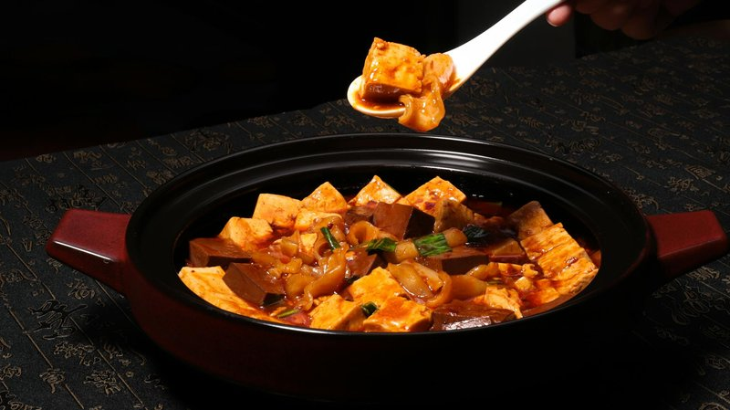

# Mapo Tofu

*Sichuan's mapo tofu: silken tofu cubes braised in a red-brown sauce of doubanjiang, black beans, pork mince, garlic, ginger and Sichuan peppercorns.*

**Serves:** 4

**Prep Time:** 15 minutes

**Cook Time:** 20 minutes

## Overview
Silken tofu cubes are blanched briefly in salted water (firms slightly and seasons). Pork mince is fried hard in oil; doubanjiang and douchi join, cooking to release oil; garlic, ginger, chilli flakes and ground Sichuan peppercorn are toasted briefly. Stock is poured in; tofu is slipped in; gentle simmer for 5 minutes; cornflour slurry thickens. Spring onions and a final dusting of ground Sichuan peppercorn finish.

## Ingredients

- 600 g silken tofu (very soft Chinese-style - not silken Japanese)
- 200 g pork mince (or beef)
- 3 tablespoons vegetable oil
- 3 tablespoons doubanjiang (Pixian fermented broad-bean paste)
- 1 tablespoon douchi (fermented black beans, rinsed and chopped, optional but classic)
- 1 tablespoon gochujang (or chilli bean sauce, optional, extra heat)
- 4 garlic cloves (very finely chopped)
- 1 thumb fresh ginger (very finely chopped)
- 1 tablespoon Shaoxing rice wine
- 350 ml chicken stock
- 1 tablespoon light soy sauce
- 1 teaspoon caster sugar
- 1 teaspoon ground Sichuan peppercorn (toasted whole then ground)
- 1 tablespoon cornflour mixed with 2 tablespoons cold water
- 4 spring onions (sliced thin)
- 1 teaspoon toasted sesame oil
- 1 teaspoon ground Sichuan peppercorn (extra, for finishing)

### To serve
- 4 servings white rice

## Method

### Stage 1 - Prep tofu
1. Cut tofu into 2 cm cubes carefully.
1. Bring 1 litre of lightly salted water to a gentle simmer.
1. Slide the tofu in; cook 2 minutes (firms slightly and seasons).
1. Drain very gently. Set aside.

### Stage 2 - Pork
1. Heat the oil in a wok over medium-high.
1. Add the pork mince; fry 4-5 minutes, breaking up clumps, until deep gold (almost crispy at edges).

### Stage 3 - Pastes
1. Reduce heat to medium. Push pork to one side.
1. Add doubanjiang and douchi (if using) to the cleared half; fry 90 seconds until the oil splits and turns deep red.
1. Stir into the pork.

### Stage 4 - Aromatics
1. Add garlic, ginger, and 1 teaspoon ground Sichuan peppercorn; cook 30 seconds.

### Stage 5 - Liquid
1. Pour in Shaoxing wine; let sizzle 15 seconds.
1. Add stock, soy sauce, sugar.
1. Bring to a simmer.

### Stage 6 - Tofu
1. Gently slide the blanched tofu cubes into the sauce.
1. Spoon sauce over the tofu - do not stir aggressively (breaks the tofu).
1. Simmer gently 5 minutes.

### Stage 7 - Thicken
1. Re-whisk the cornflour slurry.
1. Pour into the pan in a thin stream while gently shaking the pan (rather than stirring).
1. Simmer 1 minute until the sauce thickens to coat.

### Stage 8 - Finish
1. Drizzle sesame oil over the top.
1. Scatter sliced spring onions.
1. Sprinkle the remaining 1 teaspoon of ground Sichuan peppercorn over the top.

### Stage 9 - Serve
1. Bring the wok to the table.
1. Serve over hot rice.

## Notes
- **Silken Chinese tofu, not Japanese:** Use the very soft Chinese silken (often labelled "soft tofu" or "silken tofu" - usually in a plastic tube). Japanese silken is too delicate; medium-firm tofu doesn't have the right slipperiness.
- **Don't stir-aggressively:** Pushing the tofu around breaks it. Lift with a spoon, ladle sauce over.
- **Ground vs whole peppercorn:** Toast whole peppercorns lightly, then grind. Pre-ground loses the mala kick fast.

## Storage
- Refrigerate 2 days. Reheats well, though the tofu softens further.
