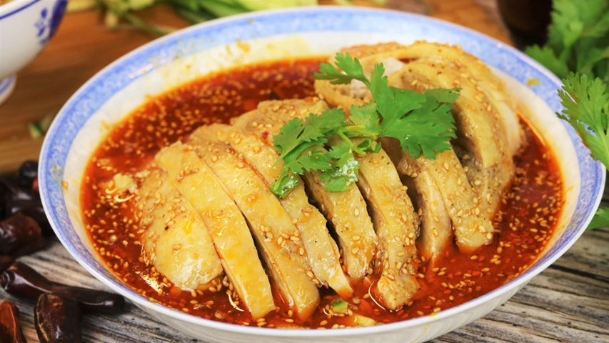

# Mouthwatering Chicken (Kou Shui Ji)

*Cool, silky poached chicken sliced and bathed in a glossy crimson sauce of chilli oil, black vinegar, sesame paste and Sichuan pepper oil. The dish gets its name (literally "saliva chicken") from the way the aroma of toasted sesame and tingly mala forces the mouth to water before the first bite.*

**Serves:** 2-4

**Prep Time:** 15 minutes

**Cook Time:** 25 minutes

## Overview
Kou shui ji is one of the great cold appetisers of Sichuan cuisine, a benchmark by which any aspiring Sichuanese cook is judged. It belongs to the broader family of cold chicken dishes (liang ban ji) that also includes bobo ji and bang bang ji, but kou shui ji is set apart by its sauce: not just spicy, but a complex layering of mala (numbing-hot) Sichuan pepper oil, fragrant chilli oil with its crisp sediment, deep aged black vinegar, sweet stone-ground sesame paste, and the concentrated chicken essence captured from steaming. The dish is uncooked at the assembly stage, which makes ingredient quality non-negotiable: cheap supermarket chilli oil and tahini will produce a sad, muddy version. Difficulty for a home cook is low if you have the right pantry; the only technical step is the gentle steaming, which yields more flavourful meat and crucial savoury juices than poaching does. The visual is striking - pale chicken slices half-submerged in a pool of red oil, scattered with chopped peanuts, sesame seeds and bright green scallion tops. Serve as a starter, on rice, or over cold noodles; the leftover sauce is too good to waste.

## Ingredients

### Chicken
- 2 bone-in, skin-on chicken breasts (about 700-900 g total)
- 1 tbsp Shaoxing wine
- 1 tbsp grated ginger
- ½ tsp salt

### Sauce
- 60 ml reserved chicken steaming juices, cooled
- 30 ml Chinkiang black vinegar
- 30 ml light soy sauce (naturally brewed)
- 1 tbsp granulated sugar
- 1 tbsp Sichuan pepper oil
- 2 tsp Chinese stone-ground sesame paste
- 1 tsp roasted sesame oil
- 60 ml chilli oil with crisp sediment (about ¾ oil to ¼ crisp)

### Garnish
- 2 spring onions, green parts only, thinly sliced
- 1 tbsp roasted peanuts, roughly chopped
- ½ tsp toasted sesame seeds

## Method

### Stage 1 - Steam the chicken
1. Rinse and pat the chicken dry. Place in a heatproof bowl or pie plate that fits your steamer.
1. Drizzle with Shaoxing wine, scatter the salt, and tuck the grated ginger over and under the skin.
1. Set the bowl in a steamer over boiling water. Cover and steam on low heat for 20-30 minutes, until a knife slipped into the thickest part shows clear juices.
1. Remove and let cool to room temperature. Reserve every drop of the juices that have collected in the bowl.

### Stage 2 - Build the sauce
1. Combine the cooled chicken juices, black vinegar, soy sauce, sugar, Sichuan pepper oil, sesame paste and sesame oil in a bowl. Stir until smooth.
1. Add most of the chilli oil and its sediment, holding back about 1 tbsp for finishing. Stir gently; do not emulsify. The goal is for red oil to settle on top of the dark sauce.

### Stage 3 - Assemble
1. Pour the sauce into a shallow serving bowl.
1. Pull the cooled chicken from the bone in large pieces. Slice across the grain about 1 cm thick.
1. Arrange the slices over the sauce, overlapping slightly.
1. Drizzle the reserved chilli oil over the top.
1. Scatter peanuts, sesame seeds and spring onion greens. Serve at room temperature, dragging each slice through the sauce as you eat.

## Notes
- **Sauce quality is everything:** stone-ground Chinese sesame paste, naturally brewed soy, aged Chinkiang vinegar and cold-pressed Sichuan pepper oil. Substitutes lead to a flat, bitter sauce.
- **Steam, don't poach:** poached chicken loses its essence to the water. Steaming concentrates that essence into the few tablespoons of juice that anchor the sauce.
- **Shortcut:** a supermarket rotisserie chicken works if you add 60 ml chicken broth and an extra teaspoon of grated ginger to compensate for the missing steaming juices.
- **Don't waste the leftover sauce:** toss it through cold noodles, dumplings or blanched vegetables the next day.

## Storage
- Assembled dish is best eaten the same day; the chicken dries slightly in the fridge.
- Steamed chicken and sauce can be stored separately for 2 days; assemble just before serving.
