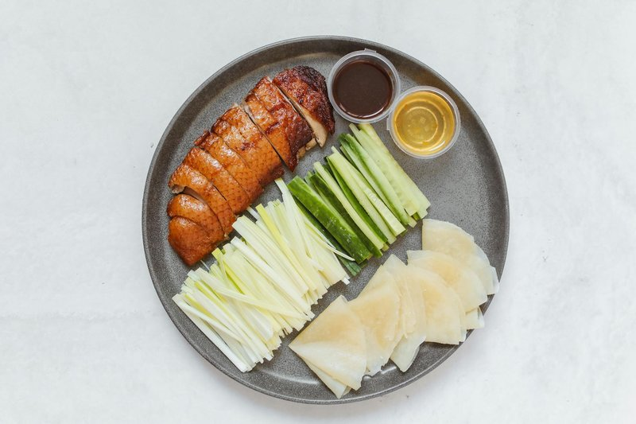

# Peking Duck

*Beijing's banquet duck: a whole bird air-dried, lacquered with maltose syrup and roasted till the skin crisps to glass.*

**Serves:** 4-6
**Prep Time:** 15 minutes
**Cook Time:** 2 minutes

## Overview
Peking duck is the duck of duck dishes, the centrepiece of imperial banquets in Beijing for six hundred years and the gold standard against which every other roast-duck cook is measured. The restaurant version involves air-pumping the bird, drying it for days, and roasting in a wood-burning fruit-tree oven; the home version cuts that to a honey-syrup glaze, a long fan-dry overnight in the fridge, and a careful roast that gives you most of the way there. The aim is two distinct elements: shatteringly crisp skin you can hear from across the kitchen, and meat that's still moist underneath. You serve it the proper way: paper-thin pancakes, julienned spring onion and cucumber, a dish of hoisin to brush across each pancake, the carved skin and meat in the middle of the table. Build your own at the table, fold, eat with your hands; never with cutlery.

## Ingredients

### Duck
- 1 whole duck (about 1.6 kg)

### Honey Syrup Glaze
- 1 lemon (cut into 5 mm slices, rind on)
- 1 litre water
- 3 tablespoons honey
- 3 tablespoons dark soy sauce
- 150 ml dry sherry (or rice wine)

### To Serve
- 12 Chinese pancakes
- 6 tablespoons hoisin sauce
- 24 spring onion brushes

## Method

### Stage 1 - Prepare & Dry
1. Rinse the duck thoroughly and ensure it is completely dry.
1. Insert a meat hook into the duck near the neck.
1. Combine the lemon slices with the remaining syrup ingredients in a large pot and bring to the boil.
1. Immediately reduce heat to low and simmer for about 20 minutes.
1. Using a large ladle, pour this mixture over the duck several times, bathing it completely until all skin is coated.
1. Hang the duck in a cool, well-ventilated place to dry for at least 6 hours, with a tray underneath to catch syrup.
1. The duck is ready when the skin feels like parchment.

### Stage 2 - Roast
1. Preheat the oven to 240°C.
1. Place the duck on a roasting rack in a roasting pan, breast side up.
1. Put 150 ml of water into the roasting pan to prevent fat spluttering.
1. Roast for 15 minutes at 240°C.
1. Turn the heat down to 180°C and continue roasting for 1 hour and 10 minutes.
1. Remove from the oven and let it sit for at least 10 minutes before carving.

### Stage 3 - Carve & Serve
1. Using a cleaver or sharp knife, cut the skin and meat into several pieces.
1. Arrange on a warm platter.
1. Serve at once with Chinese pancakes, spring onion brushes and a bowl of hoisin or sweet bean sauce.

## Notes
- **Extended drying:** The 6-hour (or longer) drying period is crucial for achieving truly crisp skin. Plan accordingly.
- **Honey syrup:** This sweet coating develops a shiny, caramelised exterior while infusing flavour throughout.
- **Parchment-like skin:** This texture indicates the duck is ready to roast. Properly dried skin becomes extremely crisp.
- **Resting period:** The 10-minute rest after roasting allows juices to redistribute, keeping meat moist.

## Serving
Serve traditional Peking duck style: with Chinese pancakes, spring onion brushes, shredded cucumber, and hoisin or sweet bean sauce for wrapping

## Storage
- Best served immediately for optimal crispness
- Can be partially prepared (through drying stage) 1 day ahead; roast just before serving
- Not recommended for freezing (skin becomes tough upon thawing)
