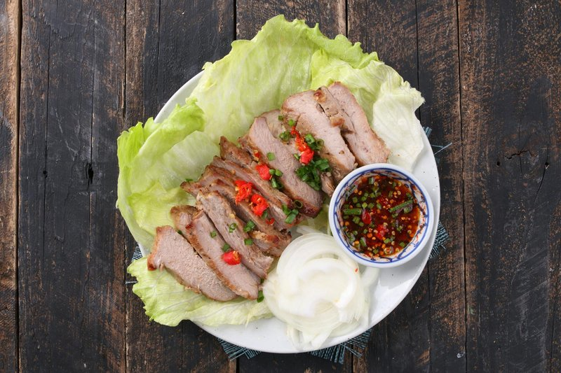

# Pork with Black Bean Sauce

*A Cantonese pork stir-fry: thinly sliced pork tossed hot with peppers, onion and a sauce of salted black beans, garlic.*

**Serves:** 4
**Prep Time:** 15 minutes
**Cook Time:** 4 minutes

## Overview
This is the dish that proves fermented black beans (douchi) are one of the great umami ingredients in any kitchen: salty, faintly funky, almost like coffee in their depth. Pork shoulder or belly is sliced thin, velveted in cornflour and Shaoxing, then seared hard in a smoking wok so the edges colour and the meat stays juicy at the centre. The black beans go in next with garlic and ginger, fried just long enough to release that distinctive briny aroma but not long enough to burn. A fast sauce of soy, sugar and a splash of stock binds everything; the pork returns for a final glossy toss. Serve straight from the wok over rice with a pile of stir-fried greens on the side.

## Ingredients

### Pork & Marinade
- 350 grams lean pork (cut into thin slices, about 5 cm long)
- 2 teaspoons dry sherry
- 2 teaspoons light soy sauce
- ½ teaspoon cornflour

### Cooking & Sauce
- 1 tablespoon oil
- 1 ½ tablespoons black beans (coarsely chopped)
- 1 ½ teaspoons garlic (finely chopped)
- 1 tablespoon spring onions (finely chopped)
- 2 teaspoons light soy sauce
- 1 teaspoon sugar
- 2 teaspoons Chinese chicken stock

## Method

### Stage 1 - Prepare & Marinate
1. Cut the pork into thin slices, about 5 cm long.
1. Put the slices into a small bowl and mix them well with the dry sherry, soy sauce and cornflour.
1. Let them marinate for about 20 minutes.

### Stage 2 - Cook Pork
1. Heat a wok or large frying pan until hot.
1. Add about ½ tablespoon of the oil and when it is almost smoking, lift the pork out of the marinade with a slotted spoon and quickly stir-fry for 2-3 minutes.
1. Transfer at once to a bowl.

### Stage 3 - Build Sauce
1. Wipe the wok clean and re-heat it.
1. Add the rest of the oil.
1. Quickly add the black beans, garlic and spring onions.
1. A few seconds later add the remaining soy sauce, sugar and stock.
1. Bring the mixture to a boil.

### Stage 4 - Combine & Serve
1. Return the pork to the wok.
1. Stir-fry the entire mixture for another 5 minutes, coating the pork thoroughly with the sauce.
1. Turn onto a platter and serve immediately.

## Notes
- **Black beans:** Fermented black beans (douchi) are essential. Chop coarsely to distribute throughout.
- **Two-oil technique:** Using less oil initially for pork preserves crispness; building sauce with remaining oil ensures proper infusion of flavours.
- **Quick stir-fry:** High heat and constant movement prevent pork from toughening.

## Serving
- **Serve with:** Plain rice or stir-fried vegetables

## Storage
- Keeps 2-3 days refrigerated
- Freezes well up to 2-3 months
- Excellent as a make-ahead dish
