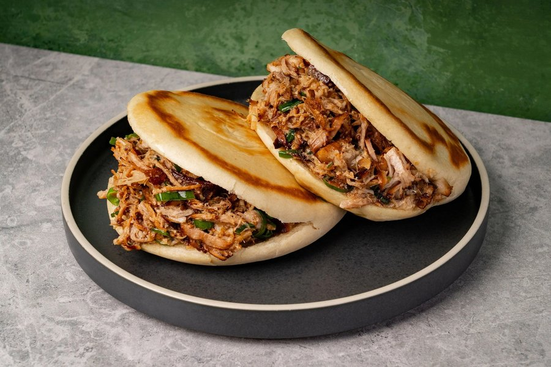

# Roujiamo (Xi'an Chinese Hamburger)

*Crisp, flaky Tongguan flatbread split open and stuffed with slow-braised pork that has been chopped fine with fresh cilantro and onion. The aroma when the hot bun meets the spiced meat is irresistible: toasted wheat, star anise, sweet caramelised pork fat, and the green snap of raw cilantro.*

**Serves:** 4 (8 buns)

**Prep Time:** 1 hour (plus 2 hours proving)

**Cook Time:** 2 hours

## Overview
Roujiamo is often, lazily, called the Chinese hamburger, but it is older than the burger by perhaps a thousand years and structurally quite different. The bread is a flat, lightly leavened, sometimes laminated wheat round, with the layered Tongguan style (flaky and croissant-like) considered superior to the softer baijimo. The filling is rich braised pork, shoulder or belly, simmered with rock sugar, soy and warming spice until it shreds under a knife, then chopped fine on a board with raw onion and cilantro and a spoonful of its own dark cooking liquid. The whole assembly is then crammed inside the freshly fried-and-baked bun while everything is still hot. Roujiamo is a quintessentially Xi'an dish, the product of a city that for centuries sat at the eastern terminus of the Silk Road; the bread tradition comes from the Hui and Uyghur Muslim communities of the northwest, while the braised pork belongs to the Han Chinese kitchen. Difficulty for a home cook is moderate to high, the lamination of the bread takes practice, and there are multiple components on timed tracks, but the result is one of the great street foods of China, and the buns and meat can both be made ahead.

## Ingredients

### Tongguan buns
- 400 g plain flour
- 1 ½ tsp instant yeast
- ½ tsp baking powder
- ½ tsp bicarbonate of soda
- ½ tsp salt
- 1 tbsp granulated sugar
- 250-280 ml warm water
- 60 ml melted lard (or butter)
- 1 tsp five-spice powder
- Peanut oil for frying

### Braised pork
- 750 g pork shoulder (or pork belly)
- 10 thin ginger slices
- 2 tbsp peanut oil
- 60 g rock sugar (about 8 lumps)
- 22 ml Shaoxing wine
- 22 ml light soy sauce
- 15 ml dark soy sauce
- 4 bay leaves
- 2 spring onion whites, cut into 5 cm pieces
- 2 star anise
- 1 cinnamon stick (large)
- 2 tsp salt

### Assembly
- ½ red onion, finely chopped
- 1 large handful (about 30 g) cilantro leaves, finely chopped
- 1-2 tbsp reserved braising liquid
- 1 tbsp chilli oil with sediment (optional)

## Method

### Stage 1 - Mix and rise the dough
1. In a large bowl, whisk together the flour, yeast, baking powder, bicarbonate of soda, salt and sugar.
1. Slowly add the warm water while stirring with chopsticks until a rough dough forms.
1. Turn out and knead 8-10 minutes (or 4-6 minutes in a mixer) until smooth and slightly tacky.
1. Cover with a damp cloth and prove for about 1 hour, until doubled.

### Stage 2 - Start the pork
1. Cut the pork into 4 cm cubes.
1. Place in a pot with cold water and 4 ginger slices. Bring to a boil, skim the scum, and boil 15 minutes. Drain and rinse.
1. In a wok over low heat, melt the rock sugar in the peanut oil without stirring until it turns dark amber.
1. Add the pork cubes and toss to coat in the caramel until lightly browned.
1. Splash in the Shaoxing wine, then the light and dark soys. Stir to combine.
1. Pour in enough water to almost cover the pork. Add the remaining ginger, bay leaves, spring onion whites, star anise, cinnamon and salt.
1. Bring to a simmer, cover, and braise on low heat for 90 minutes, topping up with water if it gets dry, until the meat shreds under a chopstick.

### Stage 3 - Laminate and shape the buns
1. Divide the proven dough into 4 equal pieces. Cover three.
1. Roll the first piece into a long strip about 90 cm by 15 cm, as thin as you can.
1. Brush generously with melted lard and dust with five-spice powder.
1. Roll up loosely from one short end like a scroll, stopping when two-thirds is rolled.
1. Cut the remaining loose third into lengthwise strips while still attached, creating a fringe.
1. Continue rolling so the strips wrap around the outside of the scroll.
1. Cut the rolled log in half. Stand each half cut-side up, press flat with the palm, and roll out to a 1 cm thick disc with the swirl visible on top.
1. Repeat with the remaining three pieces.
1. Place the discs on a tray, cover with cling film and prove 45-60 minutes.

### Stage 4 - Fry and bake the buns
1. Preheat the oven to 200 °C (190 °C fan).
1. Heat a flat pan over medium heat with 2 tbsp peanut oil. Fry the buns in batches, 1-2 minutes per side, until golden.
1. Transfer to a baking tray and bake 8-10 minutes until rich orange-brown and crisp.

### Stage 5 - Chop and stuff
1. Lift the pork out of the braise with a slotted spoon. Strain and reserve the liquid.
1. On a chopping board, finely chop the pork with a heavy knife until it is a coarse mince.
1. Tip into a bowl with the chopped red onion and cilantro. Add 1-2 tbsp of the braising liquid - enough to moisten but not pool.
1. Taste and add chilli oil if you want heat.
1. Split each warm bun three-quarters of the way through and stuff with about 60 ml (¼ cup) of the meat mixture. Eat immediately.

## Notes
- **Lamination matters:** the flaky shattering exterior of a proper Tongguan bun comes from the cut-and-wrap step. Don't skip the fringing.
- **Chop, don't shred:** the texture of roujiamo is a fine paste of meat, not pulled strands. A heavy knife on a board is the traditional tool.
- **Make ahead:** both buns and pork can be made a day ahead. Reheat buns in a 180 °C oven for 3-4 minutes before stuffing.
- **Bun balance:** the dough uses both yeast and chemical leavener; yeast for the puff, soda for the firmness and golden browning that lets the bread hold a wet filling.

## Storage
- Pork keeps 4 days refrigerated in its braising liquid; freezes 2 months.
- Buns are best the day they are baked; refresh in a hot oven for 3-4 minutes to crisp.
