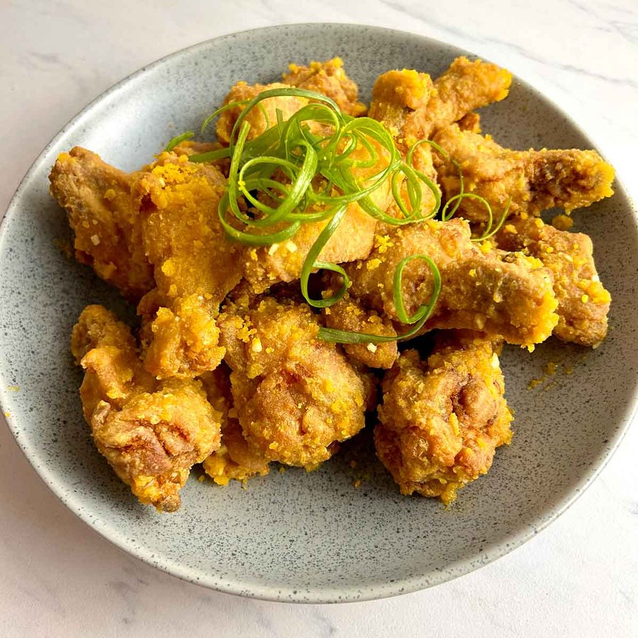

# Salted Egg Chicken Wings

*A Cantonese-Sichuan crossover: shallow-fried chicken wings tossed through a foaming, sandy coating of crumbled salted duck egg yolks.*

**Serves:** 3-4 (as part of a larger meal)

**Prep Time:** 20 minutes (plus 15 minutes marinating)

**Cook Time:** 15 minutes

## Overview
A Cantonese-Sichuan crossover: the wings are mild on their own, lightly seasoned with rice wine, soy and white pepper, then dusted in cornstarch and shallow-fried until the skin crackles. The drama is in the second step: crumbled salted duck egg yolks stirred in hot oil until they foam into a frothy, sandy paste with a pale yellow colour and a smell somewhere between butter, parmesan and salt-cured anchovy. The fried wings go back into that sand and get tossed until each one wears a fine pale crust. The eating experience is genuinely unusual: the salted yolk is intensely savoury, almost umami-heavy, but not fishy or overwhelming like the egg eaten alone. The combination originated in Hong Kong dim-sum kitchens in the 1980s and spread through Singapore, Malaysia and modern Chinese restaurants worldwide; now common across home kitchens in Sichuan and Guangdong as a snack or beer dish. Salted duck yolks are stocked in Asian grocers whole-egg or yolk-only in vacuum packs.

## Ingredients

### Wings
- 10 mid-section chicken wings (about 600 g)
- 1 tbsp Shaoxing rice wine
- 1 tbsp light soy sauce
- 1 tbsp oyster sauce
- ¼ tsp salt
- ¼ tsp white pepper
- 4-5 tbsp cornstarch (for dusting)
- 4 tbsp vegetable oil (for shallow frying)

### Salted egg coating
- 4-8 salted duck egg yolks (4 large or 8 small, depending on size)

## Method

### Stage 1 - Marinate
1. Pat the wings dry with kitchen paper.
1. Pierce each wing 4-5 times with a fork or toothpick (helps the marinade penetrate).
1. Combine wings with rice wine, light soy, oyster sauce, salt and white pepper in a bowl; toss to coat.
1. Marinate at room temperature for 15 minutes.

### Stage 2 - Fry
1. Spread cornstarch on a plate; coat each wing thoroughly, pressing the starch into the surface and shaking off the excess.
1. Heat the vegetable oil in a wide pan over medium heat until shimmering.
1. Lay the wings into the pan in a single layer; do not crowd. Work in two batches if needed.
1. Fry undisturbed for 4-5 minutes on the first side until a firm golden crust forms.
1. Flip; fry another 3-4 minutes. Increase to medium-high and turn frequently for the final minute to deepen colour. Total time around 8-10 minutes.
1. Lift the wings onto a rack. Pour off all but about 2 tablespoons of oil; wipe the pan clean of any burnt starch flecks.

### Stage 3 - Salted egg sand
1. Finely chop or mash the salted egg yolks until they break down to small grains.
1. Reduce the heat to low; add the chopped yolks to the warm oil.
1. Stir constantly with a spatula, pressing and scraping, for 1-2 minutes. The yolks will first soften, then begin to foam with large airy bubbles. This is the moment you want.
1. Return the wings to the pan; toss vigorously so the foaming yolk coats every surface.
1. Cook for another 30-60 seconds until the wings look evenly coated in a pale sandy crust.

### Stage 4 - Serve
1. Tip onto a serving plate; eat immediately while the coating is still light and crisp.

## Notes
- **Salted egg yolks:** these are not the same as century eggs. You want the cured (brined) duck egg version, usually sold separately as vacuum-packed yolks or as whole eggs that you crack and discard the white from.
- **Watch the foam:** the foaming stage is brief. If the yolks darken past pale yellow into brown, the coating will be bitter rather than buttery. Low heat and constant stirring are key.
- **Cornstarch crust:** dredging twice (or letting the first dredge sit for a minute, then dredging again) gives a thicker crackle.
- **Drumettes work too:** same method, slightly longer fry time. Adjust marinade proportionally.

## Storage
- Best eaten straight from the pan; the coating loses its airy quality within an hour.
- If reheating, use a hot dry pan or air fryer to crisp the coating again.
