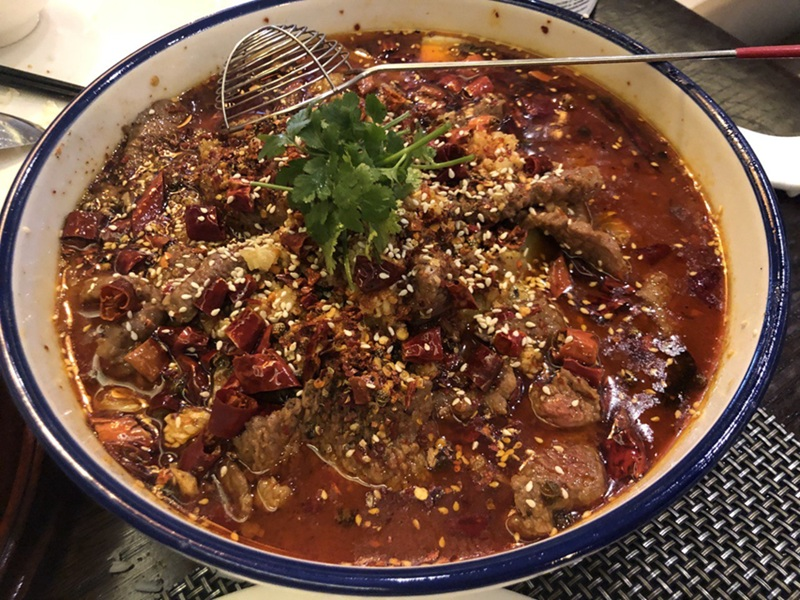

# Shuizhu Niurou

*Sichuan's water-boiled beef: silk-thin beef poached in a fiery doubanjiang broth, drowned in smoking chilli oil at the table.*

**Serves:** 4

**Prep Time:** 25 minutes (plus 20 minutes marinating)

**Cook Time:** 20 minutes

## Overview
Two sensations at once: the bright, immediate burn of dried chilli (la) sitting under the slow numbing-electric prickle of Sichuan peppercorn (ma). That mala pair is the whole point. Beneath that, the broth is salty and fermented-funky from doubanjiang, the deep umami of broad-bean paste that's been aged for months in clay vessels. The hot oil pour at the table is theatre but it does real work: it blooms the dried chillies and Sichuan peppercorn powder right before you smell them, so the aroma arrives in a wave. Texturally: gloriously tender silk-thin beef slices (the cornflour-and-egg-white marinade is what keeps them that way), crisp-on-the-edge bok choy or bean sprouts wilting under the heat, oil swimming on top. Easier than its restaurant-banquet reputation suggests once you have doubanjiang and Sichuan peppercorns in the pantry; the technique is mostly "don't overcook the beef" and "pour the oil while it's smoking". Originates in 1930s Chongqing as a riverboat-worker's dish, water and chillies were cheap, lean cuts of beef tough, then spread through Sichuan in the 1980s as the wider mala movement caught hold.

## Ingredients

### Beef and marinade
- 500 g beef sirloin, flank, or chuck (sliced **across the grain** as thinly as possible, 2-3 mm)
- 1 tablespoon light soy sauce
- 1 tablespoon Shaoxing rice wine
- 1 egg white
- 2 tablespoons cornflour (cornstarch)
- 1 teaspoon neutral oil
- ½ teaspoon salt

### Aromatic broth
- 3 tablespoons neutral oil (vegetable or rapeseed)
- 3 tablespoons doubanjiang (Pixian-style Sichuan fermented chilli-bean paste)
- 2 tablespoons whole dried Sichuan chillies (broken, seeds shaken out for less heat)
- 2 teaspoons whole Sichuan peppercorns
- 25 g fresh ginger (sliced)
- 6 garlic cloves (sliced)
- 2 spring onions (white parts, cut into 4 cm batons)
- 600 ml chicken stock (or water)
- 1 tablespoon light soy sauce
- 1 teaspoon sugar
- 1 teaspoon dark soy sauce (for colour)

### Bed of greens
- 200 g bean sprouts
- 200 g Napa cabbage (or bok choy), torn into wide pieces

### Top dressing and finishing oil
- 3 tablespoons whole dried Sichuan chillies (broken)
- 1 teaspoon Sichuan peppercorn powder (or whole peppercorns)
- 4 garlic cloves (sliced thin)
- 2 spring onions (green parts, sliced thin)
- Handful coriander (chopped)
- 4 tablespoons neutral oil (for the final pour)
- 1 tablespoon Sichuan chilli oil with sediment (optional, for extra colour)

### To serve
- Steamed jasmine rice
- Cold beer (the heat needs it)

## Method

### Stage 1 - Marinate the beef
1. Slice the beef as thinly as you can across the grain. Freezing the beef for 30 minutes first makes this much easier.
1. Combine the beef with the soy sauce, Shaoxing, egg white, cornflour, oil and salt in a bowl.
1. Mix with your hand for 1 minute until the cornflour and egg white coat every slice and form a glossy slip.
1. Rest 20 minutes at room temperature.

### Stage 2 - Bed of greens
1. Bring a wide pan of water to the boil. Salt lightly.
1. Blanch the bean sprouts for 30 seconds; lift out.
1. Blanch the Napa cabbage or bok choy for 60 seconds; lift out.
1. Arrange the blanched greens in a wide, deep serving bowl (the kind shuizhu is traditionally served in).

### Stage 3 - Fiery broth
1. Heat the 3 tablespoons of oil in a wide saucepan over medium heat.
1. Add the doubanjiang and stir-fry 1-2 minutes until the oil turns deep red. **Don't let it scorch** - keep the heat moderate.
1. Add the dried Sichuan chillies, Sichuan peppercorns, ginger, garlic and spring onion whites. Stir-fry 30 seconds till fragrant.
1. Pour in the chicken stock, light soy, sugar and dark soy. Bring to a simmer.
1. Simmer 5 minutes to extract the flavours, then strain through a sieve into a clean pan, pressing the solids (discard solids).
1. Return the broth to a gentle simmer.

### Stage 4 - Poach the beef
1. Add the marinated beef to the simmering broth in a single layer, one piece at a time so they don't clump.
1. Poach 60-90 seconds, gently agitating with chopsticks, until each slice has just turned from red to pale brown.
1. Tip the beef and broth over the bed of greens in the serving bowl. The greens will partially wilt under the hot liquid.

### Stage 5 - The crackle
1. Scatter the top of the bowl with the 3 tablespoons of dried chillies, Sichuan peppercorn powder, sliced garlic, sliced spring onion greens, and coriander.
1. Heat the 4 tablespoons of neutral oil in a small pan until just-smoking (240°C / lightly fuming).
1. **Carrying the bowl to the table**, pour the smoking oil directly over the dried chillies and garlic at the top of the bowl. They'll crackle, hiss and release a wave of aroma.
1. Drizzle the optional chilli oil over for extra colour.
1. Serve immediately, with steamed rice on the side.

## Notes
- **Beef cut and slicing:** the most important step. Beef must be cut across the grain in 2-3 mm slices. Sirloin gives the most tender result; flank is the traditional Sichuan choice; chuck is cheapest and most flavourful but needs to be sliced thinner. Freeze the beef for 30 minutes to firm it up before slicing.
- **Doubanjiang is non-negotiable:** Pixian doubanjiang (the brand in the yellow tub) is the soul of this dish. No substitute gives the same fermented-chilli depth. Generic chilli bean sauce is a poor stand-in.
- **The hot-oil pour is the dish:** don't skip it. The smoking oil bloomed onto the dry chillies and Sichuan peppercorns is what creates the dish's signature aroma. Serve immediately so the chillies don't go soggy.
- **Heat level:** moderate-to-high by default. Reduce dried chillies and doubanjiang for less burn; the Sichuan peppercorns (numbing) are part of the experience and should stay at full dose.

## Storage
- Best eaten immediately; the beef toughens on standing and the dramatic crackle is gone.
- The broth on its own (without beef) keeps 3 days refrigerated and can be reused as the base for a second batch.
- The flavoured oil left in the bowl is excellent the next morning over noodles with a poached egg.
