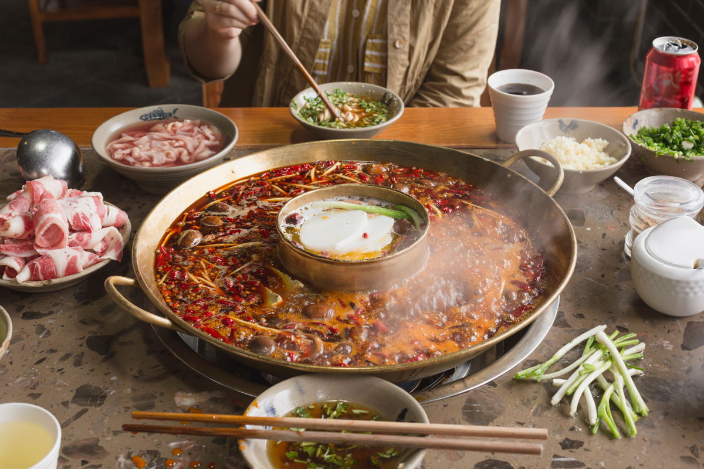

# Sichuan Hot Pot

*Sichuan's communal pot: a deep-red broth of doubanjiang, Sichuan peppercorns and dried chillies bubbling at the table. Diners cook their own meat and greens.*

**Serves:** 4-6

**Prep Time:** 30 minutes

**Cook Time:** 1 hour (broth) + diner time

## Overview
Sichuan hot pot is less a dish than a method of eating: a pot of fiercely spiced red broth (and ideally a second clear pot for tamer eaters) bubbling on a burner in the middle of the table, with raw thinly-sliced meats, vegetables, tofu and noodles laid out around it. The red broth is the centrepiece: doubanjiang and chilli bean paste fried in beef tallow until the fat is red, then loaded with Sichuan peppercorns, dried chillies, star anise, cassia, bay and aromatics before stock joins to simmer for half an hour. Each diner takes their own bowl of sesame oil with crushed garlic and coriander; raw ingredients dip into the hot pot until cooked, then into the sesame dip, then into the mouth. The mala (numbing-hot) sensation builds over the meal as the broth concentrates; the dipping sauce cools the burn. Eat slowly, drink cold beer, leave the table tingling for hours afterwards.

## Ingredients

### Spicy red broth
- 100 g beef tallow (or rendered lard, or 100 ml vegetable oil)
- 6 tablespoons doubanjiang (Pixian fermented broad-bean paste)
- 2 tablespoons gochujang (or chilli bean sauce, optional, extra heat)
- 30 g dried Sichuan red chillies (de-stemmed)
- 3 tablespoons Sichuan peppercorns (mix of red and green if you can)
- 2 star anise
- 1 piece cassia bark (or 1 stick cinnamon)
- 3 bay leaves
- 1 thumb fresh ginger (sliced)
- 6 garlic cloves (smashed)
- 4 spring onions (cut into 5 cm lengths)
- 1 tablespoon Shaoxing rice wine
- 2 ½ litres unsalted chicken (or beef stock)
- 2 tablespoons rock sugar (or 1 tablespoon caster sugar)
- 1 tablespoon dark soy sauce
- 1 ½ teaspoons salt (to taste)

### Clear broth (optional, for those who can't take the heat)
- 1 ½ litres chicken stock
- 4 slices ginger
- 2 spring onions
- 4 dried jujubes (red dates, optional)
- ½ teaspoon salt

### Cook-yourself ingredients (pick a selection)
- 400 g thinly sliced beef (sirloin, brisket, frozen 1 hour then sliced paper-thin)
- 300 g thinly sliced lamb
- 200 g raw shell-off prawns
- 200 g firm tofu (cubed)
- 200 g enoki mushrooms
- 200 g shiitake mushrooms (sliced)
- 200 g lotus root (peeled, sliced thin)
- 1 large bunch bok choy (or napa cabbage)
- 1 large bunch sweet potato glass noodles (soaked in warm water 10 min)
- 200 g fish balls (or processed Asian seafood balls)

### Dipping sauce (per diner)
- 2 tablespoons toasted sesame oil
- 1 garlic clove (very finely chopped)
- 1 tablespoon chopped coriander
- 1 teaspoon Chinese chinkiang vinegar
- ½ teaspoon chilli oil (optional)

## Method

### Stage 1 - Toast spices
1. In a wide heavy pot, melt the beef tallow over medium heat.
1. Add Sichuan peppercorns, star anise, cassia, bay; toast 1 minute.
1. Add dried chillies; toast 30 seconds (don't burn).

### Stage 2 - Aromatics
1. Add ginger, garlic, spring onions; cook 2 minutes.

### Stage 3 - Pastes
1. Reduce heat to medium-low. Add doubanjiang (and gochujang if using); cook 5 minutes, stirring, until the oil splits and turns deep red.

### Stage 4 - Simmer
1. Pour in Shaoxing wine; let sizzle 30 seconds.
1. Add stock, rock sugar, dark soy, salt.
1. Bring to a simmer; cook 30 minutes covered.

### Stage 5 - Clear broth (parallel)
1. If using, simmer chicken stock with ginger, spring onions and jujubes 20 minutes; season with salt.

### Stage 6 - Set the table
1. Arrange the raw ingredients on platters around the table.
1. Pour the broth(s) into a hot pot pan over a portable burner at the centre.
1. Each diner gets a small bowl with dipping sauce ingredients mixed.

### Stage 7 - Cook
1. Each diner picks raw ingredients with chopsticks; drops into the simmering broth; cooks until just done (30-90 seconds for thin meats, 2-3 minutes for tofu/mushrooms).
1. Dip in sesame sauce; eat.
1. Keep the broth simmering throughout.

### Stage 8 - Finish
1. The last course is often noodles cooked in the now-flavoured broth, served as a soup at the end.

## Notes
- **Mala = numbing + hot:** The combination of Sichuan peppercorn (numbing) + dried chilli (hot) is the dish's identity. Don't reduce either to fix balance.
- **Doubanjiang quality:** Pixian doubanjiang (Sichuan fermented broad-bean paste, sold in jars at Chinese shops) is essential. Without it the broth lacks depth.
- **Two-pot setup:** Yin-yang pot lets some diners pick the clear side. A single pot works fine if everyone's in for the heat.

## Storage
- The leftover broth keeps 4 days refrigerated; freezes 3 months. Strain out solids before storing; reuse as a soup base.
