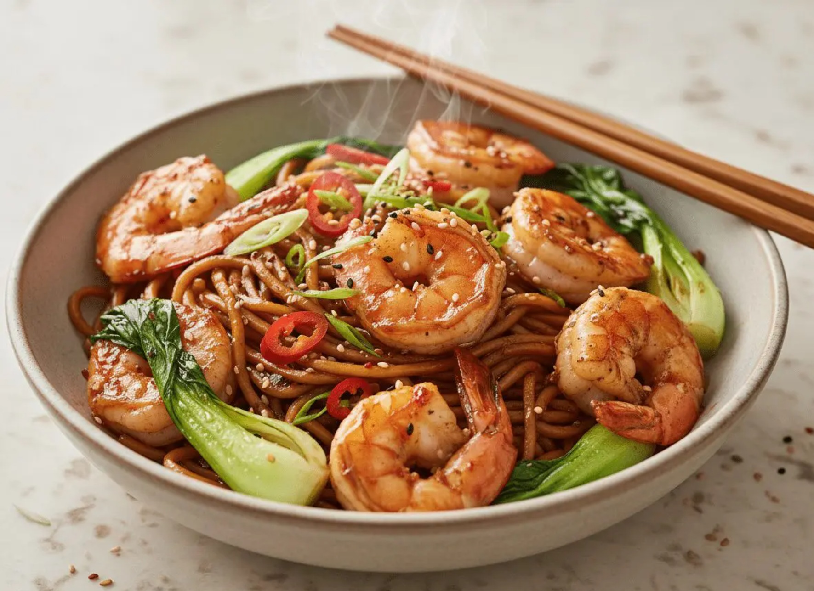

# Sichuan Prawns in Chilli Sauce

*Sichuan's prawns in chilli sauce: shell-on prawns stir-fried hot in a sauce of doubanjiang, Sichuan peppercorns, garlic.*

**Serves:** 4
**Prep Time:** 15 minutes
**Cook Time:** 5 minutes

## Overview
This is one of the most exportable Sichuan dishes: fast, vibrant, and built on a sauce sharp enough to cut through any Western palate's defences. The prawns velvet briefly in cornflour and Shaoxing, then sear in a smoking wok until they curl into bright pink commas around the chillies. The signature mala builds in seconds: doubanjiang and chilli oil for the heat, garlic and ginger for aromatics, Sichuan peppercorn for the tingle that runs along the lips after each bite. A splash of black vinegar and sugar pulls the sauce into the lychee-balance that defines Sichuan stir-fries: hot, sweet, sour, salty all at once. Serve over rice with stir-fried greens or a plate of cold cucumber to cool the burn.

## Ingredients

### Protein & Aromatics
- 225 grams prawns (shelled and de-veined)
- 2 teaspoons groundnut oil
- 2 teaspoons fresh ginger (finely chopped)
- 1 tablespoon spring onions (finely chopped)

### Sauce
- 2 teaspoons tomato purée
- ½ teaspoon chilli powder
- ¼ teaspoon salt
- ½ teaspoon sugar
- ¼ teaspoon sesame oil

## Method

### Stage 1 - Prepare
1. Wash and dry the prawns on kitchen paper.

### Stage 2 - Stir-Fry Aromatics & Prawns
1. Heat a wok or large frying pan until hot.
1. Add the oil, ginger and spring onions and stir-fry quickly for a few seconds.
1. Add the prawns and stir-fry for 30 seconds.

### Stage 3 - Add Sauce
1. Add the sauce ingredients and stir-fry for another 5 minutes over high heat.
1. Serve immediately.

## Notes
- **Quick prawn cooking:** Prawns cook extremely fast. Overcooking makes them rubbery. 5-6 minutes total is usually perfect.
- **Sauce simplicity:** The minimal sauce allows the prawns' delicate flavour to shine through while adding heat and depth.

## Serving
- Serve with: Stir-fried vegetables and steamed rice

## Storage
- Best served immediately
- Keeps 1 day refrigerated (texture deteriorates)
- Not recommended for freezing
