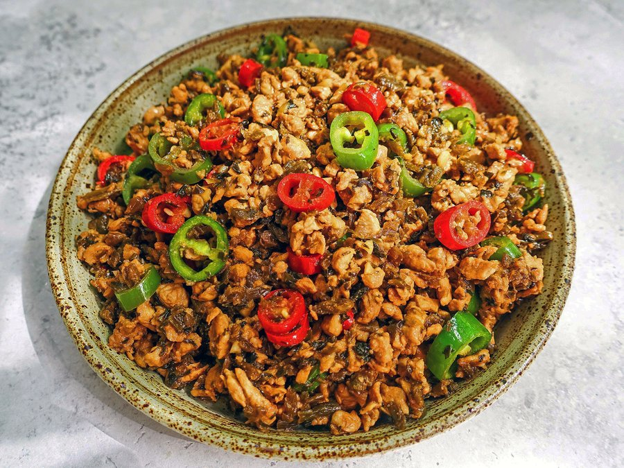

# Sichuan Stir-Fried Chicken with Yacai (Jimi Yacai)

*Tiny pea-sized cubes of chicken stir-fried with dark, sweet-salty Yibin yacai and a handful of fresh chillies. The yacai smells of caramel and soy when it hits the hot wok, and the dish lands somewhere between a stir-fry and a savoury relish that begs to be scattered over hot rice.*

**Serves:** 4 (as part of a multi-dish meal)

**Prep Time:** 15 minutes

**Cook Time:** 8 minutes

## Overview
Jimi yacai (literally "chicken rice yacai") is a Sichuan home-cook classic that turns a humble jar of preserved mustard greens into something extraordinary. Yacai is one of Sichuan's "four famous pickles", produced in Yibin in the south of the province where mustard stems are salted, fermented and aged with sugar and spices for months until they turn glossy black and intensely savoury-sweet. Diced finely and tossed with chicken cut "rice-sized" (the literal meaning of jimi), the result eats like a savoury condiment as much as a dish, a few spoonfuls over plain rice are enough to keep a meal going. The technique is straightforward but rewards finesse: the chicken is velveted with cornflour and Shaoxing wine for tenderness, the yacai is rinsed and then dry-toasted to wake up its aroma, and everything finishes with sliced fresh chillies for colour and a gentle warming heat rather than mala fire. Difficulty for a home cook is low; the dish comes together in under ten minutes once the chicken is diced. Traditionally eaten with steamed rice or wowotou (cornmeal buns), it is also superb as a noodle topping.

## Ingredients

### Chicken and marinade
- 300 g chicken breast
- 2 tsp Shaoxing wine
- 1 tsp dark soy sauce
- 1 tsp cornflour
- ¼ tsp white pepper
- 1 tsp vegetable oil

### Stir-fry
- 100 g yacai (Yibin preserved mustard greens)
- 50 g mixed fresh red and green chillies
- 2 garlic cloves, minced
- 1 tbsp ginger, minced
- 2 tbsp vegetable oil

### Seasoning
- 2 tsp light soy sauce
- 1 tsp sweet wheat paste (tian mian jiang)
- ½ tsp granulated sugar

## Method

### Stage 1 - Prep
1. Slice the chicken breast thinly, then into strips, then cross-cut into pea-sized cubes.
1. Combine the chicken with Shaoxing wine, dark soy, cornflour and white pepper. Mix well, then stir in 1 tsp oil. Rest 10 minutes.
1. Rinse the yacai under cold running water for 10 seconds, drain, then squeeze out the excess water. Chop finely if the pieces are large.
1. Stem the chillies and slice into thin rings (about 60 ml volume). Remove seeds for milder heat.

### Stage 2 - Toast the yacai
1. Heat a dry wok over low heat. Add the yacai and toast, stirring, for 2-3 minutes until it smells caramelly and any remaining moisture has evaporated. Tip onto a plate and wipe the wok clean.

### Stage 3 - Stir-fry
1. Heat the wok over high heat until lightly smoking. Reduce to medium, add the 2 tbsp oil, and immediately add the chicken.
1. Stir-fry constantly until the chicken just turns pale, about 1 minute.
1. Add the garlic and ginger; stir for 10 seconds until fragrant.
1. Return the toasted yacai. Add light soy, sweet wheat paste and sugar. Toss to coat.
1. Add the fresh chilli rings. Stir-fry 1-2 minutes until the chillies soften slightly. Taste and adjust.
1. Slide onto a plate and serve hot with rice.

## Notes
- **Rinse the yacai:** straight from the jar it is fiercely salty. A quick rinse and squeeze brings it into balance without losing flavour.
- **Dry-toast it:** the optional toast step concentrates the aroma and removes residual brine moisture so it doesn't steam the wok.
- **Hot pan, cold oil (re guo leng you):** heat the wok first, add oil, and put the chicken in while the oil is still warm. This stops the meat sticking.
- **Cut small:** the dish is called "chicken rice" for a reason. Tiny dice cooks fast and matches the texture of the yacai.

## Storage
- Keeps 3 days refrigerated. Reheats well in a hot wok with a splash of water.
- Excellent cold over rice in a packed lunch.
