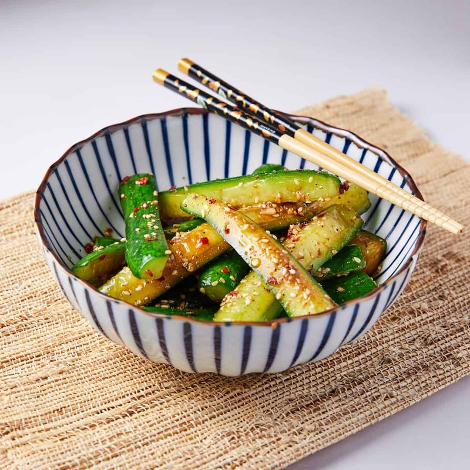

# Chinese Pickled Cucumber

*Sichuan's quick pickle: cucumber spears salted to weep, then bathed in a sweet-sour brine of rice vinegar, soy, Sichuan peppercorns and dried chillies.*

**Serves:** 6 (as a side / pickle)

**Prep Time:** 15 minutes

**Total Time:** 1 hour (minimum brine; ideally overnight)

## Overview
Cucumbers are cut into spears (or smashed-and-torn for a rougher texture), salted heavily in a colander 30 minutes to weep, then patted dry. A brine of rice vinegar, sugar, light soy, water, sliced ginger, Sichuan peppercorns and dried red chillies brings to a gentle simmer just to dissolve the sugar; cools to room temperature. The drained cucumber goes into a jar; the cooled brine pours over to submerge; refrigerated for 1 hour minimum (overnight ideal). Eats cold straight from the jar.

## Ingredients

### Cucumbers
- 600 g cucumbers (Persian or English; 4-5 small or 2 large - peel partially if thick-skinned)
- 1 tablespoon salt (for salting)

### Brine
- 200 ml rice vinegar (Japanese or Chinese - NOT distilled white)
- 80 g caster sugar
- 4 tablespoons light soy sauce
- 100 ml water
- 4 cm fresh ginger (sliced thin)
- 6 garlic cloves (sliced)
- 2 teaspoons Sichuan peppercorns (lightly bruised)
- 3 dried red chillies (whole, or 1 teaspoon chilli flakes)
- 1 teaspoon sesame oil (added at the end)

## Method

### Stage 1 - Cut and salt
1. Halve cucumbers lengthwise.
1. Scoop out the wet seedy core with a teaspoon.
1. Cut each half into spears 6 cm long, 1 cm thick - OR slice into 5 mm rounds - OR smash with a cleaver and tear into chunks (see [smashed-cucumber.md](smashed-cucumber.md)).
1. Place in a colander; sprinkle with 1 tablespoon salt; toss.
1. Rest 30 minutes - the cucumber weeps a noticeable amount of water.
1. Press gently with the back of a spoon to extract more.
1. Don't rinse - the salt level is part of the pickle.

### Stage 2 - Brine
1. In a saucepan, combine vinegar, sugar, soy sauce, water, ginger, garlic, Sichuan peppercorns and dried chillies.
1. Heat over medium just until the sugar dissolves and the mixture is steaming - about 3-4 minutes. Don't boil hard; gentle warmth is enough.
1. Off heat; cool fully to room temperature.

### Stage 3 - Combine
1. Pack the salted cucumber spears (and any extracted juice) into a clean 500 ml glass jar.
1. Pour the cooled brine over (including the ginger / garlic / chillies / peppercorns).
1. The cucumber should be submerged. If not, top up with a little extra rice vinegar.

### Stage 4 - Marinate
1. Seal the jar.
1. Refrigerate at least 1 hour, ideally overnight (24 hours is best).

### Stage 5 - Serve
1. Lift cucumber pieces out of the brine with chopsticks.
1. Pile onto a small plate.
1. Drizzle with sesame oil just before serving.
1. Optional: scatter with extra sliced chilli or coriander.

## Notes
- **Sichuan peppercorns are the signature:** They give the pickle a faintly numbing, citrusy tingle that distinguishes Chinese cucumber pickle from Japanese / Korean / Western styles. Worth seeking out at any Asian shop.
- **Rice vinegar, not white vinegar:** Distilled white vinegar is too sharp and one-dimensional. Rice vinegar is the mellow, slightly sweet base that lets the other flavours come through. Chinkiang black vinegar can substitute for a darker, more malty result.
- **Salt-then-pat-dry:** The 30-minute salt rest is what produces a crunchy pickle. Without it, the cucumber gives up water into the brine and becomes limp.

## Storage
- Refrigerated in the sealed jar: 2 weeks.
- The brine intensifies over time; the cucumber slowly softens but stays crunchy enough for the first week.
- The leftover brine can be reused once for a second batch of cucumbers (add 2 tablespoons extra vinegar to compensate for dilution).
