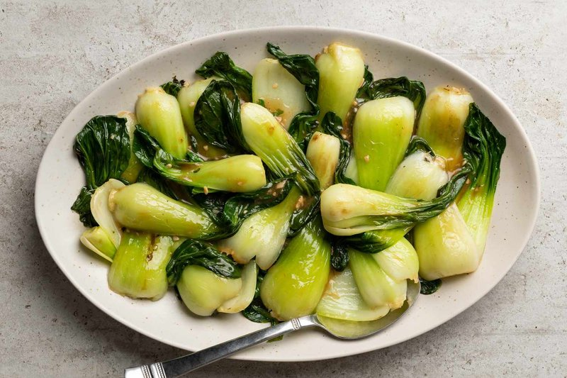

# Garlic Bok Choy

*The Cantonese restaurant side: small heads of bok choy blanched briefly, then stir-fried hard with sliced garlic and a glossy slick of oyster sauce.*

**Serves:** 4 (as a side)

**Prep Time:** 5 minutes

**Cook Time:** 6 minutes

## Overview
Small heads of bok choy are halved or quartered lengthwise (keeping each piece together at the base). Sliced garlic fries gently in oil until golden, not brown. The bok choy is blanched briefly (30 seconds) in heavily salted water (the salt fixes the colour); refreshed in cold water; drained well. The blanched bok choy then stir-fries in the garlic oil for 2 minutes; oyster sauce, a pinch of sugar and a splash of stock or water glaze; sesame oil at the end. Plated with the dressing spooned over.

## Ingredients

- 600 g baby bok choy (about 8 small heads - or 4 larger heads halved lengthwise)
- 2 teaspoons salt (for blanching)
- 3 tablespoons sunflower oil (or any neutral)
- 6 garlic cloves (sliced thin)
- 2 tablespoons oyster sauce
- 1 tablespoon light soy sauce
- 1 teaspoon caster sugar
- 3 tablespoons hot water or chicken stock
- 1 teaspoon sesame oil
- 1 teaspoon cornflour (mixed with 1 tablespoon cold water - optional, for a glossier finish)

### Optional
- 1 small red chilli (sliced - for heat)
- 1 spring onion (sliced - to scatter)

## Method

### Stage 1 - Trim and blanch
1. Trim a thin slice off the base of each bok choy; halve lengthwise (or quarter if very large), keeping the leaves attached at the base.
1. Rinse under running water - bok choy can hide grit between the stems.
1. Bring a wide pot of water with the 2 teaspoons salt to a hard boil.
1. Add the bok choy; cook just 30-45 seconds (until the green leaves are vivid and the white stems are slightly translucent).
1. Drain immediately; refresh briefly in cold water to stop the cooking.
1. Pat or press dry - wet bok choy steams instead of fries.

### Stage 2 - Fry the garlic
1. Heat sunflower oil in a wide wok or frying pan over medium heat.
1. Add the sliced garlic; cook 60-90 seconds, stirring, until just pale gold - don't let it brown (bitter).
1. If using chilli, add it at the end of this stage and stir 10 seconds.

### Stage 3 - Stir-fry
1. Increase heat to high.
1. Add the drained bok choy.
1. Toss vigorously for 60-90 seconds - the bok choy should sizzle in the garlic oil and pick up colour at the edges.

### Stage 4 - Glaze
1. Mix oyster sauce, soy sauce, sugar and hot water/stock in a small bowl.
1. Pour over the bok choy; toss to coat.
1. Cook 30 seconds.
1. Optional: add the cornflour slurry; stir 15 seconds - the sauce becomes glossy and clinging.

### Stage 5 - Finish
1. Off heat; drizzle sesame oil; toss once.

### Stage 6 - Serve
1. Pile onto a warm plate with the cut sides facing up.
1. Spoon any remaining sauce from the wok over the top.
1. Scatter spring onion if using.
1. Serve immediately.

## Notes
- **Blanch first, then stir-fry:** The two-step technique (blanch then fry) is the restaurant secret. Direct stir-frying takes longer to cook the stems through; by then the leaves are dark and limp. Blanching cooks evenly and fixes the colour; the fry adds the garlic flavour and the sauce.
- **Don't brown the garlic:** Pale gold = sweet and nutty. Brown = bitter and acrid. Watch closely; pull off the heat as soon as the slices start to colour.
- **Salt the blanching water heavily:** The salt is what keeps the leaves vibrant green; understated salt gives a duller, more khaki vegetable.

## Storage
- Best within 30 minutes.
- Doesn't keep well - the bok choy weeps water into the sauce overnight and the result is sad.
- The garlic-oil base can be made ahead and the bok choy blanched fresh, then assembled in 90 seconds.
