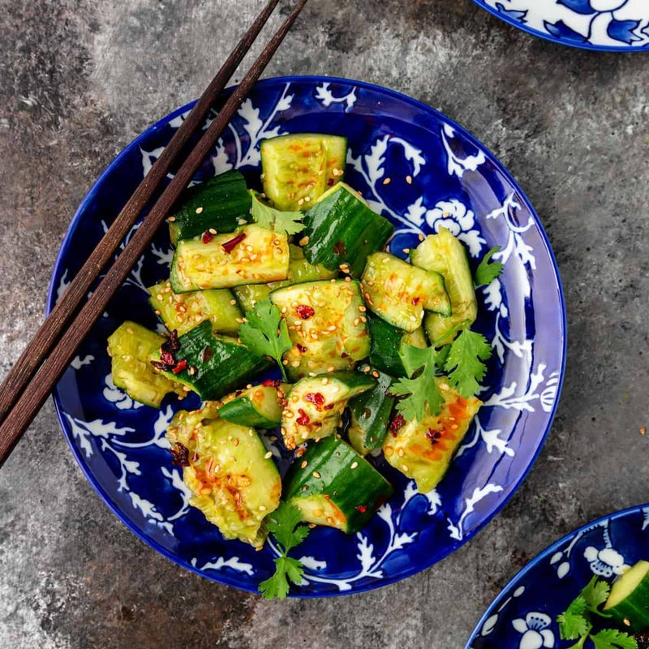

# Smashed Cucumber

*Northern China's smashed-cucumber salad: bashed cucumber salted to weep, dressed sharp with soy, vinegar, garlic and chilli oil.*

**Serves:** 4 (as a side)

**Prep Time:** 15 minutes

**Total Time:** 1 hour (with the 30-min salt + 30-min dress rest)

## Overview
Smashed cucumber (pai huang gua) is the snack the Sichuanese eat with cold beer all summer long, a dish whose entire technique is summarised by its name. You put cucumbers on a chopping board, hit them firmly with the flat of a cleaver (or a rolling pin, or a small frying pan) until the flesh cracks lengthwise, then tear the cracked pieces into rough 3-4 cm chunks with your hands. The torn surfaces hold dressing in a way that clean knife cuts never do; this is the point. The pieces salt-rest in a colander for half an hour to weep some of their water, then toss in a dressing of light soy, black vinegar (Chinkiang), sugar, sesame oil, crushed garlic and a generous spoon of chilli oil. Rest for another half hour so the cucumber drinks the dressing; eat cold from the bowl. Best at the start of summer when the cucumbers are crisp.

## Ingredients

### Cucumbers
- 3 cucumbers (small)
- 1 ½ teaspoons fine salt

### Dressing
- 3 tablespoons light soy sauce
- 2 tablespoons Chinkiang black vinegar (Chinese black vinegar - sold at Asian shops; substitute balsamic if unavailable)
- 1 tablespoon caster sugar
- 1 tablespoon sesame oil
- 1-2 tablespoons chilli oil (Lao Gan Ma or your preferred brand, with or without crispy bits)
- 5 garlic cloves (crushed to a paste)
- 1 teaspoon toasted sesame seeds
- A pinch of MSG (optional - restaurant standard; can substitute pinch of mushroom seasoning powder)

### To finish
- 1 spring onion (finely sliced)
- A few sprigs of fresh coriander (chopped)
- Extra chilli oil (optional drizzle)

## Method

### Stage 1 - Smash
1. Place a cucumber on a cutting board.
1. Peel into strips
1. Lay the flat side of a heavy cleaver (or rolling pin / small pan) on top.
1. Strike the cleaver firmly with the heel of your hand to crack the cucumber lengthwise - the skin and flesh split unevenly.
1. Repeat with remaining cucumbers.

### Stage 2 - Tear
1. With your hands, tear (don't cut) each cracked cucumber into rough 3-4 cm chunks.
1. Discard the soft watery seedy core if it's large.

### Stage 3 - Salt
1. Place the torn cucumber in a colander set over a bowl.
1. Sprinkle with the salt; toss with your hand.
1. Rest 20-30 minutes - the cucumber releases visible water.
1. Don't rinse. Just press gently and drain.

### Stage 4 - Dressing
1. While the cucumber salts, whisk all the dressing ingredients together in a small bowl.
1. Taste; adjust soy / vinegar / sugar balance.

### Stage 5 - Combine
1. Tip the drained cucumber into a wide bowl.
1. Pour the dressing over.
1. Toss thoroughly - the cucumber should be coated in the dressing, not swimming in it.

### Stage 6 - Rest
1. Cover; refrigerate 30 minutes - the cucumber absorbs the dressing's flavours.

### Stage 7 - Serve
1. Tip onto a serving plate or shallow bowl.
1. Scatter spring onion and coriander.
1. Optional: a final drizzle of chilli oil.
1. Eat cold, alongside any hot, rich, savoury main.

## Notes
- **Smashing is the technique:** Clean knife slices give clean cucumber that the dressing slides off. Smashed-and-torn cucumber has ragged porous surfaces that drink dressing. This is the entire difference between an ordinary cucumber salad and pai huang gua.
- **Chinkiang black vinegar is specific:** It's malty, complex, lower in acidity than rice vinegar. Substitute Balsamic vinegar at a stretch (similar flavour profile, though sweeter); avoid distilled white vinegar (too sharp).
- **Salt first, dress after:** Skipping the salt step gives a watery salad - the cucumber weeps into the dressing as it sits, diluting it. The 30-min salt rest sets the dressing concentrated and clinging.

## Storage
- Best within 2 hours of dressing - beyond that the cucumber goes too soft.
- Refrigerated leftovers keep 24 hours; eat as a refrigerator-quick-pickle (still good, less textured).
