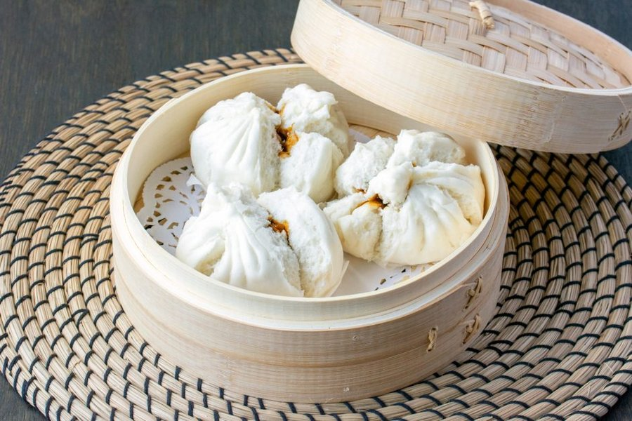

# Char Siu Bao

*The defining Cantonese dim-sum bun: pillowy white dough wrapped around sweet-soy roast pork, steamed till the tops split open at the seams.*

**Serves:** 6 (makes 12 buns)

**Prep Time:** 50 minutes (plus 1 ½ hours rising)

**Cook Time:** 15 minutes

## Overview
The dough uses a low-protein cake flour (or plain flour with cornflour added) for the snow-white pillowy crumb. Yeast, sugar, baking powder, milk and lard (or vegetable shortening) blend with the flour into a soft sweet dough. Rises for 1 hour. Filling: store-bought or homemade char siu pork is diced fine; shallots fry in oil; the diced pork tosses in with oyster sauce, hoisin, dark soy, sugar, chicken stock and a cornstarch slurry. Thickens to a sticky glaze. Cooled fully. The dough divides into 12 balls, each rolls into a thick disc with a thin edge, filling sits in the centre, pleats wrap up and pinch at the top. Final proof for 25 min. Steamed for 12 min over high heat, the tops should crack open.

## Ingredients

### Dough
- 400 g low-protein cake flour (or 380 g plain flour + 20 g cornflour)
- 30 g caster sugar
- 1 ½ teaspoons fast-action yeast
- 1 teaspoon baking powder
- 25 g lard (or vegetable shortening, softened, NOT melted)
- 200 ml warm whole milk
- 1 tablespoon vegetable oil
- A pinch of salt

### Filling
- 250 g char siu (Chinese BBQ pork - sold ready-cooked at Chinese supermarkets, or use leftover roast pork)
- 2 tablespoons vegetable oil
- 1 shallot (small, finely diced)
- 2 tablespoons oyster sauce
- 2 tablespoons hoisin sauce
- 1 tablespoon dark soy sauce
- 1 teaspoon light soy sauce
- 2 tablespoons caster sugar
- 1 teaspoon sesame oil
- 100 ml chicken stock (or water)
- 1 tablespoon cornflour (mixed with 2 tablespoons cold water)

### Equipment
- 12 squares of baking paper (about 6 cm square, one per bun)
- A bamboo steamer with lid

## Method

### Stage 1 - Dough
1. In a large bowl, whisk flour, sugar, yeast, baking powder and salt.
1. Add the warm milk, vegetable oil and softened lard.
1. Mix to a soft dough; knead 10 minutes by hand (or 7 minutes in a stand mixer) until smooth, elastic and pliable.
1. Cover; rise 1 hour until doubled.

### Stage 2 - Filling
1. Dice the char siu pork into 5 mm cubes.
1. Heat the vegetable oil in a wide pan over medium heat.
1. Add the diced shallot; cook 3 minutes until softened.
1. Add the diced pork; toss 1 minute.
1. Add oyster sauce, hoisin, both soy sauces, sugar, sesame oil and chicken stock.
1. Bring to a simmer; cook 2 minutes.
1. Stir in the cornflour slurry; cook 1 more minute until the sauce is thick and clinging.
1. Tip onto a wide plate; cool fully - warm filling tears the dough.

### Stage 3 - Shape
1. Knock back the dough; divide into 12 equal balls (about 50 g each).
1. Cover with a damp tea towel.
1. Working one at a time on a lightly floured surface, roll each ball into a disc about 10 cm across, with the centre slightly thicker than the edges (this gives a sturdy base for the filling and a thin pleated top).
1. Hold the disc in one cupped palm; spoon a tablespoon of cool filling into the centre.
1. With the other hand, pleat the edge of the dough up and around the filling in 12-16 small folds, gathering at the top.
1. Pinch the top closed firmly; twist to seal - but leave a small visible seam at the very top so the bun can split there during steaming.
1. Set each bun seam-up on a square of baking paper.

### Stage 4 - Final proof
1. Arrange the buns in the bamboo steamer baskets on their paper squares, leaving 3 cm space between each (they expand).
1. Cover with the lid.
1. Rest 25-30 minutes at room temperature.

### Stage 5 - Steam
1. Bring water to a vigorous boil in a wide pot.
1. Place the bamboo steamer on top.
1. Steam 12-15 minutes over high heat - the buns puff and the seam at the top splits open to reveal a slash of filling (this is the visual signature of char siu bao).
1. Don't lift the lid mid-steam - the drop in temperature can collapse the buns.

### Stage 6 - Serve
1. Lift the lid carefully.
1. Serve immediately in the bamboo basket.
1. Eat warm, with tea, dipping into chilli oil if you like.

## Notes
- **Low-protein flour matters:** The pillowy white texture of char siu bao depends on low-protein flour. Cake flour (~7% protein) gives the right tender crumb. Plain flour (~11%) gives chewier buns. If only plain is available, substitute 20 g of the flour with cornflour to lower the effective protein.
- **The top should crack open:** A bao that stays sealed at the top during steaming was either over-proofed or the seam was pinched too tightly. The traditional crack happens naturally if you leave a tiny visible seam and the dough is fresh-proofed.
- **Cool the filling:** Hot filling tears wet dough. Spread thin and cool to room temperature before stuffing.

## Storage
- Best fresh, hot from the steamer.
- Refrigerate cooked buns 2 days; re-steam 5 minutes.
- Freeze cooked buns 2 months on a tray, then bag - steam from frozen 8 minutes.
- Freeze raw filled buns just before final proof; defrost, proof, steam.
