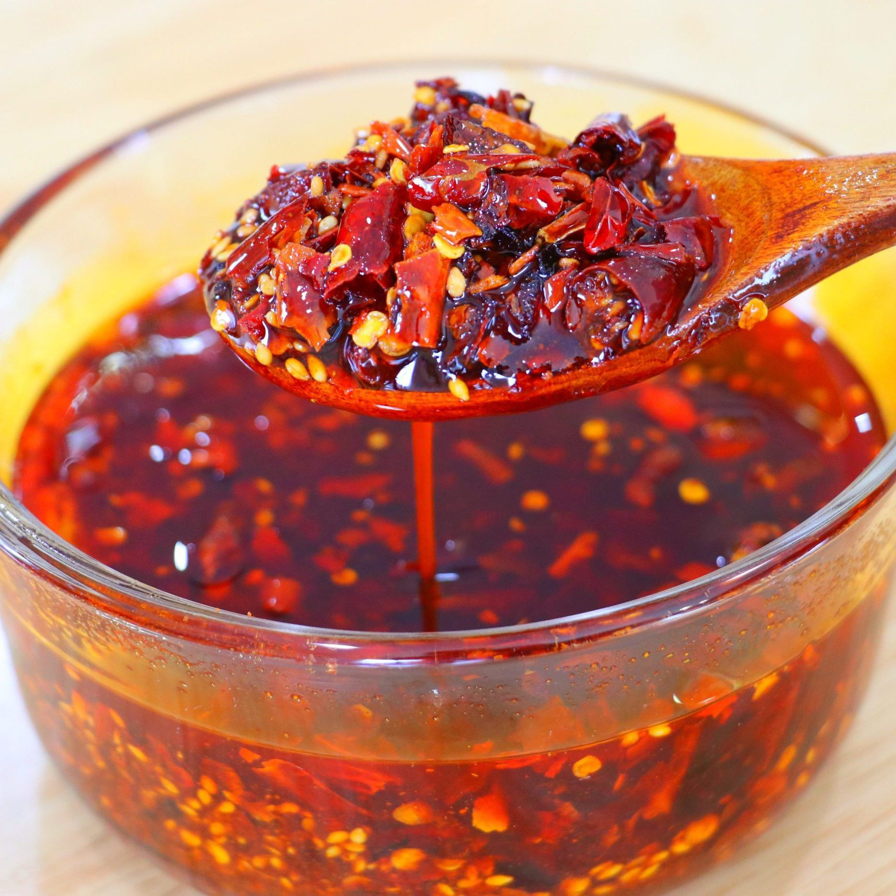

# Chilli oil

*The Chinese condiment that goes on everything. A jar of slow-infused spice oil — bay, star anise, cinnamon, cardamom, Sichuan peppercorns — poured hot over a bowl of chilli flakes, smoked paprika and crispy fried shallots. Stir before each use. Spoon over rice, noodles, eggs, soup, anything that's hot and could be improved.*

**Serves:** Makes ~1 ¼ cups (310 ml)

**Prep Time:** 20 minutes (plus 30 minutes spice soak, plus 24 hours resting after jarring)

**Cook Time:** 30 minutes

## Overview
Two-stage flavour build: first a spice infusion (whole spices soaked briefly in water, then simmered slowly in vegetable oil with spring onion and ginger), then a sizzle (the hot strained oil poured over a heat-proof bowl of chilli flakes, smoked paprika, soy and Chinese vinegar). Cooling. Mixing in the textural elements: caster sugar, salt, chicken stock powder, crispy fried shallots and crispy fried garlic. Jarred, rested 24 hours so the flavours marry, stirred vigorously before each use because the oil and solids separate.

## Ingredients

### The spice blend
- 1 dried bay leaf
- 1 star anise
- ½ cinnamon stick
- ½ teaspoon green cardamom pods (about 7-8)
- 2 ½ teaspoons red/pink Sichuan peppercorns
- ½ teaspoon fennel seeds
- ¼ teaspoon whole cloves (about 8)
- 2 teaspoons water

### The oil infusion
- 1 green onion stem (cut into 15 cm lengths)
- 1 tablespoon fresh ginger (sliced 3 mm thick)
- 1 cup vegetable or sunflower oil (peanut also works)

### The sizzle base
- 1 teaspoon white sesame seeds
- 3 teaspoons chilli flakes (Korean gochugaru is mild; Italian red pepper flakes work)
- 1 tablespoon smoked paprika
- ½ teaspoon light soy sauce
- ½ teaspoon Chinese black vinegar (Chinkiang)

### Seasoning and crunch
- 1 teaspoon caster sugar
- 1 ½ teaspoons fine sea salt
- 1 teaspoon Chinese chicken stock powder (optional but typical)
- ½ cup crispy fried shallots
- 2 tablespoons crispy fried garlic

## Method

### Stage 1 - Soak the spices
1. Roughly chop the cinnamon stick, bay leaf and star anise into 1 cm pieces. Combine with the whole cardamom (lightly cracked), Sichuan peppercorns, fennel seeds and cloves in a small bowl.
2. Add the 2 teaspoons of water — just enough to dampen everything. Stir, leave to sit for 30 minutes. The dampness slows the oil from burning the spices during the infusion.

### Stage 2 - Infuse the oil
1. Combine the soaked spices, green onion lengths, ginger slices and the cup of oil in a small (20 cm) saucepan.
2. Heat over a medium-low until the oil reaches a gentle fizzy simmer — small bubbles rising slowly around the spices. Don't go hotter; the spices burn fast above 140°C.
3. Maintain that fizz for 25-30 minutes, stirring once every 5 minutes. The oil will turn a deep amber and smell strongly of warm spice.

### Stage 3 - Prepare the sizzle bowl
1. While the oil infuses, combine the white sesame seeds, chilli flakes, smoked paprika, light soy sauce and Chinese black vinegar in a wide heat-proof bowl. Mix to a thick paste.

### Stage 4 - Pour and cool
1. Once the spice infusion is done, strain the hot oil through a fine sieve directly into the sizzle bowl. Discard the spent spices, green onion and ginger.
2. The chilli flakes will sizzle and pop. Stir gently with a heat-proof spoon to make sure all the dry ingredients meet the hot oil.
3. Leave to cool to room temperature, about 30 minutes.

### Stage 5 - Finish
1. Stir in the sugar, salt and chicken stock powder until evenly distributed.
2. Add the crispy fried shallots and crispy fried garlic. Mix well — the crunchy bits should sit suspended in the oil, with a clear oil layer above and chunks of crisp beneath.

### Stage 6 - Jar and rest
1. Transfer to a clean glass jar with a tight-fitting lid. The oil will rise; the solids settle.
2. Refrigerate for 24 hours before using — the rest period is where the flavour deepens. The aroma after a day is twice what it smelled of straight out of the pan.

## Notes
- **Vigorous stir before each use**: the oil and solids separate. Always stir from the bottom up before scooping.
- **Spice profile is forgiving**: missing star anise or cardamom? Skip them. The chilli flakes and smoked paprika carry the heart.
- **Heat level**: 3 teaspoons of mild chilli flakes (gochugaru) gives a warm, fragrant chilli oil rather than incendiary. For more heat, use the same volume of crushed Tianjin chillies; for a milder version, swap half the flakes for an extra teaspoon of smoked paprika.
- **Shelf life**: refrigerated in a clean glass jar, this keeps 2-3 months. Bring back to room temperature before using so the oil flows.

## Serving
Spoon over rice, noodles, eggs (fried, scrambled, or in a ramen broth), dumplings, pizza, avocado toast, steamed greens, soups. The "everything goes" condiment.

## Storage
- In a sealed jar in the fridge for up to 3 months. The crunchy bits go softer over time; flavour stays.
- Don't freeze — the oil clouds and the solids go pulpy on thawing.
