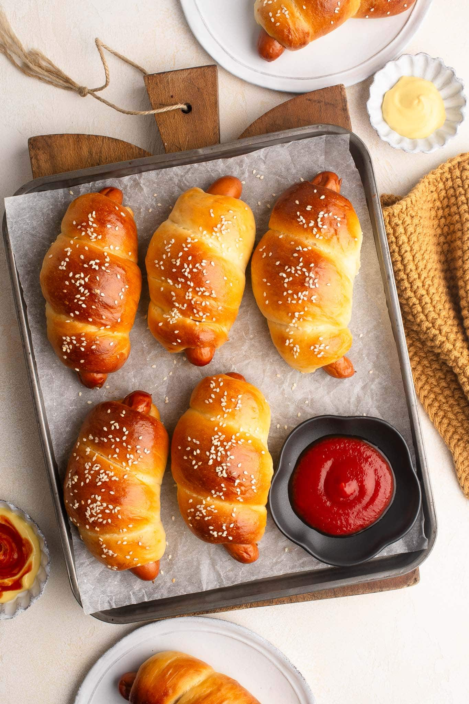

# Chinese Sesame Hot Dog Bun (Hot Dog Bao)

*Chinese-bakery hot dog roll: a hot dog wrapped in a soft slightly-sweet milk bread dough, brushed with egg wash, sprinkled with sesame seeds, and baked till the dough is golden and the dog is heated through inside. The 7-11 Asia and Chinese-bakery counter staple - a hand-held warm snack of bread and sausage in one.*

**Serves:** Makes 8 hot dog buns

**Prep Time:** 30 minutes (plus 1.5 hours dough rise)

**Cook Time:** 18 minutes

## Overview
The Chinese sesame hot dog bun (often called "hot dog bao" or just "hot dog bread" on Chinese-bakery menus) is a fixture of Chinese bakeries across mainland China, Hong Kong, Taiwan and the diaspora (Tai Pan Bakery in Hong Kong, 85°C Bakery Café in Taiwan, the countless Chinatown bakeries in San Francisco and New York all sell their version): a hot dog wrapped entirely in a soft slightly-sweet enriched milk bread dough (very similar to Japanese shokupan or Hong Kong-style cocktail bun dough - flour, milk, sugar, butter, egg, yeast, salt), shaped either as a spiral wrap around the dog or as a fully enclosed elongated bun, brushed with egg wash, generously sprinkled with white (and optionally black) sesame seeds, and baked till the dough turns deep golden brown and the dog inside is heated through. Eat with the hands as a warm portable snack - the bread enclosure means no need for utensils or plates.

## Ingredients

### Milk bread dough
- 500 g plain flour
- 1 sachet (7 g) instant yeast
- 80 g caster sugar
- 1 ½ teaspoons fine sea salt
- 240 ml warm milk
- 1 large egg (beaten)
- 60 g butter (softened)

### Hot dogs
- 8 standard hot dogs (about 12cm long; trim or stretch to fit if needed)

### Egg wash
- 1 egg (beaten with 1 tablespoon milk)

### Topping
- 3 tablespoons white sesame seeds
- 1 tablespoon black sesame seeds (optional, for contrast)

### Optional inside fillings (some bakeries add)
- 4 tablespoons mayonnaise (Kewpie or Hong Kong-style; spread thin inside the dough before wrapping)
- 100 g grated mild cheddar (for "cheese hot dog bao" variant)

### To serve
- Yellow mustard or chilli sauce (XO sauce, sriracha) for dipping
- Hot soy milk or Chinese tea
- Or a glass of cold milk

## Method

### Stage 1 - Make milk bread dough
1. In a stand mixer with the dough hook, combine flour, yeast, sugar, salt.
2. In a separate jug, whisk warm milk and beaten egg.
3. Add wet to dry; knead 6 minutes till the dough comes together.
4. Add the softened butter; knead another 6-8 minutes till smooth, elastic, and only slightly tacky.

### Stage 2 - First rise
1. Place dough in a lightly oiled bowl.
2. Cover; rise 1.5 hours in a warm spot till doubled.

### Stage 3 - Divide and shape
1. Punch dough down; divide into 8 equal pieces.
2. Take each piece; roll out into a flat oval about 15cm long and 8cm wide.
3. (Optional: spread a thin smear of mayo down the centre, or sprinkle a little cheese.)
4. Place a hot dog along the centre.
5. Roll the dough around the hot dog to fully enclose it (the seam underneath; the ends tucked under or pinched closed).

### Stage 4 - Second rise
1. Place wrapped hot dogs seam-down on a parchment-lined baking sheet.
2. Cover loosely; rest 30 minutes.

### Stage 5 - Egg wash and seed
1. Preheat oven to 200°C (400°F).
2. Brush each bao generously with egg wash.
3. Sprinkle white sesame seeds (and black, if using) all over the tops.

### Stage 6 - Bake
1. Bake 15-18 minutes till deep golden brown.
2. The dough should sound hollow when tapped on the bottom.

### Stage 7 - Cool slightly and serve
1. Cool 5 minutes (the inside is screaming hot).
2. Serve warm; eat with hands.

## Notes
- **Soft enriched milk-bread dough:** the slight sweetness and richness are signatures. Lean bread dough gives the wrong character.
- **Fully enclosed:** the dough wraps the hot dog completely. No exposed sausage.
- **Sesame on top:** the Chinese-bakery visual signature.
- **Baked till deeply golden:** pale buns underbaked; the inside dough will be gummy.

## Variations
**Spiral wrap:** instead of fully enclosing, wrap a long strand of dough around the hot dog in a spiral. Same egg-wash + sesame finish.
**Cheese hot dog bao:** add grated cheddar inside before wrapping.
**Pineapple hot dog bao:** add diced canned pineapple inside.
**With scallion:** sprinkle chopped scallion in the egg wash for savoury notes.
**Sweet version (less traditional):** add 1 tablespoon condensed milk inside for sweet-savoury contrast.

## Serving
At a Hong Kong or Taipei bakery counter; at a Chinatown bakery; at 7-Eleven Asia; at home as a breakfast or afternoon snack.

## Storage
- Best fresh.
- Room temp covered 1 day; reheat in 180°C oven 5 minutes.
- Freeze cooked 1 month; reheat from frozen at 180°C for 10 minutes.
- Dough rises also work overnight in the fridge (slow proof for deeper flavour).
