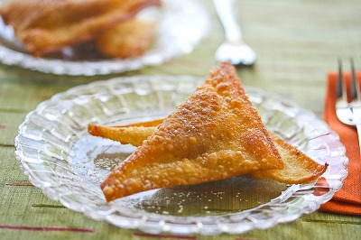

# Fried Wuntun

*Cantonese fried wontons: thin wrappers folded around a pork-and-prawn filling, deep-fried till the corners crackle.*

**Prep Time:** 15 minutes

**Serves:** 6

## Overview
Fried wonton are the deep-fried siblings of the boiled or steamed dim-sum classic: golden, crisp, and almost impossible to stop eating once a plate lands on the table. The filling marries minced pork with chopped Parma ham (an unexpected but excellent substitute for the Chinese cured meats traditionally used), seasoned with ginger, soy, sesame oil and a touch of Shaoxing. A teaspoon of filling sits in the centre of each wonton wrapper, the edges get a brush of egg, and the whole thing folds into a small triangle or pleated pocket. Deep-fried at 175°C for a couple of minutes until the wrappers go golden and audibly crisp. Serve immediately with a trio of dipping sauces: sweet chilli, sharp Chinkiang vinegar, soy with sesame, so each bite can be punctuated differently. Best eaten standing in the kitchen, the moment they leave the oil.

## Ingredients
-  1 packet wuntun skins (about 30)
- 500 ml oil (for deep frying)

### For the filling
- 350 grams minced pork
- 2 tablespoons Parma ham (finely chopped)
- 1 tablespoon dark soy sauce
- 1 tablespoon dry sherry (or rice wine)
- 1 ½ tablespoons spring onions (finely chopped)
- 2 teaspoons fresh ginger (finely chopped)
- 1 teaspoon sesame oil
- 1 egg (beaten)
- ½ teaspoon cornflour
- 1 teaspoon sugar

## Method
1. Combine the filling ingredients together in a large bowl and mix well.
1. Using a teaspoon, put a small amount of filling in the centre of each wuntun skin.
1. Bring up the two sides, dampen the edges with a little water and pinch them together to make a triangle.
1. Fold over the bottom two corners and press together.
1. The filling should be well sealed in.
1. Heat the oil in a deep fat fryer or large wok until it is very hot.
1. Deep fry the filled wuntun in several batches and drain each batch on kitchen paper.
1. Serve at once with a choice of dipping sauces.

## Notes
- Mix the filling thoroughly to ensure the egg and cornflour bind everything together for a juicy, cohesive texture.
- Dampen the wuntun edges sparingly, too much water can make the skins tear or come apart during frying.
- Fry in small batches to avoid dropping the oil temperature, which would result in greasy rather than crispy wuntun.
- Drain each batch immediately on kitchen paper and serve as quickly as possible, as they lose their crunch quickly.

## Serving
Serve with: a selection of dipping sauces such as sweet chilli, soy with ginger, or plum sauce
Temperature: hot, immediately after frying
Amount: approximately 5 wuntun per person as a starter or snack

## Storage
- Best eaten immediately; they do not keep well once fried as the skins go soft.
- Uncooked filled wuntun can be frozen on a tray, then transferred to a bag and stored for up to 1 month, fry from frozen, adding an extra minute to the cooking time.
- The raw filling can be refrigerated for up to 24 hours before wrapping.

*These delicious deep fried crisp parcels are the perfect accompaniment to pre-dinner drinks.*
