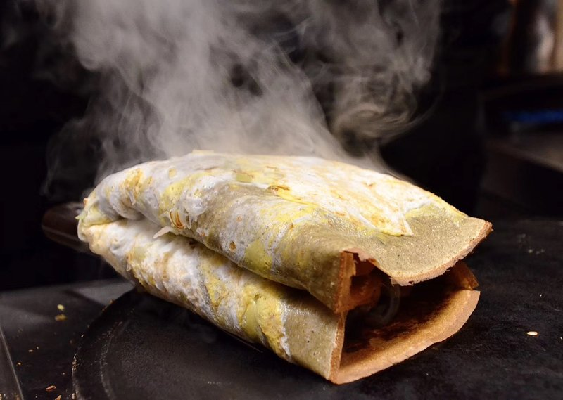

# Jian Bing

*Beijing's morning street crepe: a mung-bean batter griddled thin, with egg, bean sauce, herbs and a sheet of crisp wonton folded inside.*

**Serves:** 4 (makes 4 jian bing)

**Prep Time:** 20 minutes (plus 1 hour batter rest)

**Cook Time:** 15 minutes

## Overview
A thin batter of mung-bean flour, millet flour, plain flour, water, salt and five-spice is whisked to a single-cream consistency; rested for 1 hour. A wide flat griddle or large non-stick pan is heated; a ladle of batter is spread thinly with a wooden disc-rake (jian bing rake, or just rotate the pan to spread). An egg is cracked onto the crepe; smashed and spread with a spatula. The crepe is flipped; the cooked side is painted with sweet bean sauce and chilli paste; scattered with herbs; topped with a crisp wonton sheet; folded into quarters. Eaten warm, by hand.

## Ingredients

### Crepe batter
- 100 g mung-bean flour (or substitute chickpea flour / besan)
- 50 g millet flour (or substitute cornmeal / fine polenta)
- 80 g plain flour
- 1 teaspoon salt
- ½ teaspoon Chinese five-spice powder
- ¼ teaspoon turmeric (optional, for colour)
- 500 ml cold water (more if needed)

### Per crepe
- 1 egg (large)
- 2 teaspoons toasted black sesame seeds
- 1 teaspoon white sesame seeds
- 2 tablespoons chopped spring onion (green and white parts)
- 1 tablespoon chopped coriander
- 1 teaspoon Chinese sweet bean sauce (tian mian jiang, sold at Chinese shops; or hoisin sauce + 1 teaspoon soy)
- 1 teaspoon chilli sauce (Lao Gan Ma or any Chinese chilli paste)
- 1 sheet crisp fried wonton (about 12 cm square - see Stage 2) OR a piece of churro-like fried Chinese doughstick (you-tiao)

### For frying the wonton sheets
- 4 wonton wrappers (12 cm square - sold at Asian shops, the thin yellow kind)
- 300 ml sunflower oil
- A pinch of salt

### For greasing the griddle
- 2 tablespoons vegetable oil

## Method

### Stage 1 - Batter
1. In a wide bowl, whisk all the flours, salt, five-spice and turmeric.
1. Slowly pour in the cold water, whisking smoothly, to a thin lump-free batter like single cream.
1. Rest 1 hour at room temperature (or refrigerate overnight).
1. Stir before using; thin with extra water if it's thickened.

### Stage 2 - Fry the wonton sheets
1. Heat 300 ml sunflower oil in a deep frying pan to 180°C.
1. Lower a wonton wrapper into the oil; it puffs and crisps in 8-10 seconds.
1. Flip with chopsticks; cook 5 more seconds.
1. Lift onto kitchen paper; sprinkle with a tiny pinch of salt.
1. Repeat for all 4. Reserve.

### Stage 3 - Heat the griddle
1. Heat a large flat non-stick frying pan (28 cm+) or a flat griddle over medium-high.
1. Brush very lightly with oil.

### Stage 4 - First crepe - cook the bottom
1. Ladle about 150 ml of batter onto the centre of the hot pan.
1. Immediately tilt and rotate the pan to spread the batter into a thin disc that covers the entire base (or use a wooden disc-rake to spread it).
1. Cook 60-90 seconds - the surface should look dry, the edges starting to curl.

### Stage 5 - Egg
1. Crack an egg onto the centre of the crepe.
1. Use a spatula to spread the egg over the entire surface of the crepe.
1. Sprinkle with black and white sesame seeds, spring onion and coriander while the egg is still wet.

### Stage 6 - Flip
1. Slide a spatula under the crepe; flip carefully.
1. Cook the egg-side for 30 seconds.

### Stage 7 - Paint with sauces
1. Brush the cooked (now-on-top, originally-bottom) side of the crepe with sweet bean sauce.
1. Drizzle chilli sauce on top.

### Stage 8 - Top
1. Place a fried wonton sheet on the centre of the crepe.

### Stage 9 - Fold
1. Fold the crepe over the wonton from the left side toward the centre.
1. Fold from the right side.
1. Fold the top down and the bottom up - into a square parcel.
1. (Some Beijing-cart sellers fold it into quarters instead, into a single triangle.)

### Stage 10 - Serve
1. Lift onto a piece of paper or a plate.
1. Eat immediately, warm, with your hands.

## Notes
- **Mung-bean flour is the signature:** It's what gives jian bing its faintly savoury, nutty backbone. Chickpea flour (besan) is the closest substitute; pure plain-flour crepes don't taste like jian bing.
- **Thin crepe is the technique:** Too thick = doughy. Spread thinly with the back of a ladle or a wooden disc-rake. The crepe should be barely 2 mm thick.
- **The crisp wonton is essential:** Without something crunchy inside, jian bing is too soft. Wonton sheets are the simplest substitute; a true Beijing version uses you-tiao (Chinese long fried doughstick) but those are harder to source.

## Storage
- Eat hot. Jian bing doesn't store.
- Batter keeps refrigerated 2 days; cook fresh.
- Fried wonton sheets keep 1 day airtight at room temperature; re-crisp in a hot pan for 10 seconds if soft.
